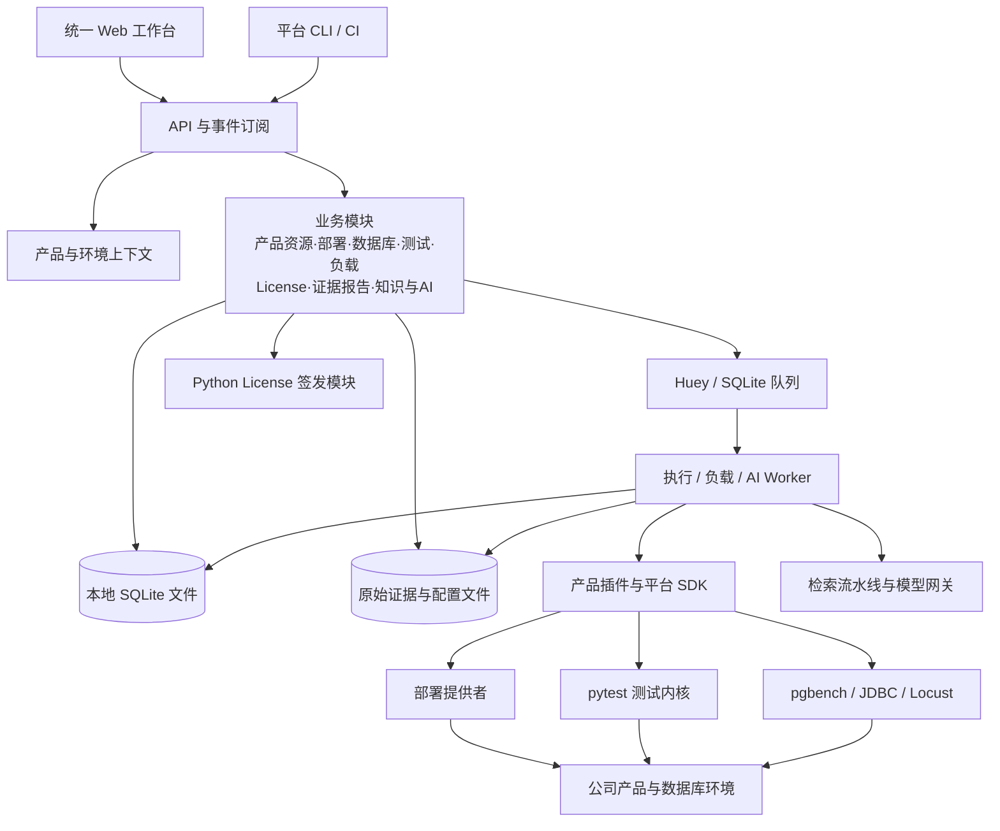
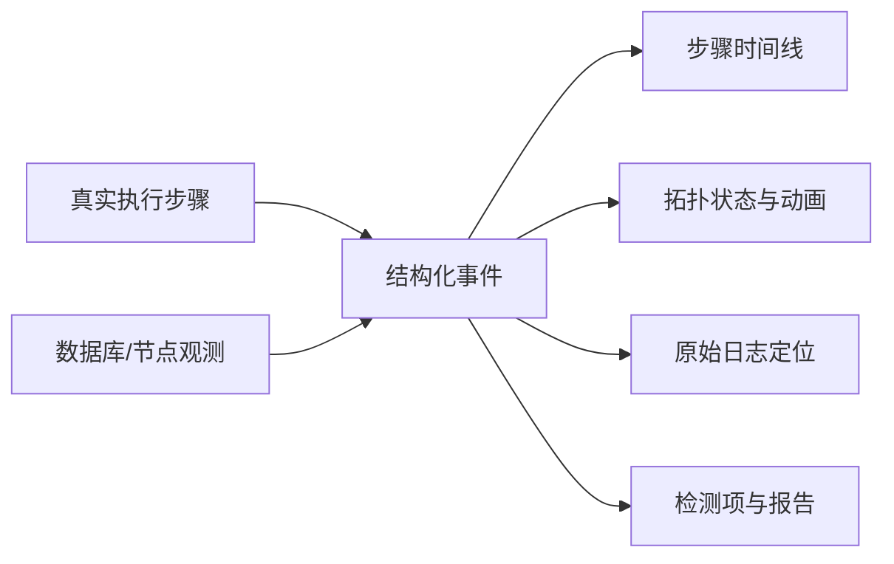

# 公司产品公共管理平台架构设计

版本：架构设计 v2 · 2026-09-23

## 1. 设计目标与已经确定的约束

建设面向公司全部产品的内部公共平台，提供产品与环境管理、图形化部署、数据库管理、License 签发、自动化测试、压测、稳定性测试、执行动画、原始证据查看、知识库、AI 失败诊断与代码问答。

平台从零独立设计，技术栈、目录结构、接口和执行内核不受现有自动化框架约束。成熟开源框架、组件和完整子系统均可采用。现有仓库用于确认业务需求、复用经过验证的领域实现和迁移测试资产；其现有模块划分不成为新平台的边界。

已经确定的约束：

- 不引入测试 `run_id`、运行批次实体和历史测试归档中心；按产品、环境、测试目标保存当前结果。
- 架构优先考虑职责清晰、产品接入简单、页面一致、原始证据可追溯。
- Web 覆盖完整操作闭环：选择产品和环境 → 配置操作 → 查看进度与证据 → 分析结果 → 执行下一步。
- 产品事实、自动化判定、AI 推断分别表达；AI 不修改确定性的测试结论。
- 可以使用开源项目作为主体能力，不要求逐项自研。
- 平台主要供公司内部使用，首版以功能、交互和部署便利为优先，不建设复杂权限、SSO、多租户或审批中心。
- 新平台业务代码采用 Python 与 TypeScript；License 用 Python 重写，原 C 程序只用于格式研究和兼容性对照。
- License 首版仅支持填写参数、生成和下载，不移植旧后台服务，不建设申请队列、审批、签发历史或在线密钥管理。
- 首版不依赖独立数据库服务或 Redis：元数据使用内嵌 SQLite，证据使用本地文件，后台任务使用本机执行进程。
- 本文是目标架构与实施路线；当前只完成源码和文档调研，没有部署平台或执行环境变更。

后台队列仍需要内部任务主键来定位取消、超时、恢复和幂等提交。该主键只服务调度，不成为测试目录层级或产品界面的测试批次，不用于建立测试历史。产品版本和知识文档版本独立保留；License 文件内部编号按文件格式生成，不建立申请业务编号。

## 2. 现有资产与可复用内容

以下结论经过当前仓库源码核对；它们用于说明资产价值，不限制新设计。

| 资产 | 已确认能力 | 新平台可复用的部分 | 新平台应重新设计的部分 |
| --- | --- | --- | --- |
| `fd_licenser` | C 语言生成工具、加密密钥存储、多产品授权；另有后台申请处理服务 | License 文件规范、产品授权规则、兼容性样本 | 仅用 Python 重写生成能力，不移植后台服务 |
| `postgresql_for_fbase_dev` | PostgreSQL 15.15 基线源码；存在 `fbase_mac_dev`、`fdd_mmr_dev` 等扩展代码及技术文档 | 源码、产品版本信息、扩展元数据、原生测试和技术资料 | 产品目录、源代码索引、统一数据库管理界面 |
| `fbase_regress` | MAC/MMR 用例、fixture、SQL/命令/等待步骤、环境标记、逐例证据、BLOCKED 语义 | 用例预期、fixture 业务逻辑、断言和日志采集方法 | 新测试 SDK、统一结果模型、Web 联动与配置组织 |
| `pgcluster` | YAML 拓扑、单实例、流复制、逻辑复制、Citus、MMR；启停、检查、切换和 rejoin | 拓扑校验、部署依赖、SQL 生成、节点生命周期与检查逻辑 | 平台部署计划接口、结构化事件、统一资源归属与图形编辑 |
| `fbasecman_regress_v2` | 路由/缓存/高可用等套件、pgbench/JDBC 负载、常稳 supervisor、逐步证据、Web 原型 | 产品测试与负载、诊断经验、报告规则、拓扑场景 | 新平台前后端、统一执行与任务管理、跨产品抽象 |

需要区别三个概念：**产品**是公司交付的业务对象；**产品模块**是数据库内核、MMR、MAC、代理等能力；**工具提供者**是部署器、签发器、压测器、测试执行器。`pgcluster` 和 `pytest` 是工具提供者，不需要被当成数据库产品。

企业版产品与 MAC/MMR 测试的覆盖关系需要在产品目录中明确。发现了某个扩展测试，不等于已经覆盖整个企业版。

源码核对还发现：

- `pgcluster` 已有可调用的 `ConfigModel`、`Runtime` 和进度回调，CLI 没有统一 JSON 事件协议。
- 两个现有测试仓库都使用顶层 `framework` 包。若迁移阶段临时运行旧框架，应隔离进程与依赖，避免放进同一解释器导入。
- `fbase_regress` 默认覆盖当前结果；新平台不启用其 `--enable-run-id`。
- 现有 fbasecman 常稳工具有自己的 supervisor 和恢复逻辑；接入时平台不能再启动第二个负载管理者。
- 旧 License 后台服务依赖 PostgreSQL 申请表且启动验证涉及固定的 v1.1 密钥，这部分不迁移。新 Python 生成模块读取明确配置的密钥；已发布产品的文件兼容性单独验收。
- `/home/postgres/fly_dev/pgcluster` 与数据库仓库下的 `pgcluster` 路径同时存在。本文以用户指定的前者为资产来源，后续绑定工具时记录明确仓库与版本。

## 3. 总体架构

推荐采用 **单机应用 + 模块化后端 + 本机任务 Worker + 产品插件 + 共享 Web 组件**。

一个平台后端统一提供业务 API，各领域模块具有明确数据和接口边界。部署、测试、负载和较长的 AI/索引操作在本机 Worker 中执行。License 是同一代码库内按请求调用的 Python 模块，生成后直接返回下载文件。一个启动入口管理 API 与后台进程，无需单独安装数据库、消息中间件或签发服务。



平台状态文件保存在控制机，独立于被管理和测试的数据库。SQLite 是内嵌数据库，不需要数据库服务；Web 刷新或关闭不影响后台操作。

### 3.1 模块职责

| 模块 | 拥有的业务与数据 | 不越过的边界 |
| --- | --- | --- |
| 产品与资源目录 | 产品、模块、版本、安装包、主机、环境、连接、资源归属 | 不执行具体数据库命令 |
| 部署管理 | 拓扑定义、校验、部署计划、节点生命周期、健康状态 | 产品特有 SQL 和命令由提供者实现 |
| 数据库管理 | 连接、对象浏览、SQL 会话、参数、会话/锁/复制状态 | 不复用测试 fixture 管理用户 SQL 会话 |
| 测试中心 | 用例目录、选择条件、测试计划、当前结果、资源需求 | 测试内核使用 pytest，产品判断由用例定义 |
| 压测与稳定性 | 负载方案、准备/预热/运行/收尾、真实指标、阈值 | 不把所有耗时脚本都视为普通单测 |
| License 生成 | 产品授权表单、参数校验、生成、下载 | 普通请求调用 Python 生成模块，不接后台申请队列 |
| 任务与资源协调 | 队列、占用、取消、超时、恢复、操作审计 | 不保存一套与产品提供者相冲突的实际节点状态 |
| 证据与报告 | 原始日志、配置快照、步骤事件、模板、导出 | 不从展示文字重新推断测试事实 |
| 知识与代码 | 文档、版本、源码仓库、符号索引、来源 | 不把当前工作区当成所有产品的同一个版本 |
| AI 服务 | 检索、失败诊断、代码问答、报告分析文案 | 不直接承担部署、签发、修复和测试判定 |

业务模块通过服务接口调用；HTTP handler 和前端不直接拼装 SSH 命令或读写产品源码目录。

## 4. 开源选型与自研边界

推荐选型是一个一致的组合；不是把表中的所有候选同时安装。

| 领域 | 推荐方案 | 自研内容 |
| --- | --- | --- |
| Web 应用 | React + TypeScript + Vite + Ant Design；TanStack Query 管理服务端状态 | 产品/环境工作台、业务页面与组件组合 |
| 后端 API | Python 3.12 + FastAPI + Pydantic + SQLAlchemy + Alembic | 产品领域模型、能力协议、业务服务 |
| 平台存储 | SQLite 元数据文件 + 本地配置、日志与报告 | schema 迁移、当前结果发布、文件引用与备份 |
| 后台执行 | Huey 的 SqliteHuey + 本机进程监管 | 资源占用、取消、异常恢复与结果核对 |
| License | Python；cryptography 的 Ed25519、argon2-cffi、PyNaCl 等成熟密码库 | 授权规则、兼容格式、读取已配置的密钥并生成文件 |
| 自动化测试 | pytest + 平台 pytest 插件；需要时采用 pytest-xdist | 数据库 fixture、证据 SDK、产品用例和资源分配 |
| 数据库访问 | Psycopg 3 的 PostgreSQL 驱动；其他协议作为独立提供者 | 元数据、管理操作、产品扩展能力 |
| 图形拓扑 | React Flow | 数据库节点、复制边、动作与状态变化的表现 |
| SQL/代码/配置 | Monaco Editor | 产品配置语法、诊断标记、受控保存和差异确认 |
| 交互终端 | xterm.js | 会话、命令进度、连接生命周期 |
| 日志检索视图 | 虚拟列表 + 后端分页、搜索与级别解析 | 原文定位、上下文、证据链接、产品日志解析器 |
| 压测 | 优先 pgbench/JDBC，接口或混合业务负载接入 Locust | 场景参数、指标归一化、数据清理和阈值策略 |
| 报告 | 统一结果模型 + Jinja2 模板；Allure 作为可选导出/报告提供者 | 公司报告结构、证据核对和覆盖说明 |
| 知识与 AI | 本地文件/SQLite 元数据、关键词与符号检索；复杂流水线再采用 Haystack | 产品/版本过滤、证据组织、模型接口、诊断和评估 |
| 观测 | 首版标准指标文件与 ECharts；持续基础设施监控接入 Prometheus | 产品采集项、负载曲线和诊断关联 |
| 内部访问 | 首版同一内部信任域；按需要启用简单本地登录 | 参数校验、目标确认、敏感字段不进入日志 |

平台首版没有独立数据库服务、Redis 或向量数据库服务。选用队列框架仍需处理任务重复、进程异常与环境收尾，不能把“消息已执行”直接当成业务动作已完成。

### 4.1 为什么不直接套一个现成大平台

| 项目 | 值得采用/借鉴的能力 | 本方案的位置 |
| --- | --- | --- |
| Backstage | 产品目录、插件化入口、文档与研发资源整合 | 可作为公司已有研发门户的外层入口；当前主工作台选择独立 React 应用，以承载大量数据库实时操作 |
| pgAdmin / CloudBeaver | 对象树、SQL 编辑、数据库属性与数据管理 | 可以先部署为完整数据库管理子系统，通过统一导航进入；能否共享登录、连接和嵌入页面需核对所选版本与协议 |
| Allure Report | 测试步骤、附件、报告组织 | 采用报告思想与结果导出；公司模板和实时动画仍消费平台证据模型 |
| AWX | 资产、操作模板、远程任务管理 | 作为架构参考；本次读取官方仓库说明存在大规模重构与发布暂停提示，暂不作为首版强依赖 |
| Huey | 支持 SQLite 的轻量 Python 任务队列 | 首版任务提供者，随应用启动一个本机 consumer |
| Celery / Temporal | 分布式任务或持久多阶段工作流 | 留作未来多机协作的候选；首版不安装 |
| Dify | 可视化 AI 工作流和知识应用 | 可选独立 AI 应用提供者；其许可证含工作区多租户及前端品牌附加条款，不能按无附加条件的 Apache 2.0 假设使用 |
| Haystack | 可组合检索、模型与工具流水线 | 复杂 AI 场景的可选 Python 库；简单问答先用产品范围内检索与模型 HTTP 接口 |

平台首版建设轻量 SQL 面板，用于节点检查、测试上下文和跨页面联动。需要完整对象编辑时，可另外启用 pgAdmin/CloudBeaver，并验证页面跳转和连接交接；这些子系统不成为基础安装依赖。

自研重点集中在公司产品知识、产品能力协议、跨能力操作流程、证据模型和用户工作台。调度队列、测试发现、代码编辑器、拓扑画布、数据库驱动和检索基础设施采用开源实现。

### 4.2 整个平台的语言选择

推荐以 **Python 3.12 + TypeScript** 作为两种业务开发语言。API、部署、测试 SDK、压测编排、License、知识库和 AI 使用 Python；浏览器界面使用 TypeScript。

| 方案 | 对本平台的适配性 | 选择 |
| --- | --- | --- |
| Python 后端 + TypeScript 前端 | pytest、数据库驱动、运维工具和 AI 生态可直接使用，前端组件生态完整 | 首选 |
| 全栈 TypeScript | 前后端类型体系一致，但数据库测试与部分 AI 工具仍需 Python 进程 | 团队主要使用 JS/TS 时可考虑，当前不优先 |
| Java 后端 + TypeScript 前端 | 企业管理和数据库生态成熟，通常仍需 Python 测试/AI 子系统 | 当前会增加语言与服务维护面 |
| Go 后端 + TypeScript 前端 | 单二进制部署方便，适合执行 Agent；测试与 AI 领域需更多跨语言集成 | 未来出现明确 Agent 性能或分发需求再评估 |

Python 的并发主要通过异步 I/O 和受控子进程实现；数据库与压测工作由目标数据库、pgbench/JDBC 等执行，吞吐不应受平台 API 进程承担重计算的影响。CPU 密集分析可以放到独立 Worker，不预先增加另一门后端语言。

使用类型标注、Pydantic、静态类型检查、Ruff、pytest 和锁定的依赖来保证工程质量。License 业务也以 Python 编写，密码原语由成熟库提供；这些库可能带原生实现，平台团队无需维护自有 C 签发代码。

当前旧 Web 使用原生 HTML/CSS/JavaScript，Three.js 和 GSAP 负责部分图形效果。React + TypeScript 是新平台目标技术栈，尚未开始前端实现。

## 5. 产品插件与工具提供者

### 5.1 产品不是一个写满条件分支的枚举

产品声明由元数据、能力绑定、测试包、配置 schema 和可选前端模块组成。能力是可选接口，避免所有产品实现一个庞大基类。

```yaml
id: fbase-enterprise
title: FBase 企业版
plugin_api: v1
capabilities:
  deployment: fbase-cluster
  database: postgresql-compatible
  tests: fbase-enterprise-tests
  load: postgres-workloads
  stability: database-soak
  config: postgres-config
  license: fd-license
  knowledge: product-knowledge
  source: fbase-source
```

示例中的 ID 是新平台设计名称，实施时与正式产品目录和 License 产品编码建立映射，不假定源码目录名就是授权产品名。

基础接口建议：

| 接口 | 主要方法/返回对象 |
| --- | --- |
| `DeploymentProvider` | `validate`、`plan`、`apply`、`inspect`、`lifecycle` → 计划/拓扑/结构化事件 |
| `DatabaseProvider` | `connect`、`catalog`、`execute`、`cancel`、`sessions`、`replication` → 元数据/查询结果 |
| `TestProvider` | `discover`、`requirements`、`execute`、`cancel` → 用例定义/结果/证据 |
| `WorkloadProvider` | `prepare`、`start`、`observe`、`stop`、`cleanup` → 指标/事件/结果 |
| `ConfigProvider` | `list`、`read`、`validate`、`diff`、`apply` → 原文/诊断/变更效果 |
| `LicenseProvider` | `product_options`、`validate_input`、`generate` → 下载文件；不提供任务/申请/审批接口 |
| `EvidenceCollector` | `collect`、`resolve` → 有来源的日志、配置、系统信息与 core 引用 |
| `KnowledgeConnector` | `list_sources`、`fetch`、`revision` → 文档/源码与版本信息 |

每个动作声明输入 schema、输出 schema、需要的资源、是否修改状态、超时、取消方式和允许的重试条件。重试策略按动作指定；部署、SQL 写入和签发不能采用统一的“失败自动重试”。

新产品的接入目标：增加产品声明、能力实现或绑定、测试包和必要页面组件；不修改通用调度器、日志组件和报告渲染器。前后端插件作为受控发布包注册，首版不开放上传任意代码并在线执行。

### 5.2 现有代码的迁移路线

新测试统一使用 pytest 和平台 SDK。业务用例迁移时保留原有前置条件、操作序列、检测项和清理语义。复杂用例继续用 Python 编写；图形界面负责选择、参数化和观察，不强迫把全部数据库逻辑改成可视化 DSL。

`pgcluster` 的有效领域实现可整理为新的部署提供者，也可先由独立桥接进程调用其库。桥接不是长期架构前提，清晰的计划与事件接口完成后可以直接迁移实现。

License 用 Python 重新实现，通过 `LicenseProvider` 暴露业务接口；旧 C 程序只参与开发期兼容性对照，不作为新平台运行依赖。数据库源码进入版本和知识体系，不直接被控制面导入或编译。需要构建产品时再增加独立构建能力。

旧测试框架的命令行适配仅是可选迁移通道；新用例直接进入新 SDK。每个临时适配器记录负责产品、输出转换方式和退出条件，防止长期维护两套相同能力。

## 6. 核心数据模型与当前结果存储

| 对象 | 最小关键字段 |
| --- | --- |
| Product / Module | 稳定产品编码、模块、负责人、能力声明、License 编码映射 |
| ProductVersion / Artifact | 产品版本、源码 revision、安装包 URI、校验和、支持平台 |
| Environment | 产品组合、拓扑、用途、资源提供者、配置引用、实际观测时间 |
| Resource | 主机身份、实例、端口、PGDATA、环境归属、管理者 |
| Connection | 产品、环境、数据库地址、认证引用、会话设置 |
| TestCase | 稳定 target、产品与版本要求、标签、资源需求、步骤和文档来源 |
| TestSelection | 用户保存的用例集合与参数方案；用于反复选择，不是执行批次 |
| LatestResult | 产品 + 环境 + 用例 + 参数方案键、判定、时间、版本/配置摘要、证据引用 |
| Operation | 内部任务主键、动作、操作者、资源占用、状态、取消标志、Worker 心跳 |
| EvidenceRef | 逻辑附件名、存储位置、编码、大小、内容摘要、行/字节范围、采集来源 |
| LicenseInput | 请求内的产品授权项、MAC、用途、有效期、密钥版本；不建立申请表 |
| KnowledgeDocument | 产品/版本、来源、revision、章节和分块 |
| SourceRepository | 仓库、分支或 commit、子模块、索引范围、工作区变更摘要 |
| ReportTemplate | 模板标识、版本、输入 schema、章节规则、输出格式 |
| Diagnosis | 目标证据摘要、模型/提示版本、结论、证据引用、未确认事项、人工反馈 |

测试结果使用固定位置，例如：

```text
data/latest/<product>/<environment>/<suite>/<case>/<profile>/
├── result.json
├── events.jsonl
├── report.txt
├── report.html
├── topology.json
├── config/
└── logs/
```

目录不含 `run_id`。同一目标重跑覆盖当前结果；参数方案是稳定的配置名称或规范化参数键，不按每次执行生成。

重跑时先取得目标写锁，并把该目标标记为执行中，使旧结果不参与本次判定。新文件在临时工作区写入，通过完整性校验后切换当前结果。旧结果只作为切换期间的读者保护，完成后可清理，不形成历史列表。后台任务记录按有限保留期清理，操作审计保留操作者、对象、动作和结论。

当前结果覆盖会使旧 AI 引用失效。诊断必须绑定证据内容摘要；生成过程中使用冻结输入，完成前再次核对。若结果已经变化，显示“证据已更新，需重新诊断”，不能把上一次分析挂到新结果上。

追加中的日志使用文件身份和已提交字节范围定位；关闭后计算完整摘要。冻结 AI 输入只占用证据副本，不继续占用数据库环境的测试锁。

## 7. 任务执行与资源协调

### 7.1 执行链路

1. 用户在某产品和环境下提交动作及参数。
2. API 校验输入和提供者兼容性，生成可核对的资源与操作计划。
3. 同一 SQLite 事务写入任务和 outbox；本机发布器将任务送入 SqliteHuey，避免提交成功但消息丢失。
4. Worker 领取任务，事务性占用实际资源，校验配置与计划仍一致。
5. 在受控进程中执行提供者，持续采集结构化事件、原始 stdout/stderr 和节点观测。
6. 执行正常清理或取消收尾，核对资源状态与产物，更新业务结论。
7. 按配置生成报告或启动 AI 诊断，完成后发布当前结果。

Huey 负责排队与触发，平台 SQLite 任务表是业务任务状态的权威来源。队列文件和业务状态文件分开，outbox 解决两者不能一次提交的问题。重复投递先核对任务状态、执行进程和资源占用，再决定是否执行。启动时核对未结束任务，不能因为队列中已经没有消息就认为任务已完成。

平台在控制机本地磁盘使用 SQLite WAL、短事务和有限的 busy timeout；领取任务、资源占用通过短写事务完成，不在事务中等待 SSH/SQL。API 和 Worker 可并行读取，写入保持短小。数据目录不放在多机共享网络文件系统上。

### 7.2 长任务、取消与恢复

Worker 以心跳报告控制状态；长时间压测由可识别的进程组或执行端 supervisor 管理。排队控制与实际长进程分别记录，长任务不能占满所有短任务执行槽。界面关闭不发送取消。

取消依次执行：标记取消 → 提供者协作停止 → 清理测试资源 → 核对实例状态 → 发布取消结果。强制停止后无法确认远端状态时，环境保持“待恢复”，禁止自动重派相同修改动作。

Worker 心跳过期不等于原进程已经死亡。必须核对 PID/进程身份、远端操作和资源占用，才能释放锁。自动重试仅适用于明确可重入的步骤，不自动重新执行整个部署、签发或破坏性测试。

后台任务状态采用 `QUEUED / RUNNING / CANCELLING / SUCCEEDED / FAILED / CANCELLED / RECOVERY_REQUIRED`。测试判定独立采用 `PASS / FAIL / BLOCKED / SKIPPED / ERROR / CANCELLED`；前置条件不足、用例断言失败和执行器异常分别呈现。

### 7.3 环境归属

资源占用按真实主机、PGDATA、端口及环境关系归一化，不能只按 YAML 文件名或套件名加锁。一个环境同时被两个产品引用时仍是同一批资源。

新环境优先由统一部署提供者管理。迁移环境保留原管理者和 marker，跨工具接管需要显式登记、核对和移交。不能自动添加或替换 marker，让多个工具都认为自己拥有清理权限。

读取状态可共享；部署、故障注入、重建和冲突的压力任务取得独占占用。独立环境可并发执行。同一环境上的回归和压测默认互斥，只有明确的组合场景才共同编排。

通过旧 CLI 在平台之外启动的进程仍可能绕开平台锁；迁移期间页面展示这一控制边界，发现占用时禁止继续修改，不能宣称统一锁已经覆盖所有外部操作。

## 8. Web 信息架构与日常操作

顶部保留全局产品选择器、环境选择器、全局搜索和当前任务入口。产品可以组合多个模块，例如数据库内核 + MMR + 代理；页面始终显示当前操作对象。

建议导航：

```text
工作台
产品与环境
  产品目录 / 版本与安装包 / 主机与连接 / 环境拓扑
部署与数据库
  部署向导 / 节点管理 / SQL 工作台 / 对象与参数 / 复制与会话
测试与负载
  用例目录 / 执行与动画 / 压测 / 稳定性 / 当前报告
License 生成
知识与 AI
  产品知识库 / 代码浏览与问答 / 失败诊断 / 报告模板
平台设置
  平台配置 / 工具提供者 / 模型配置 / 数据备份
```

一级导航按工作目的组织，产品能力决定页内功能。某产品不支持 SQL 时不出现 SQL 操作；前置条件不满足时明确显示原因。全局入口始终可见，避免每切换产品就失去定位。

工作台展示当前环境健康、正在执行的任务、当前失败项、License 生成入口和常用操作。主要页面可以通过 URL 直接打开；刷新保留产品、环境、筛选和选中的步骤。任务队列是当前工作列表，不建设测试批次历史页。

### 8.1 图形化部署

用户选择产品版本 → 拓扑模板 → 主机/端口/目录 → 参数和 License → 校验 → 操作计划 → 执行。

图形拓扑和 YAML 表单共用一个规范化模型。后端校验节点引用、依赖、端口、安装版本和必要扩展；前端只辅助提前反馈。高级配置无法转换为图形字段时保留原文并说明，不静默丢弃。

生成计划是无副作用计算，不通过尝试部署来推测影响。计划记录配置摘要和目标资源，执行前再次校验；配置原文的注释与未知扩展字段使用可往返的解析方式保留。

计划包含将创建/修改的实例、数据目录、复制关系、服务状态变化及准备失败的节点。执行时展示具体阶段与节点状态，失败可直接进入该步骤的命令、日志和配置。恢复入口由提供者声明，不能对未知失败统一显示“重试部署”。

### 8.2 数据库管理

平台轻量工作台提供连接、库/schema/表树、SQL 编辑、结果表、原始输出、取消查询、会话与锁、参数和复制状态。PostgreSQL 兼容协议能力与 FBase 特有管理动作分别扩展。

一次用户 SQL 只执行一次；结果表、命令标签和原始展示来自同一次结果，不能为了 CSV 或格式化再次执行 SQL。会话模型明确自动提交、事务、超时、取消及结果行数限制。

pgAdmin/CloudBeaver 可选承担完整对象编辑和高级数据库管理。平台跳转时传递连接引用，不在 URL 中传数据库密码。基础部署使用平台自带 SQL 面板，外部工作台按需启用。

### 8.3 原始日志与配置

| 日志视图 | 配置与代码视图 |
| --- | --- |
| 保留原始文件、行号、时间、来源节点和命令 | 展示原始路径、来源节点、采集时间与文件摘要 |
| ERROR/FATAL/PANIC/WARN 分级高亮 | SQL、YAML、JSON、INI、PostgreSQL conf 语法高亮 |
| 普通搜索、正则、级别/节点/时间过滤 | fbasecman 配置语言使用专用 tokenizer/校验器 |
| 命中项前后上下文、上一处/下一处、完整下载 | 搜索、跳行、折叠、当前与候选配置对比 |
| 追加跟随、暂停滚动、日志轮转提示 | 区分已落盘配置与实际运行参数，显示 reload/restart 要求 |
| 多行异常堆栈作为关联记录查看 | 修改前校验、显示差异，保存时核对原内容摘要 |

大型日志由后端按字节/行窗口读取和搜索，前端虚拟列表渲染；设置查询时间、扫描量与返回条数限制。日志高亮只是显示能力，不意味着出现一次 ERROR 就判用例失败；预期错误仍由断言解释。

xterm.js 用于真实终端/ANSI 输出；日志检索保留独立数据模型。原始文件保留原编码，解码用于展示，不能把解码替换后的文本称为字节级原件。

### 8.4 测试动画与证据联动

一屏组织：左侧步骤，中间拓扑，右侧当前操作/检测项，下方原始日志。支持实时跟随、暂停、逐步播放、拖动时间线、定位失败步骤和倍速回放当前结果。



动画区分“正在执行停止命令”“已经观测到节点停止”“预期发生切换”。缺失观测显示未知；不能根据标题或动作意图把节点画成已经恢复。图形坐标由前端保存，不写进数据库拓扑事实。

先完成二维拓扑与步骤联动。三维展示作为可选视图，消费相同事件和状态模型。

## 9. 测试、压测与稳定性内核

### 9.1 基于 pytest 的统一测试 SDK

平台插件负责用例元数据发现、环境资源申请、步骤事件、原始命令输出、失败取证和最终结果转换。pytest 负责测试发现、fixture、参数化、断言和用例生命周期。

SDK 概念示例：

```python
@product_case(id="mmr.failover.primary", requires=["mmr", "isolated-env"])
def test_primary_failover(cluster, evidence):
    with evidence.step("停止当前主节点", expected="副本接管且业务恢复"):
        cluster.stop_primary()
        observed = cluster.wait_for_primary_change(timeout=60)
        evidence.topology(observed.topology)
        evidence.check("写入恢复", expected=True, actual=observed.writable)
```

示例用于表达接口方向，不是当前已有 API。命令回显、返回码、原始输出和日志区间由 SDK 统一采集；fixture 的恢复失败必须进入结论。用例可声明原生程序/JDBC/SQL 协议驱动，平台不强行把这些测试逻辑翻译成 Python SQL。

pytest-xdist 只能用于获得独立资源的用例。共享环境、故障注入与 session fixture 按资源策略串行。实际产品测试与平台单元测试分开管理。

### 9.2 压测与稳定性

两类功能共用负载提供者，但有不同的产品目标：压测观察容量与时延，稳定性观察持续运行中的错误、资源增长、连接恢复和状态漂移。

一个负载方案声明产品版本、数据准备、并发/连接数、预热、正式时长、负载脚本、采样项、故障动作、阈值和收尾。可保存反复使用的方案；正式测试和短时联调在页面上明确标记。

指标包括吞吐、延迟分位、错误率、CPU/RSS、文件描述符、连接数和复制延迟。分位数只有原始采样或工具输出支持时才展示；缺失值显示未采集，不填固定数值。

负载结束后的数据库状态与数据清理也属于结果。稳定性期间的 RSS 上升只是观测，是否泄漏需要结合阶段、回收行为和诊断证据判断。

## 10. License 生成

由 Python 重写 License 生成，操作为填写产品/版本/有效期/MAC/用途 → 校验 → 生成 → 下载。首版不提供原后台服务、申请/审批、历史管理、密钥生成或修改口令界面。

后端通过普通 `POST /api/v1/licenses/generate` 请求调用生成模块，成功返回 License 文件，错误返回具体字段与原因。该能力不进入 Huey，不创建后台任务或申请表；前端仅显示当前请求的加载和下载状态。

产品编码、License 格式版本与密钥版本单独建模。生成模块读取服务器已配置的密钥，必要的解密口令只用于当前请求；密码计算在有并发上限的线程/短进程中完成，避免阻塞 API 事件循环或耗尽内存。密钥选择不继承旧后台服务固定验证 v1.1 的行为。

密码算法使用成熟库：Ed25519 采用 cryptography/PyNaCl，Argon2id 使用显式参数的实现，XChaCha20-Poly1305 可使用 PyNaCl。不手写签名和加密原语。旧加密密钥文件的参数与字节布局需要验证兼容后才能导入。

已核对的旧实现细节：Ed25519 签名为 64 字节；密钥保存为 32 字节 seed + 32 字节公钥；签名覆盖 payload JSON 的实际字节；文件包含 Base64 编码的签名与 payload 及历史 MD5SUM 字段。密钥派生使用 Argon2id、65536 个 KiB 内存块、2 次迭代和 1 lane，加密密钥容器为 salt(16) + nonce(24) + ciphertext(64) + tag(16)。这些是兼容性输入，尚未证明 Python 新实现互通。

实现前建立格式说明与专用测试密钥的对照向量，验证 Python 签发可被已发布产品接受、旧文件可被 Python 解析和校验。覆盖 JSON 编码/转义、时间边界、多产品/MAC、错误签名、错误口令和版本选择。MD5SUM 仅按旧文件协议保留，真实性由数字签名校验决定。

初期采用本地加密密钥文件，口令与密钥不写入日志或 AI 输入。生成后的格式与签名校验属于生成模块内部正确性检查，不扩展成另一个后台产品。Python 普通对象不承诺完全擦除内存；只在当前调用所需范围持有解密材料。

## 11. 知识库、代码分析与 AI

### 11.1 共用知识基础

输入来源包括产品手册、转测文档、部署说明、缺陷记录、已确认的诊断结论、数据库源码、扩展源码和选定测试证据。首版支持 Markdown、文本、源码及文本型 PDF/DOCX；扫描文档再按需增加 OCR。

索引保留产品、模块、版本、仓库 revision、文档章节、路径、行范围和原文摘要。文档保存在文件系统，索引元信息保存在 SQLite。首版内部共享知识，不建设多租户和文档权限体系。

检索先限定产品、版本和来源，再做关键词/符号搜索并组织证据。小规模文档可采用文件搜索；SQLite FTS 可用时用于索引，但需要实测中文搜索效果，不能假设默认分词已经足够。

语义检索作为后续可选能力，可先使用嵌入式本地索引；首版不要求向量数据库、Redis 或外部检索服务。文档变化后更新或删除索引，缓存按内容版本失效。未来出现多机检索需求时再评估 PostgreSQL + pgvector 等服务化存储。

### 11.2 自动化失败诊断

诊断输入包括失败步骤、预期/实际、原始返回码、前后日志、配置快照、版本、环境检查和相关源码位置。先用确定性规则提取连接失败、前置条件、崩溃等线索，再检索知识和源码，最后由模型解释。

输出固定包含：

1. 已确认的失败事实。
2. 有证据支持的原因与对应引用。
3. 尚未确认的假设和缺失证据。
4. 下一步验证动作，以及动作可能改变什么。
5. 关联知识、源码位置和适用版本。

定位来源必须能点击打开原始日志行、配置项或源码。AI 不把“相似问题”直接标为根因。模型故障、超时或不可用时，规则诊断和原始报告仍可使用。

### 11.3 基于 AI 的代码分析与回答

代码问答以明确的产品仓库和 revision 为边界，支持函数解释、调用路径、变更影响、测试覆盖与故障关联。初期使用文本搜索 + Tree-sitter 符号/结构索引；需要准确 C/C++ 跨文件语义时接入有编译参数的 clangd/编译数据库。

Tree-sitter 提取的结构不等于完整语义调用图。涉及宏、条件编译或缺少构建参数时说明分析范围。回答引用文件、行号和 commit；分析用户工作区时额外记录未提交差异摘要。

同一产品存在源码副本、开发扩展目录与发布目录时必须选择权威来源；默认排除构建产物、第三方大仓库、密钥和运行数据。不能把 `_dev` 与发布目录的同名函数混合回答。

首版提供阅读、分析和建议补丁。以后增加代码修改或工具调用时，通过明确的操作入口执行；文档和日志中的命令不自动执行。

### 11.4 模型与工具网关

平台 `ModelProvider` 屏蔽模型厂商、内网模型服务、流式输出和重试差异；简单检索问答直接组合现有接口，复杂流水线再采用 Haystack。不同场景可配置不同模型与上下文预算，用户配置一个可用模型 HTTP 端点即可开始使用。

AI 使用选定产品和证据范围，数据库密码、签发口令和私钥不进入提示词。记录模型版本、提示模板版本、输入证据摘要与人工反馈；首版不引入复杂模型审批或专门安全治理子系统。

用已知故障建立诊断评估集，检查证据引用是否准确、根因是否命中、缺失信息时是否停止推断，以及不同产品版本是否混淆。代码问答也需要覆盖宏、同名符号与版本差异的样例。

## 12. 基于模板的测试报告

报告先由结构化事实和模板生成，AI 补充解释性内容。模板定义章节、必填字段、用例与检测项表、覆盖映射、证据附录和输出格式。

固定事实包含：产品/版本、环境、配置摘要、测试内容、步骤、命令/返回码/原始输出、预期/实际、判定、清理状态与证据位置。AI 可生成失败分析、结果说明和建议，但不能新增未执行步骤、改写判定或声称没有证据的覆盖。

建议保留公司已习惯的中文报告字段，例如“用例、结论、测试开始时间、测试结束时间、步骤、检测项、通过原因/失败原因”。不同产品选择不同模板，核心结果 schema 相同。

首版导出 HTML、文本和 JUnit。正式 Word 模板需要占位符与重复表格映射，可使用 docxtpl；PDF 从已验证 HTML 渲染。任意上传一个 Word 文件不等于可以自动正确填充，模板发布前提供字段检查和预览。

AI 文案与原始事实有清晰来源标识。模板版本、输入证据摘要进入导出元信息；当前证据变化后提示重新生成。模板缺字段时明确报错或保留“未采集”，不能用模型补全事实。

## 13. API 与事件协议

首版接口面向内部信任网络，按产品和环境解析操作目标并校验参数；需要时统一开启简单本地登录。后端发布 OpenAPI，由前端生成客户端类型，避免两边手工维护字段。不在各业务模块自建角色或审批系统。

| 接口族 | 示例用途 |
| --- | --- |
| `/api/v1/products` | 产品、模块、版本与能力发现 |
| `/api/v1/environments` | 环境、节点、观测拓扑与资源占用 |
| `/api/v1/deployments/plan` | 校验并返回将执行的操作计划 |
| `/api/v1/operations` | 提交已注册动作、查看当前队列、取消、恢复 |
| `/api/v1/tests` | 发现用例、标签筛选、参数方案和当前结果 |
| `/api/v1/workloads` | 压测/稳定性方案、控制与指标 |
| `/api/v1/connections` | 数据库连接、SQL 会话、查询及取消 |
| `/api/v1/evidence` | 当前目标日志、搜索、范围读取、下载 |
| `/api/v1/configurations` | 原文、校验、差异与受控保存 |
| `/api/v1/licenses` | 生成表单选项与生成下载；不提供申请队列和后台服务管理 |
| `/api/v1/knowledge`、`/sources` | 文档/源码接入、版本与索引 |
| `/api/v1/diagnoses`、`/answers` | 失败诊断和有引用的问答 |
| `/api/v1/report-templates`、`/reports` | 模板、预览与生成 |

长动作由 `POST /operations` 返回内部任务引用；通用提交接口只接受注册动作及 schema，不接受前端传入的任意 shell 命令。SQL 工作台由专门的 SQL 会话接口管理。

事件最小字段：`schema_version, sequence, timestamp, product, environment, target, step_key, event_type, payload, evidence_refs`。内部任务通道定位当前执行，`sequence` 用于顺序与断线续传，证据引用使用内容摘要。

事件类型至少包含：`step.started`、`command.finished`、`observation.captured`、`assertion.checked`、`artifact.ready`、`step.finished`、`operation.finished`。

普通进度用 SSE，实时终端用 WebSocket。事件先落盘，再由 API 按序号推送；单机模式使用进程内通知或短间隔读取已提交事件，无需 Redis pub/sub。断线续传无法补齐时返回重取当前状态的明确指令，不能无声跳过。

日志内容通过范围接口读取，事件只携带引用，避免 SSE 为大文件传输通道。旧工具只能返回阶段文本时，适配器标记为普通进度；没有结构化观测时不制造精细动画。

## 14. 建议仓库组织与依赖方向

设计包位于 `/home/postgres/fly_dev/product_platform`，独立于原产品和自动化测试仓库。当前交付包含设计文档；下列应用目录是实施时的目标结构，尚未创建应用代码。

```text
product_platform/
├── backend/
│   ├── platform_app/
│   │   ├── api/                 # HTTP、事件订阅与输入输出
│   │   ├── modules/             # catalog、deployment、database、tests、load
│   │   │                       # licenses、evidence、reports、knowledge、ai
│   │   ├── contracts/           # 稳定 schema 与提供者接口
│   │   └── infrastructure/     # SQLite、队列、文件、进程、传输
│   ├── platform_sdk/           # 提供者、测试和采集 SDK
│   ├── platform_pytest/        # pytest hooks 与证据插件
│   └── migrations/
├── frontend/
│   └── src/
│       ├── app/                # 路由、产品/环境上下文、登录
│       ├── features/           # 部署、数据库、测试、负载、License、知识
│       ├── components/         # 日志、配置、步骤、拓扑、引用等公共组件
│       └── api/                # OpenAPI 生成客户端
├── providers/                  # 部署、数据库驱动、License、负载、模型
├── products/                   # 产品声明、可选特有页面与元数据
├── testpacks/                  # 新 pytest 产品用例包
├── report_templates/
├── deploy/                     # 单机/多 Worker 部署清单
├── tests/                      # 单元、契约、故障恢复、浏览器交互测试
└── docs/
```

依赖约束：领域模块只依赖稳定 contracts 与必要的应用服务；具体产品提供者实现 contracts；核心不反向导入某个产品包；产品测试依赖 SDK，不调用 HTTP handler；前端不解析中文报告来产生业务状态。

插件注册负责装配，不在通用模块到处增加 `if product == ...`。公共组件以第二个真实产品的复用需求验证边界，避免提前设计无法验证的通用 DSL。

## 15. 部署形态

首版以普通内部单机软件交付：一个 Python 环境、编译好的前端静态文件、一份配置和一个本地数据目录。FastAPI 同时提供 API 和静态页面，一个入口启动 API、Huey consumer 与本机任务监管；License 只是请求中的普通 Python 调用。反向代理、Docker 都是可选部署方式。

建议用户入口为 `platform start/status/stop`，服务管理器跟踪所属进程，停止时区分“停止平台服务”和“取消运行中的测试”。这些是拟定命令，当前尚未实现。

```text
data/
├── platform.sqlite3    # 产品、环境、任务、配置引用与知识元数据
├── queue.sqlite3       # Huey SQLite 队列
├── latest/             # 固定目标下的当前结果和原始证据
├── knowledge/          # 文档与本地检索索引
├── configs/            # 配置模板和快照
└── keys/               # 本地加密密钥
```

发布包预先构建前端，使用者不用安装 Node.js；Node.js 只属于开发/构建环境。SSH、数据库客户端、JDBC 等按启用的产品能力检查，不作为平台首页启动的全部前置条件。AI 配置可用模型地址后启用，不要求启动本地大模型。

首版支持多个浏览器用户和多个本机执行进程；SQLite 位于本机磁盘，事务保持短小，限制索引批量写入，防止影响任务状态更新。整机备份使用 SQLite 在线备份接口或暂停写入后复制，不能只拷贝正在使用中的主数据库文件而忽略 WAL。

未来只有出现多台平台执行机、持续写入争用或高可用要求，才通过存储与队列接口迁移到 PostgreSQL 和 Redis/其他队列。届时由迁移工具搬运 schema、数据和任务状态，不宣称更换连接串就能完成升级。产品能力接口与 UI 不随部署形态改变。

安全方面按内部工具做基本处理：目标与路径检查、危险操作的对象确认、密码/密钥不写日志。不把 SSO、复杂 RBAC、多租户、集中审计或 License 审批作为首版工作项。

## 16. 实施阶段与验收

| 阶段 | 可交付结果 | 验收标准 |
| --- | --- | --- |
| A：平台骨架与契约 | 独立仓库、产品目录、产品/环境上下文、任务与证据 API、两种产品声明 | 无独立数据库和 Redis 可启动；增加第二种产品不改通用页面；任务脱离浏览器运行 |
| B：图形部署闭环 | 一个产品版本的拓扑建模、计划、部署、状态、日志/配置查看 | 实际部署并验证一个隔离集群；图形与配置一致；失败定位到真实命令；取消后状态可核对 |
| C：数据库与 License | 轻量 SQL 工作台、节点管理、Python License 生成下载 | SQL 只执行一次；无需 C 程序、后台签发服务或申请表即可生成；现有产品验签与文件兼容通过 |
| D：新测试内核与动画 | pytest SDK、两个产品代表用例、步骤/拓扑/日志联动、公司报告模板 | 同时验证 PASS、FAIL、BLOCKED、取消及清理失败；动画与原始证据一致；结果按固定目标覆盖 |
| E：压测与稳定性 | pgbench/JDBC 方案、采样、曲线、长任务监管和收尾 | 完成正式时长的实际负载；指标有真实来源；重启控制服务不重复启动负载 |
| F：知识与 AI | 文档/源码索引、有引用问答、失败诊断、模板报告分析文案 | 已知故障评估通过；跨版本来源不混淆；无证据时说明不足；结果覆盖后旧诊断失效 |
| G：规模化产品接入 | 多活、企业版、代理等更多能力与用例迁移 | 新产品通过插件契约接入；独立环境可并发；核心模块不增加产品分支 |

A/B 建立第一条可用链路，C 的 License 可以独立推进。知识资料整理可与前期并行，AI 自动诊断依赖 D 的证据质量。阶段划分按可验收能力推进，不以界面按钮数量计完成度。

### 平台必须持续验证的场景

- 两种产品使用同一个日志、配置、步骤与报告组件。
- 一个用户刷新页面或断线后能恢复当前任务、步骤与日志位置。
- 重复提交、消息重复投递、Worker 异常退出不会重复执行不可重入操作。
- 两个工具引用同一主机/PGDATA 时能识别资源冲突。
- 不受管环境有明确提示，接管与清理不会选错目标。
- 搜索大日志保持响应，命中位置能返回原始上下文，日志轮转不会错位。
- 测试产物、图形状态与模板报告一致，预期错误不会被关键词高亮误判。
- AI 引用能回到原文，文档变化和结果覆盖后不继续显示错误上下文。
- 代码回答展示匹配的源码版本；编译信息不完整时不声称完整调用关系。
- 平台单元测试、API/插件契约测试、浏览器实际操作与产品真实测试分别验收。

## 17. 架构决策摘要

1. 独立新平台；现有仓库是资产来源，可选择性复用与迁移。
2. 控制面按领域模块组织；任务与高负载工作在独立 Worker 执行。
3. 采用开源 pytest 作为新测试内核，平台 SDK 提供数据库资源与证据能力。
4. 产品声明能力，工具提供者实现能力，共享前端按协议渲染。
5. 不建设测试 run_id 与历史批次；当前结果有固定身份和可核对的证据摘要。
6. 图形动画、报告、AI 共享结构化证据；原始输出始终可访问。
7. Python 重写 License 生成下载，兼容现有产品；不迁移后台服务和申请流程，旧 C 实现仅作对照。
8. 首版 Python + TypeScript、SQLite + 文件、Huey 本机 Worker，一条命令启动，无外部数据库和 Redis。
9. 主要内部使用，优先业务与交互，复杂安全与企业身份体系不列入首版。

## 18. 调研来源与证据边界

本次未运行部署、签发、数据库查询或产品测试。阅读了仓库入口、关键实现和官方开源项目资料，未读取私钥文件。技术选型为设计建议，具体版本锁定、组件兼容与浏览器体验需要在实施阶段验证。

本地源码与文档：

- [pgcluster README](/home/postgres/fly_dev/pgcluster/README.md)、[配置模型](/home/postgres/fly_dev/pgcluster/pgclusterlib/config_model.py)、[部署 Runtime](/home/postgres/fly_dev/pgcluster/pgclusterlib/runtime.py)、[配置锁](/home/postgres/fly_dev/pgcluster/pgclusterlib/locking.py)。
- [fd_licenser README](/home/postgres/fly_dev/fd_licenser/README.md)、[数据库任务协议](/home/postgres/fly_dev/fd_licenser/src/db_task.c)、[签发服务入口](/home/postgres/fly_dev/fd_licenser/src/fd_lic_service.c)。
- [数据库基线](/home/postgres/fly_dev/postgresql_for_fbase_dev/configure.ac:20)、[MAC 扩展构建](/home/postgres/fly_dev/postgresql_for_fbase_dev/contrib/fbase_mac_dev/fbase_mac/Makefile)、[MMR 扩展构建](/home/postgres/fly_dev/postgresql_for_fbase_dev/contrib/fdd_mmr_dev/fdd_mmr/Makefile)。
- [fbase_regress README](/home/postgres/fly_dev/postgresql_for_fbase_dev/fbase_regress/README.md)、[测试执行器](/home/postgres/fly_dev/postgresql_for_fbase_dev/fbase_regress/framework/runner.py)、[结果模型](/home/postgres/fly_dev/postgresql_for_fbase_dev/fbase_regress/framework/models.py)。
- [fbasecman 测试契约](/home/postgres/fly_dev/fbasecman_dev/fbasecman_regress_v2/framework/suites/contracts.py)、[常稳说明](/home/postgres/fly_dev/fbasecman_dev/fbasecman_regress_v2/suites/stable/README.md)、[现有 Web 报告与拓扑解析](/home/postgres/fly_dev/fbasecman_dev/fbasecman_regress_v2/tools/web_reports.py)。

已读取的官方开源资料，检索日期 2026-09-23：

- [Backstage](https://github.com/backstage/backstage)：软件目录、开发者门户和插件。
- [pgAdmin 功能](https://www.pgadmin.org/features/)、[CloudBeaver Community](https://github.com/dbeaver/cloudbeaver)：数据库图形管理。
- [pytest](https://github.com/pytest-dev/pytest)、[Allure Report](https://github.com/allure-framework/allure2)：测试内核与报告。
- [Huey](https://github.com/coleifer/huey)：支持 SQLite 存储与本机 consumer 的首版任务队列。
- [Celery Redis 文档](https://docs.celeryq.dev/en/stable/getting-started/backends-and-brokers/redis.html)、[Temporal](https://github.com/temporalio/temporal)、[AWX](https://github.com/ansible/awx)：后续分布式任务与工作流参考，不是首版依赖。
- [React Flow](https://github.com/xyflow/xyflow)、[xterm.js](https://github.com/xtermjs/xterm.js)、[Monaco Editor](https://github.com/microsoft/monaco-editor)、[CodeMirror](https://codemirror.net/)：拓扑、终端、编辑器参考；本方案编辑器选择 Monaco。
- [Locust](https://github.com/locustio/locust)：可扩展负载与实时结果。
- [Haystack](https://github.com/deepset-ai/haystack)、[pgvector](https://github.com/pgvector/pgvector)、[Dify 许可证](https://github.com/langgenius/dify/blob/main/LICENSE)：AI 检索、存储与候选方案边界。
- [cryptography Ed25519](https://cryptography.io/en/latest/hazmat/primitives/asymmetric/ed25519/)、[PyNaCl 密钥派生](https://pynacl.readthedocs.io/en/latest/password_hashing/)、[PyNaCl AEAD 实现接口](https://github.com/pyca/pynacl/blob/main/src/nacl/bindings/crypto_aead.py)：Python 签发模块候选密码组件。
