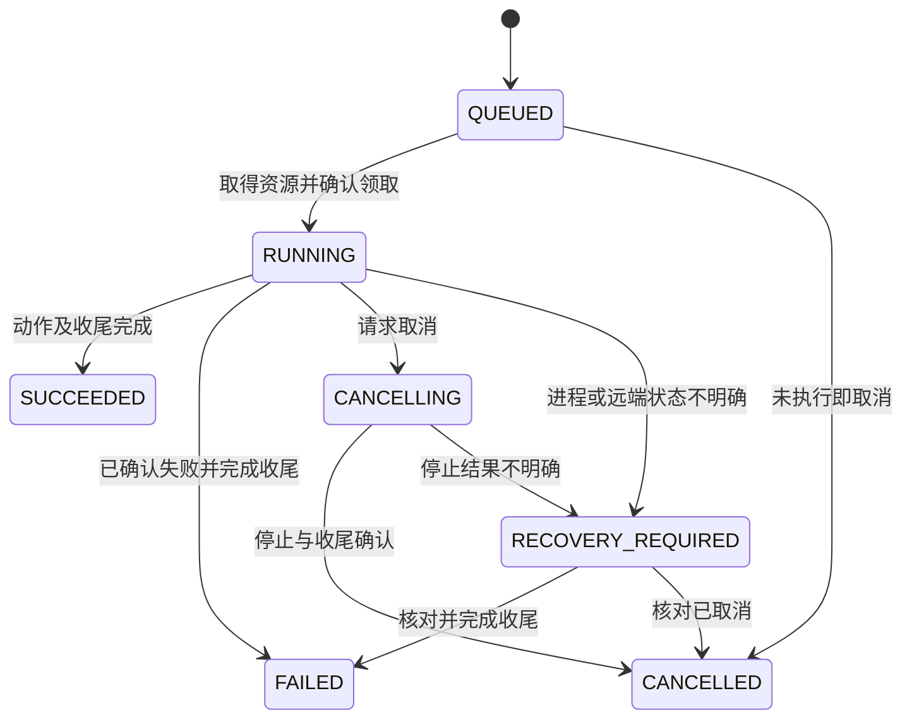

# 接口与扩展契约 v1

这是新平台的开发接口设计，配合 [总体架构](architecture.md) 使用。示例数据均为说明用途，不代表真实测试已经运行。

## 1. 领域边界与稳定标识

- `product`：稳定产品编码，不随中文名称变化。
- `environment`：平台中的环境身份，可关联数据库内核、代理和多活等多个产品模块。
- `target`：用例或工作负载的稳定业务名称，例如 `ha.replica_failure`。
- `profile`：可复用的参数方案名称，例如 `default`、`sql-parse`，不是执行次数。
- `operation`：部署/测试/长任务的内部队列引用，仅用于当前控制与恢复。
- `evidence`：内容引用，包含文件身份、行或字节范围和内容摘要。

当前结果键是 `(product, environment, target, profile)`。软件版本、源码 revision 和配置摘要属于结果内容，不增加历史批次目录。

产品适配器与 UI 不能自行拼接物理产物路径。由 ArtifactStore 把逻辑引用解析到本地文件，之后改变存储实现时不影响调用者。

## 2. 产品与提供者注册

产品声明示例：

```json
{
  "schema_version": "1.0",
  "id": "fbase-enterprise",
  "title": "FBase 企业版",
  "capabilities": {
    "deployment": "fbase-cluster",
    "database": "postgres-compatible",
    "tests": "fbase-pytest",
    "load": "postgres-workloads",
    "license": "python-license"
  }
}
```

提供者在进程启动时注册，声明 `provider_id`、接口主版本和支持的动作。首版显式注册或使用受控 Python entry point；未知能力、重复 ID、找不到的提供者、主版本不兼容都在启动/安装检查中报错。

必需接口属于对应能力：只有 License 能力的产品不需要实现 `DeploymentProvider`；一个通用 PostgreSQL 提供者可以服务多个产品。产品特有字段放在本产品输入 schema 内，公共模型不随产品数量堆积可选字段。

前端基础页面按能力显示；产品特有页面在前端构建时注册路由和组件。首版不要求运行时下载 JavaScript 插件。常规新产品只需声明和后端能力绑定即可使用共享页面。

SDK 通过 `ExecutionContext` 提供当前产品/环境、取消信号、日志、事件发布、文件附件和配置快照。SDK 不暴露原 Web handler 或旧框架对象。

## 3. 注册动作与长操作请求

动作声明包含 `action`、输入 schema、目标资源解析器、效果类型、超时、取消方法与重入策略。

```json
{
  "action": "deployment.restart",
  "provider": "fbase-cluster",
  "effect": "mutate",
  "resource_mode": "exclusive",
  "retry": "never_automatically",
  "cancellation": "cooperative_then_reconcile",
  "timeout_seconds": 120
}
```

`POST /api/v1/operations` 示例：

```json
{
  "product": "fbase-enterprise",
  "environment": "lab-mmr",
  "action": "tests.execute",
  "parameters": {
    "targets": ["ha.replica_failure"],
    "profile": "default"
  },
  "submission_key": "client-generated-once-per-click"
}
```

成功返回 `202 Accepted` 和内部任务引用。相同提交键与相同输入返回同一任务，相同键但输入不同返回 `409`。服务端只运行已注册动作，不接受客户端传来的任意执行脚本。

短只读查询和 License 生成不进入该接口。同步查询失败不应创建一个孤立后台任务。

部署计划包含解析后的资源、动作、前置条件、配置摘要和预计变更。计划阶段无副作用；执行时配置或资源归属已变，返回 `409 PLAN_STALE` 并重新计算计划。

## 4. 本机队列、资源与恢复

业务任务、资源占用和 outbox 在 `platform.sqlite3` 的短事务中提交；Huey 使用自己的 `queue.sqlite3`。发布器可能重复发送，执行端必须基于业务任务状态去重。

SQLite 写事务只用于领取、状态转换和资源占用，不跨越实际 SSH/SQL 执行。单机 WAL 和有限 busy timeout 足够支撑起步阶段；不把数据库文件放在 NFS 上实现多机队列。

任务转换：



服务重启先核对未结束任务，再决定观察、收尾或恢复排队。心跳失联本身不触发再次启动。进程身份至少包含 PID、开始时间及所属任务，防止 PID 被复用后误杀。

数据库资源以登记主机和实际 PGDATA/实例归一化。相同环境上的故障测试、重建和负载默认互斥；独立环境可并发。原工具的 marker 仍决定谁可以管理数据目录，不能靠创建新 marker 自动取得归属。

`stop platform` 与 `cancel operation` 分开。停止 API 时可让任务继续；完整停机检查仍在运行的任务并返回清单，由用户选择等待或取消，不暗中杀掉正式常稳测试。

## 5. 执行事件与动画事实

通用事件字段：

```json
{
  "schema_version": "1.0",
  "sequence": 12,
  "timestamp": "2026-09-23T12:00:03.200Z",
  "product": "fbasecman",
  "environment": "lab-ha",
  "target": "ha.replica_failure",
  "profile": "default",
  "step_key": "probe-replica",
  "event_type": "observation.captured",
  "payload": {
    "entity": "replica-b",
    "state": "unreachable",
    "source": "connection-probe"
  },
  "evidence_refs": [
    {"artifact": "logs/probe.log", "line_start": 21, "line_end": 24}
  ]
}
```

`sequence` 在内部任务通道内单调递增。事件提交完成后才能推送；浏览器忽略重复序号，出现缺口时请求补齐。已有内容被替换时，服务端发送明确的 `result.replaced` 控制通知，浏览器重新加载当前结果，不把两次执行的事件拼在一起。

核心事件：`step.started`、`command.finished`、`observation.captured`、`assertion.checked`、`artifact.ready`、`step.finished`、`operation.finished`。事件中原始日志使用引用，避免每条事件携带整份文件。

`command.finished` 包含返回码、起止时间、执行节点和输出引用；`assertion.checked` 包含独立检查名称、expected、actual、verdict 与证据。动作意图不能写成 `observation.captured`。

观测包含采集时间与来源。两台机器的日志时间不能直接作为可靠因果顺序；任务序号描述平台收集顺序，原始时间戳保留用于定位并提示可能的时钟偏差。

## 6. 当前结果与测试判定

执行阶段与判定分别存储：`execution_state` 表示正在执行、结束或待恢复；最终 `verdict` 为 `PASS / FAIL / BLOCKED / SKIPPED / ERROR / CANCELLED`，尚未结束时为空。

| 情况 | 判定 |
| --- | --- |
| 必需步骤及检查完成且成功，清理成功，证据完整 | PASS |
| 产品行为断言不满足 | FAIL |
| 前置条件不足，未进入相关业务验证 | BLOCKED |
| 用户选择或测试策略明确跳过 | SKIPPED |
| 执行器异常、证据无法完成、清理失败 | ERROR |
| 用户取消且已确认停止与收尾 | CANCELLED |

同时出现断言失败和清理错误时，最终为 ERROR，保留断言的 FAIL 和原始失败原因；报告首先展示业务失败，再展示清理错误。判定不通过日志关键词猜测。pytest setup/call/teardown 的报告都要采集，不能只看 call 阶段。

已知预期失败用 pytest marker 明确声明并单独计数，不能计入 PASS；未预期的通过按项目严格策略暴露。pytest 适配器保留原状态与转换原因。

结果示例：

```json
{
  "schema_version": "1.0",
  "product": "fbasecman",
  "environment": "lab-ha",
  "target": "ha.replica_failure",
  "profile": "default",
  "execution_state": "finished",
  "verdict": "FAIL",
  "reason": "离线副本仍被选为读节点",
  "failed_step": "check-read-route",
  "cleanup": {"status": "PASS", "reason": "副本已恢复"},
  "evidence_complete": true
}
```

保存最新结果时，同目标先加写锁，再原子发布完整文件集合或其清单指针。API 不能读到“新 report.txt + 旧 result.json”。正在读取旧内容的请求结束后回收临时旧文件；这是读者保护，不形成历史批次。

## 7. 文件、日志与配置协议

`GET /evidence/{ref}/content` 接受字节/行窗口，返回原始文件身份、范围、下一游标和轮转状态。`GET /evidence/{ref}/search` 支持文本、级别、节点和有限正则查询，返回命中区间、上下文与下一游标。

追加中的文件使用“文件身份 + 已提交范围”引用；封闭文件使用内容摘要。轮转、截断和当前结果替换必须重置游标并提示，不能沿用旧 offset。

日志原件完整保留；UI 高亮、分级和搜索结果是派生视图。未知格式仍支持原文查看；多行堆栈可分组，但保留原始行号。

配置读取返回原文、语言、摘要、来源和采集时间。保存提交原摘要与候选原文；发生并发修改返回 `409 CONFIG_CHANGED`。验证结果包含错误所在行和可操作说明。应用配置另外声明 reload/restart，不把“保存文件”显示为“运行参数已生效”。

## 8. Python License 最小接口

- `GET /api/v1/licenses/options`：可用产品、版本规则和已配置的密钥版本。
- `POST /api/v1/licenses/generate`：产品授权项、开始/到期时间、MAC、用途及需要时的当前解密口令。
- 成功：直接返回下载文件；失败：返回字段级错误或 `SIGNING_FAILED`。

生成接口不返回任务 ID，不写申请表，不加入 Huey，不提供原后台服务启动/停止接口。前端提交时禁用重复点击；用户明确再生成可得到新的文件内部编号。

以 Python 密码库实现签名；现有 C 工具仅用于开发期兼容性对照。密钥来自后端配置，不能让网页任意指定服务器文件路径。内存昂贵的密钥派生限制并发，确保页面仍能响应。

旧格式的 JSON 原始字节、签名、Base64、文件分隔、MAC 与日期语义需要对照测试。生产公私钥不属于演示数据和测试样例。

## 9. 数据库、知识与 AI 接口

SQL 请求绑定连接和会话，显式包含自动提交/事务语义、超时和结果限制。一次请求执行一次 SQL，返回的表格、文本与命令标签从同一结果生成。取消接口定位正在运行的那条查询，不能仅中止浏览器请求。

知识检索请求限定产品、版本与来源。源文件更新后使索引与缓存失效；界面展示资料时间与源码 revision。

失败诊断请求引用当前结果的内容摘要和证据范围。输出包括 `facts`、`likely_causes`、`unknowns`、`next_checks` 与 `citations`。模型结果与规则判定分开保存；当前结果变化后诊断标为过期，不能自动覆盖到新结果。

代码问答引用仓库、revision、文件与行号。候选代码修改以建议呈现，普通问答不自动运行修改或部署命令。

报告模板消费相同结果和证据模型，AI 只能填充允许的分析文字区域；缺失事实显示未采集。模板输入版本不兼容时停止生成并给出具体原因。

## 10. 错误与接口演进

公共错误字段：`code`、`message`、`field_errors`、`context`，context 只放产品/环境/步骤等可展示信息。例：`INVALID_INPUT`、`RESOURCE_BUSY`、`PLAN_STALE`、`CONFIG_CHANGED`、`EVIDENCE_REPLACED`、`PROVIDER_UNAVAILABLE`。

HTTP 400/422 表示输入错误；409 表示资源或版本冲突；404 表示目标不存在；500 表示平台执行异常。License 生成和 SQL 请求的产品错误应保留明确业务说明，不混成无信息的服务端错误。

schema 主版本不兼容时拒绝加载；次版本只能增加可忽略字段。未知事件可以在原始事件视图展示，不能被 UI 解释为成功。API、前端类型、提供者与测试 SDK 的版本检查纳入平台启动诊断。
