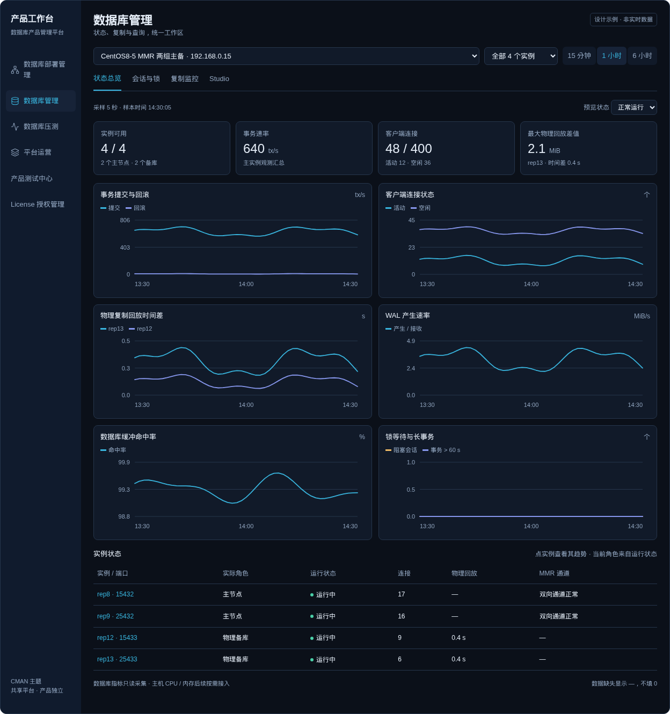
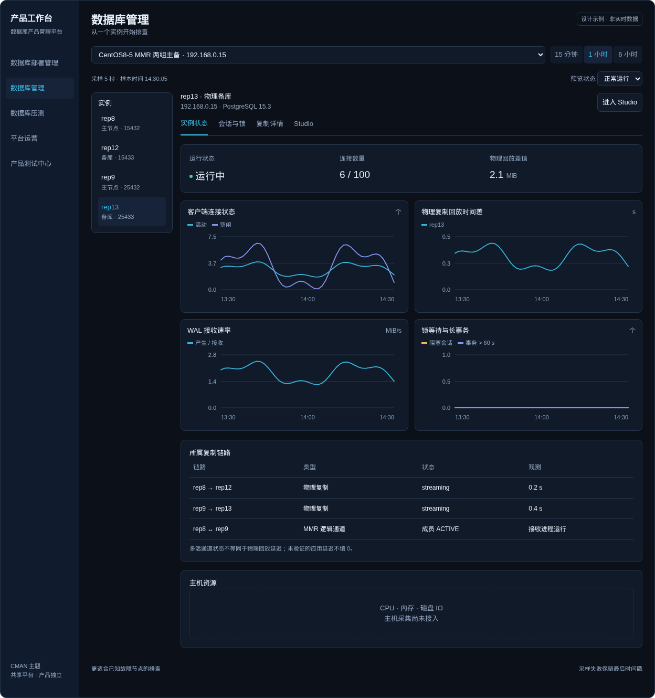
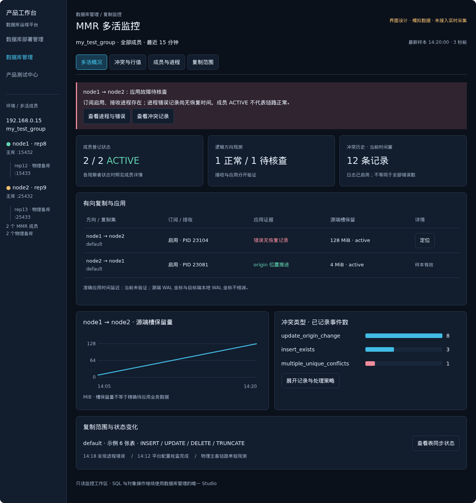
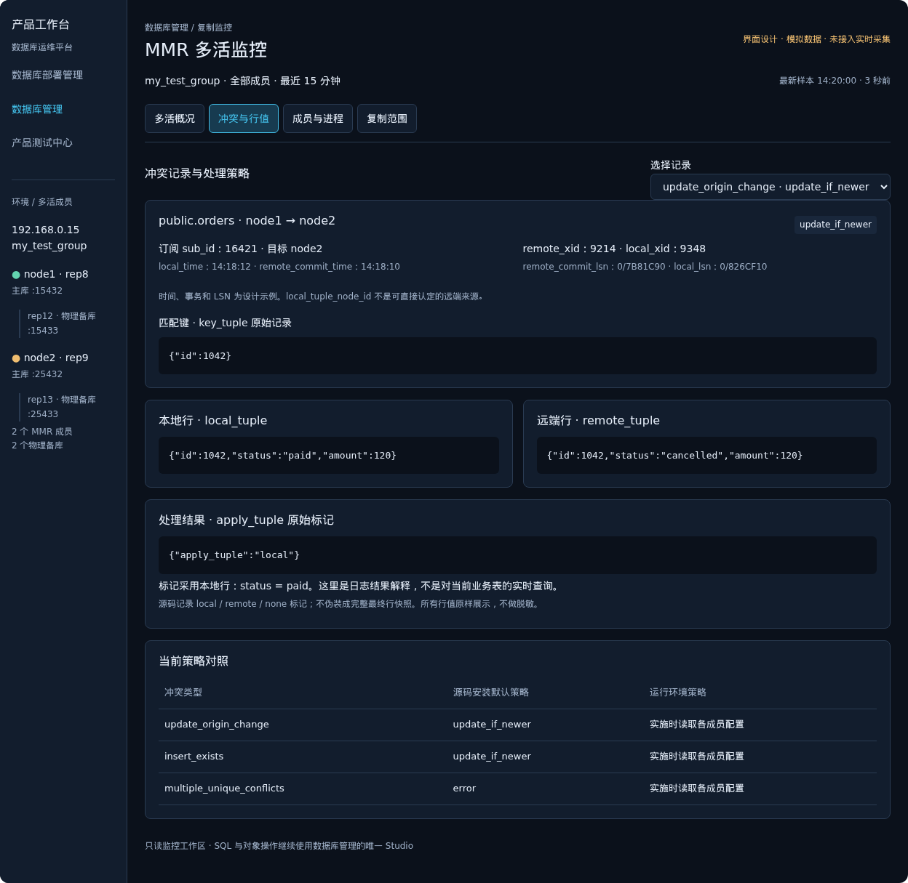
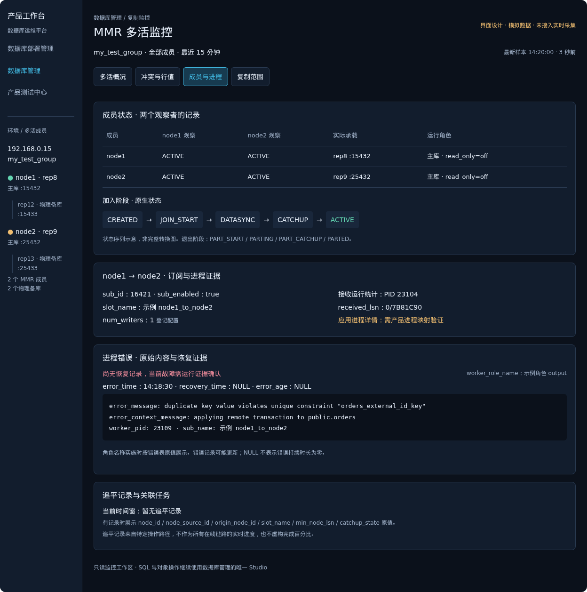
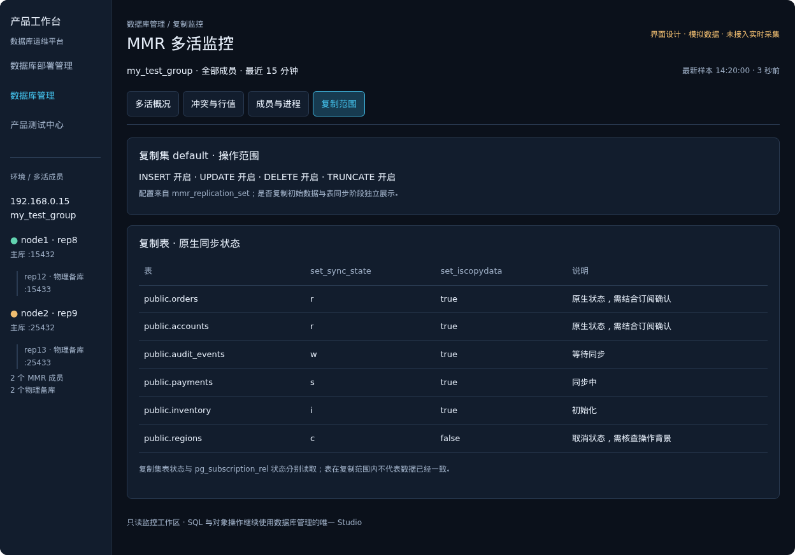

# 数据库状态与监控设计

状态：核心监控、主机资源及按需查询诊断已实现 · 更新于 2026-10-03

当前完整功能清单与使用说明见[数据库监控状态](database-monitoring-status.md)。

## 界面设计图

以下图片为设计示意，使用模拟数据；实际代码已接入真实后台采集，当前实现以专项方案进度为准。沿用平台深色主题，数据库工具保持唯一 Studio。

### 状态总览

### 节点诊断

### 多活监控：源码核对后的新版

四个专题使用同一成员树和时间窗，示例为成员 ACTIVE、订阅启用但应用错误尚无恢复记录。所有状态、行值和时间均为模拟数据，尚未接入实时采集。

#### 多活概况

#### 冲突与原始行值

#### 成员与进程错误

#### 复制范围与表同步

成员名和组名示例不代表运行环境已核验。2 个 MMR 成员与 2 个物理备库分开。冲突行值不做脱敏；apply_tuple 保留源码中的结果标记，不伪造最终行快照。

## 目标与入口

让用户在一个工作区回答：集群是否可用、负载是否异常、哪个实例或链路需要处理、如何进入现有工具排查。

沿用「数据库管理」入口。顶部共用环境、实例、时间范围；内部标签为「状态总览」「会话与锁」「复制监控」「Studio」。默认打开状态总览；SQL、对象和表数据继续使用唯一 Studio。部署页保留配置与操作拓扑，监控页只展示运行状态，不再复制一套可编辑部署画布。

长时间统计回归用例维持默认不执行，不作为监控功能的开发依赖或发布门槛。监控使用只读统计；不通过 pgbench 或持续写入业务表产生监控数据。

## 参考与取舍

- [pgAdmin Dashboard](https://www.pgadmin.org/docs/pgadmin4/latest/tabbed_browser.html)：连接、事务、行操作和 Block I/O 趋势，图表下钻到会话与锁。
- [PMM PostgreSQL Instance Summary](https://docs.percona.com/percona-monitoring-and-management/3/reference/dashboards/dashboard-postgresql-instance-summary.html)：环境／实例分层、连接压力与异常优先展示。
- [pganalyze Query Performance](https://pganalyze.com/docs/query-performance)：从负载趋势定位高耗时 SQL，基于数据库查询统计而非工作台请求计时。

首版借鉴这些组织方式，保留平台主题和产品扩展边界，不要求额外安装一整套外部监控系统。

## 推荐布局：总览优先

1. 工具栏：环境、全部实例／单实例、15 分钟／1 小时／6 小时／24 小时、暂停页面刷新。范围切换保留同一时间窗。
2. 异常摘要：优先列采集失败、复制异常、连接接近上限、锁阻塞；给出实例、样本时间及下钻入口，不用一个含糊的综合健康分数掩盖异常。
3. 四个摘要：实例可用数、观测事务速率、客户端连接占用、最大物理复制位置差值。每项注明聚合范围，缺失显示「—」。
4. 六张首版趋势图：提交／回滚、活动／空闲／idle in transaction、物理复制时间差、WAL 产生速率、数据库缓冲命中率、被阻塞会话／长事务。
5. 实例表：地址端口、实际主备角色、运行状态、连接、复制链路与采集新鲜度。点击实例筛选曲线；点击指标进入对应详情。

备选「节点诊断优先」：左侧实例列表，右侧单实例摘要、趋势和复制链路，便于已知故障节点排查。推荐总览优先作为默认，节点诊断作为下钻状态，不需要另建第二套管理页面。

## 指标定义与来源

以 [PostgreSQL 15 统计视图](https://www.postgresql.org/docs/15/monitoring-stats.html) 为基础，按产品／服务器能力启用，不能把缺少字段或权限当作零值。

| 图表／详情 | 首版来源 | 必须明确的语义 |
| --- | --- | --- |
| 事务速率 | pg_stat_database 的 xact_commit、xact_rollback 差分 | tx/s；累计值除以采样时间差，不把累计计数直接画成速率。MMR 多实例可能包含复制应用及内部事务，集群汇总不宣称是去重后的业务 TPS |
| 连接状态 | pg_stat_activity、max_connections | 按 client backend 分类，排除本服务采集连接；上限是实例级，数据库过滤后的连接不能冒称全部连接占用 |
| 物理复制 | pg_stat_replication、pg_stat_wal_receiver、同一家族的 WAL 位置 | 位置差值与时间差分别呈现；空闲时 replay_lag 可能为 NULL，不能把最后回放时间距现在的值当作持续复制故障 |
| WAL 速率 | 服务器支持的 pg_stat_wal / WAL 位置计数 | MiB/s；按角色展示「产生」或「接收」，不混淆主库产生量与备库业务写入 |
| 缓冲命中率 | pg_stat_database 的 blks_hit、blks_read 差分 | 时间窗内数据库共享缓冲命中比例；不是 OS page cache 命中率，也不是 SQL 性能得分。无访问量显示无样本 |
| 锁与长事务 | pg_locks、pg_blocking_pids、pg_stat_activity | 分开显示锁等待、被阻塞会话、idle in transaction、长事务；下钻显示阻塞者、等待者、事务时间及 SQL |
| 表维护详情 | pg_stat_user_tables、Vacuum 进度视图 | 估计活行／死行、最近 vacuum/analyze、维护进度；较重的表级信息按需读取，避免所有表每 5 秒扫描 |

MMR：由产品监控扩展提供成员 ACTIVE、订阅接收／应用进程、复制槽保留 WAL、冲突增量等可验证指标。逻辑通道健康不能用物理 replay_lag 代替；保留 WAL 不等同于未应用事务积压。没有可靠应用延迟时展示「暂无准确应用延迟」，不制造 0 ms。采集不能调用会修复／写入状态的接口。

Citus：按 Coordinator／Worker 角色展示可用性和节点负载；集群层先呈现节点对比。分片大小和倾斜分析放入按需详情，重查询不进入高频采样。

## 异常到排查的闭环

- 连接升高 → 会话详情 → 活动、空闲、事务空闲分类 → 对应 SQL。
- 锁等待峰值 → 同一时间窗的阻塞关系 → 定位根阻塞会话；取消／终止仍是显式确认操作，不由监控自动执行。
- 物理回放差值升高 → 定位主备链路 → 发送／接收／回放位置、连接状态、样本新鲜度。
- MMR 通道异常 → 成员和订阅状态 → 冲突／错误证据；不自动退出成员、重建订阅或改复制参数。
- 重启／切换／部署变更 → 时间线上标记已有操作事件 → 观察前后趋势，缺少明确关联证据时不声称因果关系。

第一版异常提示只定位问题，不自动修复。阈值按实例／环境设置并需要连续多个样本确认；采集失败独立于数据库故障，不把 SSH 或权限问题直接标红为数据库宕机。

## 数据采集与历史

- 由后台一个采集服务执行，不让每个浏览器标签重复向数据库发送采样 SQL。页面关闭后历史仍可积累；暂停页面刷新不等于停掉后台采集。
- 默认每实例 5 秒，轻量查询合并，连接持久复用；有限并发、连接及语句超时，一个节点失败不拖住整个环境。采集事务只读，使用单独 application_name 和最小可用的监控权限。
- 样本包含实例身份、服务器角色、时间戳、计数器、stats_reset、pg_postmaster_start_time、数据有效性与错误类型。重启、统计重置、角色变化、计数倒退时断开曲线，重新建立速率基线。
- 聚合按指标类型定义：计数／速率求和，比例按分子分母加权，延迟显示各链路及最大值；主机指标按主机采集一次，不能因同机有四个 PG 实例就累计四遍 CPU。
- 历史建议：5 秒原始样本保留 24 小时；分钟聚合保留 7 天，按需扩展。聚合存平均与最大值，不把异常峰值平均掉。
- 时序数据使用独立存储模块，可用标准库 SQLite 做单机索引和保留策略，文件放 data/monitoring/。环境、任务、计划的 FileStore 控制面保持现状；不把监控采样追加到环境配置或任务事件。
- 页面 API 读取采样与聚合结果，不现场串行查询全部实例。查询数量有上限，图表按时间粒度下采样。

## 可视化与产品边界

沿用现有四套主题变量，图表使用同一组件，时间窗、图例、单位、空状态、悬浮提示统一。模块按需加载，避免把图表依赖塞入首页首屏；压测曲线可以复用同一绘图组件，但真实运维指标和压测数据分开标识。

公共层负责采集调度、历史、指标类型、图表和 PostgreSQL 基础指标；FBase/MMR、Citus、fbasecman 的专属状态和统计查询留在产品扩展。新功能不建立另一套环境、权限、部署动作或 SQL 编辑器。

## 分期

**第一期：状态可见。** 总览、六张基础趋势、实例对比、物理／逻辑通道区分、会话锁下钻、采集异常及最近 24 小时历史。复用已有 Studio、会话与锁、复制查询。

**第二期：排查深入。** pg_stat_statements 查询排行／调用率／平均执行耗时，表维护、事件关联、可配置告警，以及 SSH 主机 CPU／内存／磁盘／IO。未启用扩展或主机采集时明确显示未接入。pg_stat_statements 的均值不能伪装为 P95；需要分位数时增加真实分布／采样来源。

**按需扩展。** 标准 Exporter / Prometheus 接入，长期保留和跨平台告警；首版不强制增加这些运行依赖。

## 验收

- 正常、复制延迟、锁阻塞、采集失败、重启／统计重置各有可读状态。
- 切换环境／实例不混数据，单实例与环境聚合口径一致；同一时间窗下钻。
- 多浏览器不重复采集；有缺失样本时出现断点，所有缺失值不填零。
- 权限不足、扩展缺失、主机采集未接入有独立空状态，基础监控仍可用。
- 所有采集只读，不初始化表、不触发压测、不修改配置、不自动杀会话。
- 保持唯一 Studio；桌面与窄屏布局可用，图表均有单位、时间轴和文本状态。

## MMR 多活专项实施方案

多活以源码核对后的[MMR 监控实施方案](mmr-monitoring-design.md)为唯一专项规格，涵盖拓扑、链路证据、冲突原始行字段对比、成员生命周期、错误恢复、复制范围、采集契约与验收。

本页保留通用数据库监控设计与界面图片；多活图片为模拟预览，不代表全部专项交互已经实现。冲突和错误详情不做脱敏。EDB PGD／BDR 是主要交互参考，实际字段与状态语义按 FBase 源码和部署版本核验。

## 通用数据库监控实现进度（2026-10-03）

已增加每实例负载趋势：提交／回滚事务速率、活动／空闲／事务内空闲客户端连接、共享缓冲命中率、主库 WAL 产生／备库 WAL 接收速率、被阻塞客户端会话、超过 60 秒的客户端事务、临时文件写入及死锁速率。即时曲线使用最近原始样本，长周期图使用有效样本均值与峰值。事务计数包含内部、复制与采集事务，不作为去重业务 TPS。

PostgreSQL 基础查询与派生算法位于 backend/platform_app/postgres_monitoring.py，FBase/MMR 产品扩展复用这些查询。统计重置、实例重启、角色或时间线变化、计数倒退、缺失字段以及过长采样间隔重新建立基线；没有访问量时命中率无样本。实例连接和当前数据库连接分列，max_connections 不冒充数据库级上限。

会话与锁支持 pg_blocking_pids 的阻塞关系图及会话原始 SQL／事务／等待事件详情，每次最多 100 个客户端会话和 100 条阻塞关系。图中箭头由阻塞来源指向等待者，PID 0 解释为预备事务，不作为普通后台进程。点击 PID 后以实例、PID 与 backend_start 核对当前身份，不将 PID 复用误作原会话；跳转唯一 Studio 操作，不自动终止会话。

采集统一放在一次只读事务中，用保存点隔离单项失败，减少采集自身的事务计数及网络开销。历史不保存会话 SQL 或原始冲突行，仅最新快照供详情使用。

已对 192.168.0.15 四实例做两轮只读原生统计检查，全部基础接口有效；另在临时 PGDATA 中创建真实行锁等待，确认阻塞者、等待者、SQL 及阻塞会话数，测试结束回滚并停止测试实例，未在现有多活环境制造阻塞。

SSH 主机资源、按需查询排行和表维护专题已接入，见下节。Prometheus 只读出口已接入，外部告警通知尚未接入；准确多活应用时间延迟与并行连续提交水位仍需要产品提供可验证的只读接口。

## 主机资源、查询排行与表维护实现进度（2026-10-03）

页面入口归并为六组：实例概况、负载趋势、复制监控、诊断工作区、主机资源、观测事件。复制与诊断各自包含专题，不把全部功能挤在一条导航上；SQL 操作继续使用唯一 Studio。

主机采集复用部署 SSH user／port／identity_file 配置，通过只读 Linux agent 读取 CPU、IO 等待、MemAvailable、运行时间、负载、设备读写计数及 PGDATA／WAL 文件系统容量。同一 SSH 主机共享 60 秒缓存，四个 PG 实例不重复累计 CPU 或容量；数据按当前环境路径筛选，不返回其他环境的路径列表。CPU 为总核心平均忙碌比例，排除 idle+iowait，IO 等待单列。设备吞吐分别展示，不将物理盘、分区和 dm 层相加；同卷 PGDATA／WAL 容量合并。重启、计数倒退或采样间隔过长重建基线，第一轮 CPU／IO 不填零。各环境共享主机采样，但分钟聚合按环境和实际主机采样时间去重。

查询排行与表维护仅在用户点击后读取，不加入每 15 秒后台采样。查询排行查找实际 pg_stat_statements 扩展 schema，使用限定对象名，展示当前数据库累计执行耗时前 30 条、调用数、均值、缓存及临时块统计和重置信息；均值不伪装为 P95。扩展未安装、字段或权限不支持时明确提示，监控不会自动 CREATE EXTENSION、修改预加载或重启数据库。

表维护读取死元组估计前 30 张表、活／死元组估计、最近 Vacuum／Analyze 时间及总大小，并显示正在执行的 Vacuum 进度。死元组估计不标为膨胀率，查询大小有语句超时限制；页面不执行 Vacuum 或其他写操作。

真实环境只读验证：192.168.0.15 两轮主机采集、CPU／内存／设备 IO 及容量读取成功，同机四实例只展示一个共享文件系统；表维护可读，pg_stat_statements 未安装，因此查询排行显示未安装。隔离临时数据库验证了未安装时不自动安装，以及扩展安装在自定义 stats schema 后可读取排行和重置信息。

本期已增加 Prometheus 缓存出口，未增加外部通知、主动一致性检查，也未承诺缺少内核接口的并行连续水位或精确多活应用时间延迟。

## 主机压力告警与告警工作区（2026-10-03）

新增每环境 CPU 忙碌率、内存使用率和文件系统可用空间阈值，默认分别为 85%、90% 和可用空间低于 10%。CPU 和内存需连续独立主机样本超过阈值才触发；磁盘零可用空间立即严重告警。主机缓存约 60 秒更新一次，同一缓存不会在数据库 15 秒采样中重复增加确认计数。CPU 是相邻主机样本间的平均忙碌率，不是瞬时值。

CPU／内存恢复需降到阈值的 80% 以下，磁盘恢复需达到可用空间阈值的 125%，并连续确认；SSH 失败、指标缺失、资源身份或系统启动周期变化时保留未知或重建确认窗口，不用零值解除告警。

规则折叠展示，可保存或放弃修改。告警列表支持复制槽、链路、成员、主机分类和活跃／待确认／未知／恢复状态筛选。未知状态标明最后有效证据；整个数据库缓存超过一分钟时拓扑连接证据转为待核查，旧告警不冒充实时结果。

部署配置内容变化也参与采样身份指纹，避免 SSH 映射或参数变化后沿用旧确认窗口。新增告警使用受控数据验证，未在真实主机制造 CPU 压力或填满磁盘，未自动修改主机与数据库。

稳定性补充：页面使用独立计时更新缓存新鲜度，即使连续请求失败且错误文本相同，也会将过期拓扑和旧告警转为未知；主机 CPU／IO 间隔使用同一 boot_id 下的 uptime，而非可能跳变的系统墙钟。

## 连接与事务告警补充（2026-10-03）

新增实例客户端连接占比、被阻塞客户端会话数和最长客户端事务时长告警，默认阈值分别为 80%、1 个、180 秒。按数据库独立采样连续确认，恢复需低于阈值的 80% 并连续确认；实例重启、统计基线变化或长采样间隔重建窗口。连接上限仍为实例 max_connections，包含保留连接，不宣称达到占比即完全耗尽。

事务详情因权限不可见时，长事务时长和数量标记未知，不将 NULL 当成没有长事务；只有查询有效且没有隐藏客户端时，空最大时长才解释为 0。新告警归入「连接与事务」类别，仍无自动取消、终止或参数修改。

隔离真实验收已覆盖：启用后台采集、一次采集入库、接口读取快照与历史、重复 tick 合并、停止后不继续采样且保留历史。测试使用临时 PGDATA 和控制面目录，没有启用或修改实际环境的监控设置。
