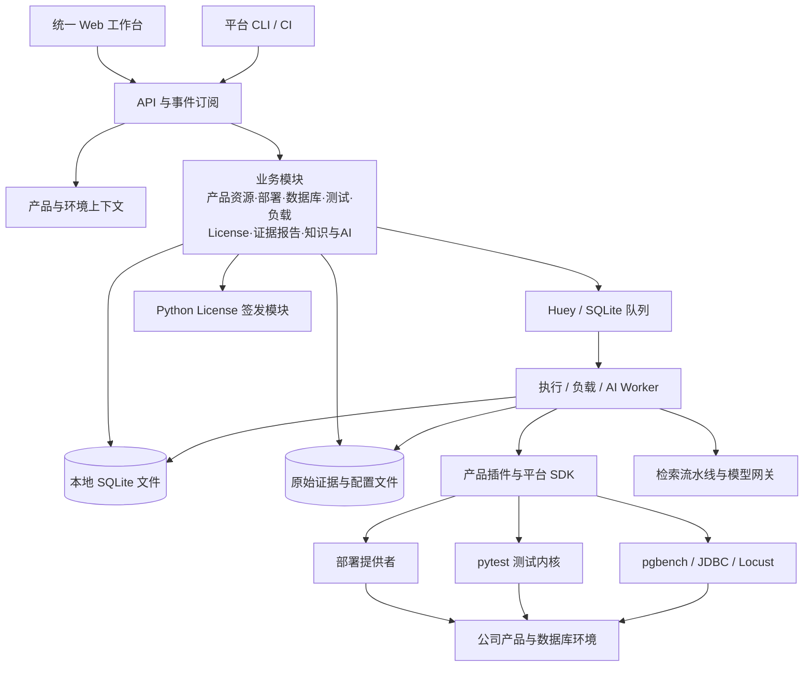
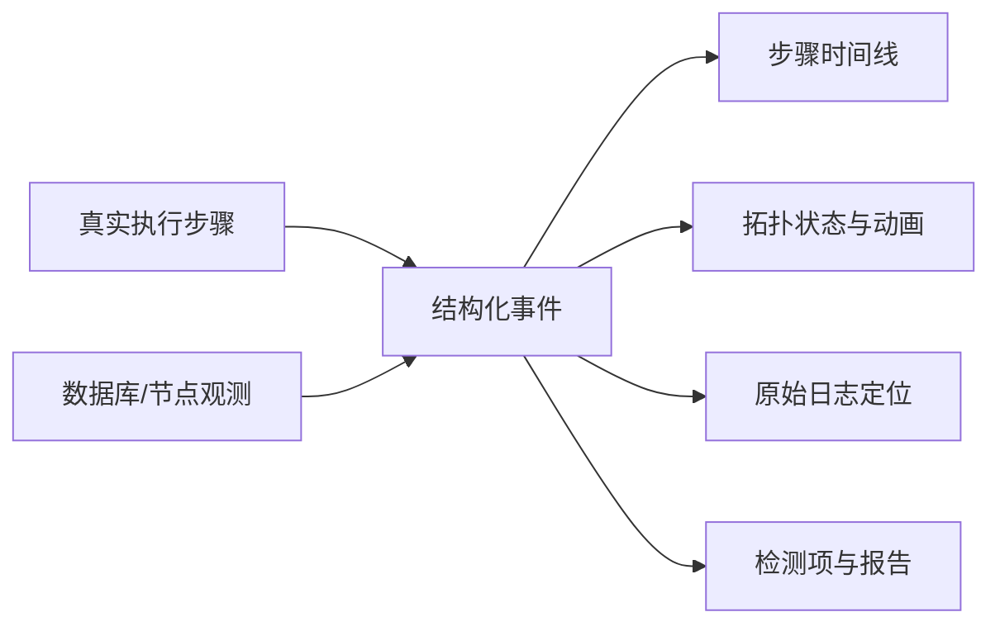
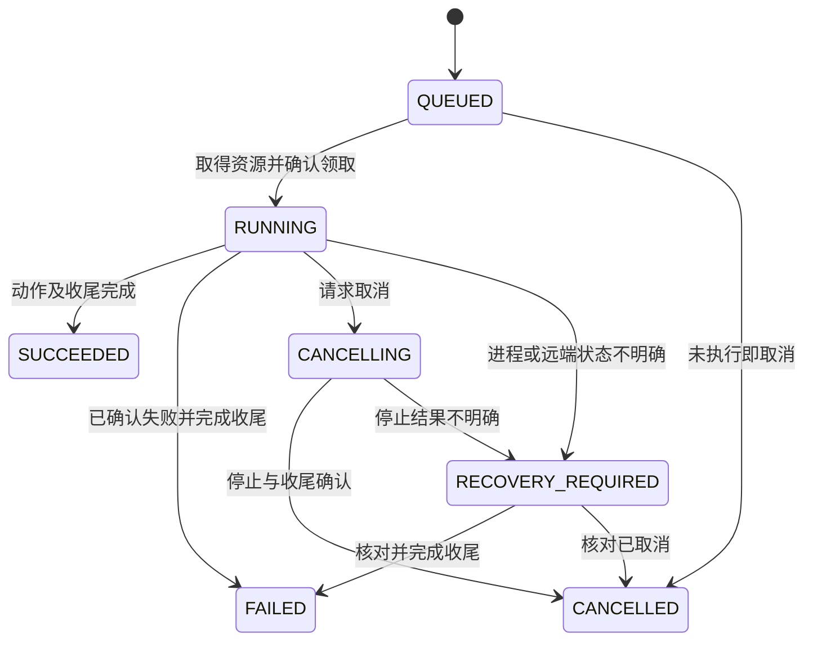

# 平台设计文档

版本:v1 · 2026-09-25。本文档整合并取代原 architecture.md、capability-roadmap.md、decisions.md、contracts.md、frontend-and-animation.md、dependencies.md 六份文档;实施状态、未完成项与历史教训见 [progress.md](progress.md)。

## 阅读指引

| 部分 | 内容 |
| --- | --- |
| 第一部分 | 总体架构:目标架构、模块边界、开源选型、数据模型与部署形态(v2 设计总纲,2026-09-23) |
| 第二部分 | 能力升级路线图:九个能力域方案、产品解耦协议、P1–P7 实施阶段与验收(2026-09-25) |
| 第三部分 | 关键设计决策:部署归属、迁移边界、结果与证据、License、运行形态、失败分类 |
| 第四部分 | 接口与扩展契约:产品/提供者注册、动作协议、任务状态机、事件与判定规则 |
| 第五部分 | 前端与动画设计:视觉风格、页面布局、事件到画面的实现与交互验收 |
| 第六部分 | 新增依赖清单:分阶段依赖、锁定版本、安装命令与验证步骤(2026-09-25 实查) |

各部分内部章节编号自成体系;文中"第一/二/…部分"即指本文档对应部分。

---

# 第一部分:总体架构(v2 设计总纲)


版本：架构设计 v2 · 2026-09-23

## 1. 设计目标与已经确定的约束

建设面向公司全部产品的内部公共平台，提供产品与环境管理、图形化部署、数据库管理、License 签发、自动化测试、压测、稳定性测试、执行动画、原始证据查看、知识库、AI 失败诊断与代码问答。

平台从零独立设计，技术栈、目录结构、接口和执行内核不受现有自动化框架约束。成熟开源框架、组件和完整子系统均可采用。现有仓库用于确认业务需求、复用经过验证的领域实现和迁移测试资产；其现有模块划分不成为新平台的边界。

已经确定的约束：

- 不引入测试 `run_id`、运行批次实体和历史测试归档中心；按产品、环境、测试目标保存当前结果。
- 架构优先考虑职责清晰、产品接入简单、页面一致、原始证据可追溯。
- Web 覆盖完整操作闭环：选择产品和环境 → 配置操作 → 查看进度与证据 → 分析结果 → 执行下一步。
- 产品事实、自动化判定、AI 推断分别表达；AI 不修改确定性的测试结论。
- 可以使用开源项目作为主体能力，不要求逐项自研。
- 平台主要供公司内部使用，首版以功能、交互和部署便利为优先，不建设复杂权限、SSO、多租户或审批中心。
- 新平台业务代码采用 Python 与 TypeScript；License 用 Python 重写，原 C 程序只用于格式研究和兼容性对照。
- License 首版仅支持填写参数、生成和下载，不移植旧后台服务，不建设申请队列、审批、签发历史或在线密钥管理。
- 首版不依赖独立数据库服务或 Redis：元数据使用内嵌 SQLite，证据使用本地文件，后台任务使用本机执行进程。
- 本文是目标架构与实施路线；当前只完成源码和文档调研，没有部署平台或执行环境变更。

后台队列仍需要内部任务主键来定位取消、超时、恢复和幂等提交。该主键只服务调度，不成为测试目录层级或产品界面的测试批次，不用于建立测试历史。产品版本和知识文档版本独立保留；License 文件内部编号按文件格式生成，不建立申请业务编号。

## 2. 现有资产与可复用内容

以下结论经过当前仓库源码核对；它们用于说明资产价值，不限制新设计。

| 资产 | 已确认能力 | 新平台可复用的部分 | 新平台应重新设计的部分 |
| --- | --- | --- | --- |
| `fd_licenser` | C 语言生成工具、加密密钥存储、多产品授权；另有后台申请处理服务 | License 文件规范、产品授权规则、兼容性样本 | 仅用 Python 重写生成能力，不移植后台服务 |
| `postgresql_for_fbase_dev` | PostgreSQL 15.15 基线源码；存在 `fbase_mac_dev`、`fdd_mmr_dev` 等扩展代码及技术文档 | 源码、产品版本信息、扩展元数据、原生测试和技术资料 | 产品目录、源代码索引、统一数据库管理界面 |
| `fbase_regress` | MAC/MMR 用例、fixture、SQL/命令/等待步骤、环境标记、逐例证据、BLOCKED 语义 | 用例预期、fixture 业务逻辑、断言和日志采集方法 | 新测试 SDK、统一结果模型、Web 联动与配置组织 |
| `pgcluster` | YAML 拓扑、单实例、流复制、逻辑复制、Citus、MMR；启停、检查、切换和 rejoin | 拓扑校验、部署依赖、SQL 生成、节点生命周期与检查逻辑 | 平台部署计划接口、结构化事件、统一资源归属与图形编辑 |
| `fbasecman_regress_v2` | 路由/缓存/高可用等套件、pgbench/JDBC 负载、常稳 supervisor、逐步证据、Web 原型 | 产品测试与负载、诊断经验、报告规则、拓扑场景 | 新平台前后端、统一执行与任务管理、跨产品抽象 |

需要区别三个概念：**产品**是公司交付的业务对象；**产品模块**是数据库内核、MMR、MAC、代理等能力；**工具提供者**是部署器、签发器、压测器、测试执行器。`pgcluster` 和 `pytest` 是工具提供者，不需要被当成数据库产品。

企业版产品与 MAC/MMR 测试的覆盖关系需要在产品目录中明确。发现了某个扩展测试，不等于已经覆盖整个企业版。

源码核对还发现：

- `pgcluster` 已有可调用的 `ConfigModel`、`Runtime` 和进度回调，CLI 没有统一 JSON 事件协议。
- 两个现有测试仓库都使用顶层 `framework` 包。若迁移阶段临时运行旧框架，应隔离进程与依赖，避免放进同一解释器导入。
- `fbase_regress` 默认覆盖当前结果；新平台不启用其 `--enable-run-id`。
- 现有 fbasecman 常稳工具有自己的 supervisor 和恢复逻辑；接入时平台不能再启动第二个负载管理者。
- 旧 License 后台服务依赖 PostgreSQL 申请表且启动验证涉及固定的 v1.1 密钥，这部分不迁移。新 Python 生成模块读取明确配置的密钥；已发布产品的文件兼容性单独验收。
- `/home/postgres/fly_dev/pgcluster` 与数据库仓库下的 `pgcluster` 路径同时存在。本文以用户指定的前者为资产来源，后续绑定工具时记录明确仓库与版本。

## 3. 总体架构

推荐采用 **单机应用 + 模块化后端 + 本机任务 Worker + 产品插件 + 共享 Web 组件**。

一个平台后端统一提供业务 API，各领域模块具有明确数据和接口边界。部署、测试、负载和较长的 AI/索引操作在本机 Worker 中执行。License 是同一代码库内按请求调用的 Python 模块，生成后直接返回下载文件。一个启动入口管理 API 与后台进程，无需单独安装数据库、消息中间件或签发服务。



平台状态文件保存在控制机，独立于被管理和测试的数据库。SQLite 是内嵌数据库，不需要数据库服务；Web 刷新或关闭不影响后台操作。

### 3.1 模块职责

| 模块 | 拥有的业务与数据 | 不越过的边界 |
| --- | --- | --- |
| 产品与资源目录 | 产品、模块、版本、安装包、主机、环境、连接、资源归属 | 不执行具体数据库命令 |
| 部署管理 | 拓扑定义、校验、部署计划、节点生命周期、健康状态 | 产品特有 SQL 和命令由提供者实现 |
| 数据库管理 | 连接、对象浏览、SQL 会话、参数、会话/锁/复制状态 | 不复用测试 fixture 管理用户 SQL 会话 |
| 测试中心 | 用例目录、选择条件、测试计划、当前结果、资源需求 | 测试内核使用 pytest，产品判断由用例定义 |
| 压测与稳定性 | 负载方案、准备/预热/运行/收尾、真实指标、阈值 | 不把所有耗时脚本都视为普通单测 |
| License 生成 | 产品授权表单、参数校验、生成、下载 | 普通请求调用 Python 生成模块，不接后台申请队列 |
| 任务与资源协调 | 队列、占用、取消、超时、恢复、操作审计 | 不保存一套与产品提供者相冲突的实际节点状态 |
| 证据与报告 | 原始日志、配置快照、步骤事件、模板、导出 | 不从展示文字重新推断测试事实 |
| 知识与代码 | 文档、版本、源码仓库、符号索引、来源 | 不把当前工作区当成所有产品的同一个版本 |
| AI 服务 | 检索、失败诊断、代码问答、报告分析文案 | 不直接承担部署、签发、修复和测试判定 |

业务模块通过服务接口调用；HTTP handler 和前端不直接拼装 SSH 命令或读写产品源码目录。

## 4. 开源选型与自研边界

推荐选型是一个一致的组合；不是把表中的所有候选同时安装。

| 领域 | 推荐方案 | 自研内容 |
| --- | --- | --- |
| Web 应用 | React + TypeScript + Vite + Ant Design；TanStack Query 管理服务端状态 | 产品/环境工作台、业务页面与组件组合 |
| 后端 API | Python 3.12 + FastAPI + Pydantic + SQLAlchemy + Alembic | 产品领域模型、能力协议、业务服务 |
| 平台存储 | SQLite 元数据文件 + 本地配置、日志与报告 | schema 迁移、当前结果发布、文件引用与备份 |
| 后台执行 | Huey 的 SqliteHuey + 本机进程监管 | 资源占用、取消、异常恢复与结果核对 |
| License | Python；cryptography 的 Ed25519、argon2-cffi、PyNaCl 等成熟密码库 | 授权规则、兼容格式、读取已配置的密钥并生成文件 |
| 自动化测试 | pytest + 平台 pytest 插件；需要时采用 pytest-xdist | 数据库 fixture、证据 SDK、产品用例和资源分配 |
| 数据库访问 | Psycopg 3 的 PostgreSQL 驱动；其他协议作为独立提供者 | 元数据、管理操作、产品扩展能力 |
| 图形拓扑 | React Flow | 数据库节点、复制边、动作与状态变化的表现 |
| SQL/代码/配置 | Monaco Editor | 产品配置语法、诊断标记、受控保存和差异确认 |
| 交互终端 | xterm.js | 会话、命令进度、连接生命周期 |
| 日志检索视图 | 虚拟列表 + 后端分页、搜索与级别解析 | 原文定位、上下文、证据链接、产品日志解析器 |
| 压测 | 优先 pgbench/JDBC，接口或混合业务负载接入 Locust | 场景参数、指标归一化、数据清理和阈值策略 |
| 报告 | 统一结果模型 + Jinja2 模板；Allure 作为可选导出/报告提供者 | 公司报告结构、证据核对和覆盖说明 |
| 知识与 AI | 本地文件/SQLite 元数据、关键词与符号检索；复杂流水线再采用 Haystack | 产品/版本过滤、证据组织、模型接口、诊断和评估 |
| 观测 | 首版标准指标文件与 ECharts；持续基础设施监控接入 Prometheus | 产品采集项、负载曲线和诊断关联 |
| 内部访问 | 首版同一内部信任域；按需要启用简单本地登录 | 参数校验、目标确认、敏感字段不进入日志 |

平台首版没有独立数据库服务、Redis 或向量数据库服务。选用队列框架仍需处理任务重复、进程异常与环境收尾，不能把“消息已执行”直接当成业务动作已完成。

### 4.1 为什么不直接套一个现成大平台

| 项目 | 值得采用/借鉴的能力 | 本方案的位置 |
| --- | --- | --- |
| Backstage | 产品目录、插件化入口、文档与研发资源整合 | 可作为公司已有研发门户的外层入口；当前主工作台选择独立 React 应用，以承载大量数据库实时操作 |
| pgAdmin / CloudBeaver | 对象树、SQL 编辑、数据库属性与数据管理 | 可以先部署为完整数据库管理子系统，通过统一导航进入；能否共享登录、连接和嵌入页面需核对所选版本与协议 |
| Allure Report | 测试步骤、附件、报告组织 | 采用报告思想与结果导出；公司模板和实时动画仍消费平台证据模型 |
| AWX | 资产、操作模板、远程任务管理 | 作为架构参考；本次读取官方仓库说明存在大规模重构与发布暂停提示，暂不作为首版强依赖 |
| Huey | 支持 SQLite 的轻量 Python 任务队列 | 首版任务提供者，随应用启动一个本机 consumer |
| Celery / Temporal | 分布式任务或持久多阶段工作流 | 留作未来多机协作的候选；首版不安装 |
| Dify | 可视化 AI 工作流和知识应用 | 可选独立 AI 应用提供者；其许可证含工作区多租户及前端品牌附加条款，不能按无附加条件的 Apache 2.0 假设使用 |
| Haystack | 可组合检索、模型与工具流水线 | 复杂 AI 场景的可选 Python 库；简单问答先用产品范围内检索与模型 HTTP 接口 |

平台首版建设轻量 SQL 面板，用于节点检查、测试上下文和跨页面联动。需要完整对象编辑时，可另外启用 pgAdmin/CloudBeaver，并验证页面跳转和连接交接；这些子系统不成为基础安装依赖。

自研重点集中在公司产品知识、产品能力协议、跨能力操作流程、证据模型和用户工作台。调度队列、测试发现、代码编辑器、拓扑画布、数据库驱动和检索基础设施采用开源实现。

### 4.2 整个平台的语言选择

推荐以 **Python 3.12 + TypeScript** 作为两种业务开发语言。API、部署、测试 SDK、压测编排、License、知识库和 AI 使用 Python；浏览器界面使用 TypeScript。

| 方案 | 对本平台的适配性 | 选择 |
| --- | --- | --- |
| Python 后端 + TypeScript 前端 | pytest、数据库驱动、运维工具和 AI 生态可直接使用，前端组件生态完整 | 首选 |
| 全栈 TypeScript | 前后端类型体系一致，但数据库测试与部分 AI 工具仍需 Python 进程 | 团队主要使用 JS/TS 时可考虑，当前不优先 |
| Java 后端 + TypeScript 前端 | 企业管理和数据库生态成熟，通常仍需 Python 测试/AI 子系统 | 当前会增加语言与服务维护面 |
| Go 后端 + TypeScript 前端 | 单二进制部署方便，适合执行 Agent；测试与 AI 领域需更多跨语言集成 | 未来出现明确 Agent 性能或分发需求再评估 |

Python 的并发主要通过异步 I/O 和受控子进程实现；数据库与压测工作由目标数据库、pgbench/JDBC 等执行，吞吐不应受平台 API 进程承担重计算的影响。CPU 密集分析可以放到独立 Worker，不预先增加另一门后端语言。

使用类型标注、Pydantic、静态类型检查、Ruff、pytest 和锁定的依赖来保证工程质量。License 业务也以 Python 编写，密码原语由成熟库提供；这些库可能带原生实现，平台团队无需维护自有 C 签发代码。

当前旧 Web 使用原生 HTML/CSS/JavaScript，Three.js 和 GSAP 负责部分图形效果。React + TypeScript 是新平台目标技术栈，尚未开始前端实现。

## 5. 产品插件与工具提供者

### 5.1 产品不是一个写满条件分支的枚举

产品声明由元数据、能力绑定、测试包、配置 schema 和可选前端模块组成。能力是可选接口，避免所有产品实现一个庞大基类。

```yaml
id: fbase-enterprise
title: FBase 企业版
plugin_api: v1
capabilities:
  deployment: fbase-cluster
  database: postgresql-compatible
  tests: fbase-enterprise-tests
  load: postgres-workloads
  stability: database-soak
  config: postgres-config
  license: fd-license
  knowledge: product-knowledge
  source: fbase-source
```

示例中的 ID 是新平台设计名称，实施时与正式产品目录和 License 产品编码建立映射，不假定源码目录名就是授权产品名。

基础接口建议：

| 接口 | 主要方法/返回对象 |
| --- | --- |
| `DeploymentProvider` | `validate`、`plan`、`apply`、`inspect`、`lifecycle` → 计划/拓扑/结构化事件 |
| `DatabaseProvider` | `connect`、`catalog`、`execute`、`cancel`、`sessions`、`replication` → 元数据/查询结果 |
| `TestProvider` | `discover`、`requirements`、`execute`、`cancel` → 用例定义/结果/证据 |
| `WorkloadProvider` | `prepare`、`start`、`observe`、`stop`、`cleanup` → 指标/事件/结果 |
| `ConfigProvider` | `list`、`read`、`validate`、`diff`、`apply` → 原文/诊断/变更效果 |
| `LicenseProvider` | `product_options`、`validate_input`、`generate` → 下载文件；不提供任务/申请/审批接口 |
| `EvidenceCollector` | `collect`、`resolve` → 有来源的日志、配置、系统信息与 core 引用 |
| `KnowledgeConnector` | `list_sources`、`fetch`、`revision` → 文档/源码与版本信息 |

每个动作声明输入 schema、输出 schema、需要的资源、是否修改状态、超时、取消方式和允许的重试条件。重试策略按动作指定；部署、SQL 写入和签发不能采用统一的“失败自动重试”。

新产品的接入目标：增加产品声明、能力实现或绑定、测试包和必要页面组件；不修改通用调度器、日志组件和报告渲染器。前后端插件作为受控发布包注册，首版不开放上传任意代码并在线执行。

### 5.2 现有代码的迁移路线

新测试统一使用 pytest 和平台 SDK。业务用例迁移时保留原有前置条件、操作序列、检测项和清理语义。复杂用例继续用 Python 编写；图形界面负责选择、参数化和观察，不强迫把全部数据库逻辑改成可视化 DSL。

`pgcluster` 的有效领域实现可整理为新的部署提供者，也可先由独立桥接进程调用其库。桥接不是长期架构前提，清晰的计划与事件接口完成后可以直接迁移实现。

License 用 Python 重新实现，通过 `LicenseProvider` 暴露业务接口；旧 C 程序只参与开发期兼容性对照，不作为新平台运行依赖。数据库源码进入版本和知识体系，不直接被控制面导入或编译。需要构建产品时再增加独立构建能力。

旧测试框架的命令行适配仅是可选迁移通道；新用例直接进入新 SDK。每个临时适配器记录负责产品、输出转换方式和退出条件，防止长期维护两套相同能力。

## 6. 核心数据模型与当前结果存储

| 对象 | 最小关键字段 |
| --- | --- |
| Product / Module | 稳定产品编码、模块、负责人、能力声明、License 编码映射 |
| ProductVersion / Artifact | 产品版本、源码 revision、安装包 URI、校验和、支持平台 |
| Environment | 产品组合、拓扑、用途、资源提供者、配置引用、实际观测时间 |
| Resource | 主机身份、实例、端口、PGDATA、环境归属、管理者 |
| Connection | 产品、环境、数据库地址、认证引用、会话设置 |
| TestCase | 稳定 target、产品与版本要求、标签、资源需求、步骤和文档来源 |
| TestSelection | 用户保存的用例集合与参数方案；用于反复选择，不是执行批次 |
| LatestResult | 产品 + 环境 + 用例 + 参数方案键、判定、时间、版本/配置摘要、证据引用 |
| Operation | 内部任务主键、动作、操作者、资源占用、状态、取消标志、Worker 心跳 |
| EvidenceRef | 逻辑附件名、存储位置、编码、大小、内容摘要、行/字节范围、采集来源 |
| LicenseInput | 请求内的产品授权项、MAC、用途、有效期、密钥版本；不建立申请表 |
| KnowledgeDocument | 产品/版本、来源、revision、章节和分块 |
| SourceRepository | 仓库、分支或 commit、子模块、索引范围、工作区变更摘要 |
| ReportTemplate | 模板标识、版本、输入 schema、章节规则、输出格式 |
| Diagnosis | 目标证据摘要、模型/提示版本、结论、证据引用、未确认事项、人工反馈 |

测试结果使用固定位置，例如：

```text
data/latest/<product>/<environment>/<suite>/<case>/<profile>/
├── result.json
├── events.jsonl
├── report.txt
├── report.html
├── topology.json
├── config/
└── logs/
```

目录不含 `run_id`。同一目标重跑覆盖当前结果；参数方案是稳定的配置名称或规范化参数键，不按每次执行生成。

重跑时先取得目标写锁，并把该目标标记为执行中，使旧结果不参与本次判定。新文件在临时工作区写入，通过完整性校验后切换当前结果。旧结果只作为切换期间的读者保护，完成后可清理，不形成历史列表。后台任务记录按有限保留期清理，操作审计保留操作者、对象、动作和结论。

当前结果覆盖会使旧 AI 引用失效。诊断必须绑定证据内容摘要；生成过程中使用冻结输入，完成前再次核对。若结果已经变化，显示“证据已更新，需重新诊断”，不能把上一次分析挂到新结果上。

追加中的日志使用文件身份和已提交字节范围定位；关闭后计算完整摘要。冻结 AI 输入只占用证据副本，不继续占用数据库环境的测试锁。

## 7. 任务执行与资源协调

### 7.1 执行链路

1. 用户在某产品和环境下提交动作及参数。
2. API 校验输入和提供者兼容性，生成可核对的资源与操作计划。
3. 同一 SQLite 事务写入任务和 outbox；本机发布器将任务送入 SqliteHuey，避免提交成功但消息丢失。
4. Worker 领取任务，事务性占用实际资源，校验配置与计划仍一致。
5. 在受控进程中执行提供者，持续采集结构化事件、原始 stdout/stderr 和节点观测。
6. 执行正常清理或取消收尾，核对资源状态与产物，更新业务结论。
7. 按配置生成报告或启动 AI 诊断，完成后发布当前结果。

Huey 负责排队与触发，平台 SQLite 任务表是业务任务状态的权威来源。队列文件和业务状态文件分开，outbox 解决两者不能一次提交的问题。重复投递先核对任务状态、执行进程和资源占用，再决定是否执行。启动时核对未结束任务，不能因为队列中已经没有消息就认为任务已完成。

平台在控制机本地磁盘使用 SQLite WAL、短事务和有限的 busy timeout；领取任务、资源占用通过短写事务完成，不在事务中等待 SSH/SQL。API 和 Worker 可并行读取，写入保持短小。数据目录不放在多机共享网络文件系统上。

### 7.2 长任务、取消与恢复

Worker 以心跳报告控制状态；长时间压测由可识别的进程组或执行端 supervisor 管理。排队控制与实际长进程分别记录，长任务不能占满所有短任务执行槽。界面关闭不发送取消。

取消依次执行：标记取消 → 提供者协作停止 → 清理测试资源 → 核对实例状态 → 发布取消结果。强制停止后无法确认远端状态时，环境保持“待恢复”，禁止自动重派相同修改动作。

Worker 心跳过期不等于原进程已经死亡。必须核对 PID/进程身份、远端操作和资源占用，才能释放锁。自动重试仅适用于明确可重入的步骤，不自动重新执行整个部署、签发或破坏性测试。

后台任务状态采用 `QUEUED / RUNNING / CANCELLING / SUCCEEDED / FAILED / CANCELLED / RECOVERY_REQUIRED`。测试判定独立采用 `PASS / FAIL / BLOCKED / SKIPPED / ERROR / CANCELLED`；前置条件不足、用例断言失败和执行器异常分别呈现。

### 7.3 环境归属

资源占用按真实主机、PGDATA、端口及环境关系归一化，不能只按 YAML 文件名或套件名加锁。一个环境同时被两个产品引用时仍是同一批资源。

新环境优先由统一部署提供者管理。迁移环境保留原管理者和 marker，跨工具接管需要显式登记、核对和移交。不能自动添加或替换 marker，让多个工具都认为自己拥有清理权限。

读取状态可共享；部署、故障注入、重建和冲突的压力任务取得独占占用。独立环境可并发执行。同一环境上的回归和压测默认互斥，只有明确的组合场景才共同编排。

通过旧 CLI 在平台之外启动的进程仍可能绕开平台锁；迁移期间页面展示这一控制边界，发现占用时禁止继续修改，不能宣称统一锁已经覆盖所有外部操作。

## 8. Web 信息架构与日常操作

顶部保留全局产品选择器、环境选择器、全局搜索和当前任务入口。产品可以组合多个模块，例如数据库内核 + MMR + 代理；页面始终显示当前操作对象。

建议导航：

```text
工作台
产品与环境
  产品目录 / 版本与安装包 / 主机与连接 / 环境拓扑
部署与数据库
  部署向导 / 节点管理 / SQL 工作台 / 对象与参数 / 复制与会话
测试与负载
  用例目录 / 执行与动画 / 压测 / 稳定性 / 当前报告
License 生成
知识与 AI
  产品知识库 / 代码浏览与问答 / 失败诊断 / 报告模板
平台设置
  平台配置 / 工具提供者 / 模型配置 / 数据备份
```

一级导航按工作目的组织，产品能力决定页内功能。某产品不支持 SQL 时不出现 SQL 操作；前置条件不满足时明确显示原因。全局入口始终可见，避免每切换产品就失去定位。

工作台展示当前环境健康、正在执行的任务、当前失败项、License 生成入口和常用操作。主要页面可以通过 URL 直接打开；刷新保留产品、环境、筛选和选中的步骤。任务队列是当前工作列表，不建设测试批次历史页。

### 8.1 图形化部署

用户选择产品版本 → 拓扑模板 → 主机/端口/目录 → 参数和 License → 校验 → 操作计划 → 执行。

图形拓扑和 YAML 表单共用一个规范化模型。后端校验节点引用、依赖、端口、安装版本和必要扩展；前端只辅助提前反馈。高级配置无法转换为图形字段时保留原文并说明，不静默丢弃。

生成计划是无副作用计算，不通过尝试部署来推测影响。计划记录配置摘要和目标资源，执行前再次校验；配置原文的注释与未知扩展字段使用可往返的解析方式保留。

计划包含将创建/修改的实例、数据目录、复制关系、服务状态变化及准备失败的节点。执行时展示具体阶段与节点状态，失败可直接进入该步骤的命令、日志和配置。恢复入口由提供者声明，不能对未知失败统一显示“重试部署”。

### 8.2 数据库管理

平台轻量工作台提供连接、库/schema/表树、SQL 编辑、结果表、原始输出、取消查询、会话与锁、参数和复制状态。PostgreSQL 兼容协议能力与 FBase 特有管理动作分别扩展。

一次用户 SQL 只执行一次；结果表、命令标签和原始展示来自同一次结果，不能为了 CSV 或格式化再次执行 SQL。会话模型明确自动提交、事务、超时、取消及结果行数限制。

pgAdmin/CloudBeaver 可选承担完整对象编辑和高级数据库管理。平台跳转时传递连接引用，不在 URL 中传数据库密码。基础部署使用平台自带 SQL 面板，外部工作台按需启用。

### 8.3 原始日志与配置

| 日志视图 | 配置与代码视图 |
| --- | --- |
| 保留原始文件、行号、时间、来源节点和命令 | 展示原始路径、来源节点、采集时间与文件摘要 |
| ERROR/FATAL/PANIC/WARN 分级高亮 | SQL、YAML、JSON、INI、PostgreSQL conf 语法高亮 |
| 普通搜索、正则、级别/节点/时间过滤 | fbasecman 配置语言使用专用 tokenizer/校验器 |
| 命中项前后上下文、上一处/下一处、完整下载 | 搜索、跳行、折叠、当前与候选配置对比 |
| 追加跟随、暂停滚动、日志轮转提示 | 区分已落盘配置与实际运行参数，显示 reload/restart 要求 |
| 多行异常堆栈作为关联记录查看 | 修改前校验、显示差异，保存时核对原内容摘要 |

大型日志由后端按字节/行窗口读取和搜索，前端虚拟列表渲染；设置查询时间、扫描量与返回条数限制。日志高亮只是显示能力，不意味着出现一次 ERROR 就判用例失败；预期错误仍由断言解释。

xterm.js 用于真实终端/ANSI 输出；日志检索保留独立数据模型。原始文件保留原编码，解码用于展示，不能把解码替换后的文本称为字节级原件。

### 8.4 测试动画与证据联动

一屏组织：左侧步骤，中间拓扑，右侧当前操作/检测项，下方原始日志。支持实时跟随、暂停、逐步播放、拖动时间线、定位失败步骤和倍速回放当前结果。



动画区分“正在执行停止命令”“已经观测到节点停止”“预期发生切换”。缺失观测显示未知；不能根据标题或动作意图把节点画成已经恢复。图形坐标由前端保存，不写进数据库拓扑事实。

先完成二维拓扑与步骤联动。三维展示作为可选视图，消费相同事件和状态模型。

## 9. 测试、压测与稳定性内核

### 9.1 基于 pytest 的统一测试 SDK

平台插件负责用例元数据发现、环境资源申请、步骤事件、原始命令输出、失败取证和最终结果转换。pytest 负责测试发现、fixture、参数化、断言和用例生命周期。

SDK 概念示例：

```python
@product_case(id="mmr.failover.primary", requires=["mmr", "isolated-env"])
def test_primary_failover(cluster, evidence):
    with evidence.step("停止当前主节点", expected="副本接管且业务恢复"):
        cluster.stop_primary()
        observed = cluster.wait_for_primary_change(timeout=60)
        evidence.topology(observed.topology)
        evidence.check("写入恢复", expected=True, actual=observed.writable)
```

示例用于表达接口方向，不是当前已有 API。命令回显、返回码、原始输出和日志区间由 SDK 统一采集；fixture 的恢复失败必须进入结论。用例可声明原生程序/JDBC/SQL 协议驱动，平台不强行把这些测试逻辑翻译成 Python SQL。

pytest-xdist 只能用于获得独立资源的用例。共享环境、故障注入与 session fixture 按资源策略串行。实际产品测试与平台单元测试分开管理。

### 9.2 压测与稳定性

两类功能共用负载提供者，但有不同的产品目标：压测观察容量与时延，稳定性观察持续运行中的错误、资源增长、连接恢复和状态漂移。

一个负载方案声明产品版本、数据准备、并发/连接数、预热、正式时长、负载脚本、采样项、故障动作、阈值和收尾。可保存反复使用的方案；正式测试和短时联调在页面上明确标记。

指标包括吞吐、延迟分位、错误率、CPU/RSS、文件描述符、连接数和复制延迟。分位数只有原始采样或工具输出支持时才展示；缺失值显示未采集，不填固定数值。

负载结束后的数据库状态与数据清理也属于结果。稳定性期间的 RSS 上升只是观测，是否泄漏需要结合阶段、回收行为和诊断证据判断。

## 10. License 生成

由 Python 重写 License 生成，操作为填写产品/版本/有效期/MAC/用途 → 校验 → 生成 → 下载。首版不提供原后台服务、申请/审批、历史管理、密钥生成或修改口令界面。

后端通过普通 `POST /api/v1/licenses/generate` 请求调用生成模块，成功返回 License 文件，错误返回具体字段与原因。该能力不进入 Huey，不创建后台任务或申请表；前端仅显示当前请求的加载和下载状态。

产品编码、License 格式版本与密钥版本单独建模。生成模块读取服务器已配置的密钥，必要的解密口令只用于当前请求；密码计算在有并发上限的线程/短进程中完成，避免阻塞 API 事件循环或耗尽内存。密钥选择不继承旧后台服务固定验证 v1.1 的行为。

密码算法使用成熟库：Ed25519 采用 cryptography/PyNaCl，Argon2id 使用显式参数的实现，XChaCha20-Poly1305 可使用 PyNaCl。不手写签名和加密原语。旧加密密钥文件的参数与字节布局需要验证兼容后才能导入。

已核对的旧实现细节：Ed25519 签名为 64 字节；密钥保存为 32 字节 seed + 32 字节公钥；签名覆盖 payload JSON 的实际字节；文件包含 Base64 编码的签名与 payload 及历史 MD5SUM 字段。密钥派生使用 Argon2id、65536 个 KiB 内存块、2 次迭代和 1 lane，加密密钥容器为 salt(16) + nonce(24) + ciphertext(64) + tag(16)。这些是兼容性输入，尚未证明 Python 新实现互通。

实现前建立格式说明与专用测试密钥的对照向量，验证 Python 签发可被已发布产品接受、旧文件可被 Python 解析和校验。覆盖 JSON 编码/转义、时间边界、多产品/MAC、错误签名、错误口令和版本选择。MD5SUM 仅按旧文件协议保留，真实性由数字签名校验决定。

初期采用本地加密密钥文件，口令与密钥不写入日志或 AI 输入。生成后的格式与签名校验属于生成模块内部正确性检查，不扩展成另一个后台产品。Python 普通对象不承诺完全擦除内存；只在当前调用所需范围持有解密材料。

## 11. 知识库、代码分析与 AI

### 11.1 共用知识基础

输入来源包括产品手册、转测文档、部署说明、缺陷记录、已确认的诊断结论、数据库源码、扩展源码和选定测试证据。首版支持 Markdown、文本、源码及文本型 PDF/DOCX；扫描文档再按需增加 OCR。

索引保留产品、模块、版本、仓库 revision、文档章节、路径、行范围和原文摘要。文档保存在文件系统，索引元信息保存在 SQLite。首版内部共享知识，不建设多租户和文档权限体系。

检索先限定产品、版本和来源，再做关键词/符号搜索并组织证据。小规模文档可采用文件搜索；SQLite FTS 可用时用于索引，但需要实测中文搜索效果，不能假设默认分词已经足够。

语义检索作为后续可选能力，可先使用嵌入式本地索引；首版不要求向量数据库、Redis 或外部检索服务。文档变化后更新或删除索引，缓存按内容版本失效。未来出现多机检索需求时再评估 PostgreSQL + pgvector 等服务化存储。

### 11.2 自动化失败诊断

诊断输入包括失败步骤、预期/实际、原始返回码、前后日志、配置快照、版本、环境检查和相关源码位置。先用确定性规则提取连接失败、前置条件、崩溃等线索，再检索知识和源码，最后由模型解释。

输出固定包含：

1. 已确认的失败事实。
2. 有证据支持的原因与对应引用。
3. 尚未确认的假设和缺失证据。
4. 下一步验证动作，以及动作可能改变什么。
5. 关联知识、源码位置和适用版本。

定位来源必须能点击打开原始日志行、配置项或源码。AI 不把“相似问题”直接标为根因。模型故障、超时或不可用时，规则诊断和原始报告仍可使用。

### 11.3 基于 AI 的代码分析与回答

代码问答以明确的产品仓库和 revision 为边界，支持函数解释、调用路径、变更影响、测试覆盖与故障关联。初期使用文本搜索 + Tree-sitter 符号/结构索引；需要准确 C/C++ 跨文件语义时接入有编译参数的 clangd/编译数据库。

Tree-sitter 提取的结构不等于完整语义调用图。涉及宏、条件编译或缺少构建参数时说明分析范围。回答引用文件、行号和 commit；分析用户工作区时额外记录未提交差异摘要。

同一产品存在源码副本、开发扩展目录与发布目录时必须选择权威来源；默认排除构建产物、第三方大仓库、密钥和运行数据。不能把 `_dev` 与发布目录的同名函数混合回答。

首版提供阅读、分析和建议补丁。以后增加代码修改或工具调用时，通过明确的操作入口执行；文档和日志中的命令不自动执行。

### 11.4 模型与工具网关

平台 `ModelProvider` 屏蔽模型厂商、内网模型服务、流式输出和重试差异；简单检索问答直接组合现有接口，复杂流水线再采用 Haystack。不同场景可配置不同模型与上下文预算，用户配置一个可用模型 HTTP 端点即可开始使用。

AI 使用选定产品和证据范围，数据库密码、签发口令和私钥不进入提示词。记录模型版本、提示模板版本、输入证据摘要与人工反馈；首版不引入复杂模型审批或专门安全治理子系统。

用已知故障建立诊断评估集，检查证据引用是否准确、根因是否命中、缺失信息时是否停止推断，以及不同产品版本是否混淆。代码问答也需要覆盖宏、同名符号与版本差异的样例。

## 12. 基于模板的测试报告

报告先由结构化事实和模板生成，AI 补充解释性内容。模板定义章节、必填字段、用例与检测项表、覆盖映射、证据附录和输出格式。

固定事实包含：产品/版本、环境、配置摘要、测试内容、步骤、命令/返回码/原始输出、预期/实际、判定、清理状态与证据位置。AI 可生成失败分析、结果说明和建议，但不能新增未执行步骤、改写判定或声称没有证据的覆盖。

建议保留公司已习惯的中文报告字段，例如“用例、结论、测试开始时间、测试结束时间、步骤、检测项、通过原因/失败原因”。不同产品选择不同模板，核心结果 schema 相同。

首版导出 HTML、文本和 JUnit。正式 Word 模板需要占位符与重复表格映射，可使用 docxtpl；PDF 从已验证 HTML 渲染。任意上传一个 Word 文件不等于可以自动正确填充，模板发布前提供字段检查和预览。

AI 文案与原始事实有清晰来源标识。模板版本、输入证据摘要进入导出元信息；当前证据变化后提示重新生成。模板缺字段时明确报错或保留“未采集”，不能用模型补全事实。

## 13. API 与事件协议

首版接口面向内部信任网络，按产品和环境解析操作目标并校验参数；需要时统一开启简单本地登录。后端发布 OpenAPI，由前端生成客户端类型，避免两边手工维护字段。不在各业务模块自建角色或审批系统。

| 接口族 | 示例用途 |
| --- | --- |
| `/api/v1/products` | 产品、模块、版本与能力发现 |
| `/api/v1/environments` | 环境、节点、观测拓扑与资源占用 |
| `/api/v1/deployments/plan` | 校验并返回将执行的操作计划 |
| `/api/v1/operations` | 提交已注册动作、查看当前队列、取消、恢复 |
| `/api/v1/tests` | 发现用例、标签筛选、参数方案和当前结果 |
| `/api/v1/workloads` | 压测/稳定性方案、控制与指标 |
| `/api/v1/connections` | 数据库连接、SQL 会话、查询及取消 |
| `/api/v1/evidence` | 当前目标日志、搜索、范围读取、下载 |
| `/api/v1/configurations` | 原文、校验、差异与受控保存 |
| `/api/v1/licenses` | 生成表单选项与生成下载；不提供申请队列和后台服务管理 |
| `/api/v1/knowledge`、`/sources` | 文档/源码接入、版本与索引 |
| `/api/v1/diagnoses`、`/answers` | 失败诊断和有引用的问答 |
| `/api/v1/report-templates`、`/reports` | 模板、预览与生成 |

长动作由 `POST /operations` 返回内部任务引用；通用提交接口只接受注册动作及 schema，不接受前端传入的任意 shell 命令。SQL 工作台由专门的 SQL 会话接口管理。

事件最小字段：`schema_version, sequence, timestamp, product, environment, target, step_key, event_type, payload, evidence_refs`。内部任务通道定位当前执行，`sequence` 用于顺序与断线续传，证据引用使用内容摘要。

事件类型至少包含：`step.started`、`command.finished`、`observation.captured`、`assertion.checked`、`artifact.ready`、`step.finished`、`operation.finished`。

普通进度用 SSE，实时终端用 WebSocket。事件先落盘，再由 API 按序号推送；单机模式使用进程内通知或短间隔读取已提交事件，无需 Redis pub/sub。断线续传无法补齐时返回重取当前状态的明确指令，不能无声跳过。

日志内容通过范围接口读取，事件只携带引用，避免 SSE 为大文件传输通道。旧工具只能返回阶段文本时，适配器标记为普通进度；没有结构化观测时不制造精细动画。

## 14. 建议仓库组织与依赖方向

设计包位于 `/home/postgres/fly_dev/product_platform`，独立于原产品和自动化测试仓库。当前交付包含设计文档；下列应用目录是实施时的目标结构，尚未创建应用代码。

```text
product_platform/
├── backend/
│   ├── platform_app/
│   │   ├── api/                 # HTTP、事件订阅与输入输出
│   │   ├── modules/             # catalog、deployment、database、tests、load
│   │   │                       # licenses、evidence、reports、knowledge、ai
│   │   ├── contracts/           # 稳定 schema 与提供者接口
│   │   └── infrastructure/     # SQLite、队列、文件、进程、传输
│   ├── platform_sdk/           # 提供者、测试和采集 SDK
│   ├── platform_pytest/        # pytest hooks 与证据插件
│   └── migrations/
├── frontend/
│   └── src/
│       ├── app/                # 路由、产品/环境上下文、登录
│       ├── features/           # 部署、数据库、测试、负载、License、知识
│       ├── components/         # 日志、配置、步骤、拓扑、引用等公共组件
│       └── api/                # OpenAPI 生成客户端
├── providers/                  # 部署、数据库驱动、License、负载、模型
├── products/                   # 产品声明、可选特有页面与元数据
├── testpacks/                  # 新 pytest 产品用例包
├── report_templates/
├── deploy/                     # 单机/多 Worker 部署清单
├── tests/                      # 单元、契约、故障恢复、浏览器交互测试
└── docs/
```

依赖约束：领域模块只依赖稳定 contracts 与必要的应用服务；具体产品提供者实现 contracts；核心不反向导入某个产品包；产品测试依赖 SDK，不调用 HTTP handler；前端不解析中文报告来产生业务状态。

插件注册负责装配，不在通用模块到处增加 `if product == ...`。公共组件以第二个真实产品的复用需求验证边界，避免提前设计无法验证的通用 DSL。

## 15. 部署形态

首版以普通内部单机软件交付：一个 Python 环境、编译好的前端静态文件、一份配置和一个本地数据目录。FastAPI 同时提供 API 和静态页面，一个入口启动 API、Huey consumer 与本机任务监管；License 只是请求中的普通 Python 调用。反向代理、Docker 都是可选部署方式。

建议用户入口为 `platform start/status/stop`，服务管理器跟踪所属进程，停止时区分“停止平台服务”和“取消运行中的测试”。这些是拟定命令，当前尚未实现。

```text
data/
├── platform.sqlite3    # 产品、环境、任务、配置引用与知识元数据
├── queue.sqlite3       # Huey SQLite 队列
├── latest/             # 固定目标下的当前结果和原始证据
├── knowledge/          # 文档与本地检索索引
├── configs/            # 配置模板和快照
└── keys/               # 本地加密密钥
```

发布包预先构建前端，使用者不用安装 Node.js；Node.js 只属于开发/构建环境。SSH、数据库客户端、JDBC 等按启用的产品能力检查，不作为平台首页启动的全部前置条件。AI 配置可用模型地址后启用，不要求启动本地大模型。

首版支持多个浏览器用户和多个本机执行进程；SQLite 位于本机磁盘，事务保持短小，限制索引批量写入，防止影响任务状态更新。整机备份使用 SQLite 在线备份接口或暂停写入后复制，不能只拷贝正在使用中的主数据库文件而忽略 WAL。

未来只有出现多台平台执行机、持续写入争用或高可用要求，才通过存储与队列接口迁移到 PostgreSQL 和 Redis/其他队列。届时由迁移工具搬运 schema、数据和任务状态，不宣称更换连接串就能完成升级。产品能力接口与 UI 不随部署形态改变。

安全方面按内部工具做基本处理：目标与路径检查、危险操作的对象确认、密码/密钥不写日志。不把 SSO、复杂 RBAC、多租户、集中审计或 License 审批作为首版工作项。

## 16. 实施阶段与验收

| 阶段 | 可交付结果 | 验收标准 |
| --- | --- | --- |
| A：平台骨架与契约 | 独立仓库、产品目录、产品/环境上下文、任务与证据 API、两种产品声明 | 无独立数据库和 Redis 可启动；增加第二种产品不改通用页面；任务脱离浏览器运行 |
| B：图形部署闭环 | 一个产品版本的拓扑建模、计划、部署、状态、日志/配置查看 | 实际部署并验证一个隔离集群；图形与配置一致；失败定位到真实命令；取消后状态可核对 |
| C：数据库与 License | 轻量 SQL 工作台、节点管理、Python License 生成下载 | SQL 只执行一次；无需 C 程序、后台签发服务或申请表即可生成；现有产品验签与文件兼容通过 |
| D：新测试内核与动画 | pytest SDK、两个产品代表用例、步骤/拓扑/日志联动、公司报告模板 | 同时验证 PASS、FAIL、BLOCKED、取消及清理失败；动画与原始证据一致；结果按固定目标覆盖 |
| E：压测与稳定性 | pgbench/JDBC 方案、采样、曲线、长任务监管和收尾 | 完成正式时长的实际负载；指标有真实来源；重启控制服务不重复启动负载 |
| F：知识与 AI | 文档/源码索引、有引用问答、失败诊断、模板报告分析文案 | 已知故障评估通过；跨版本来源不混淆；无证据时说明不足；结果覆盖后旧诊断失效 |
| G：规模化产品接入 | 多活、企业版、代理等更多能力与用例迁移 | 新产品通过插件契约接入；独立环境可并发；核心模块不增加产品分支 |

A/B 建立第一条可用链路，C 的 License 可以独立推进。知识资料整理可与前期并行，AI 自动诊断依赖 D 的证据质量。阶段划分按可验收能力推进，不以界面按钮数量计完成度。

### 平台必须持续验证的场景

- 两种产品使用同一个日志、配置、步骤与报告组件。
- 一个用户刷新页面或断线后能恢复当前任务、步骤与日志位置。
- 重复提交、消息重复投递、Worker 异常退出不会重复执行不可重入操作。
- 两个工具引用同一主机/PGDATA 时能识别资源冲突。
- 不受管环境有明确提示，接管与清理不会选错目标。
- 搜索大日志保持响应，命中位置能返回原始上下文，日志轮转不会错位。
- 测试产物、图形状态与模板报告一致，预期错误不会被关键词高亮误判。
- AI 引用能回到原文，文档变化和结果覆盖后不继续显示错误上下文。
- 代码回答展示匹配的源码版本；编译信息不完整时不声称完整调用关系。
- 平台单元测试、API/插件契约测试、浏览器实际操作与产品真实测试分别验收。

## 17. 架构决策摘要

1. 独立新平台；现有仓库是资产来源，可选择性复用与迁移。
2. 控制面按领域模块组织；任务与高负载工作在独立 Worker 执行。
3. 采用开源 pytest 作为新测试内核，平台 SDK 提供数据库资源与证据能力。
4. 产品声明能力，工具提供者实现能力，共享前端按协议渲染。
5. 不建设测试 run_id 与历史批次；当前结果有固定身份和可核对的证据摘要。
6. 图形动画、报告、AI 共享结构化证据；原始输出始终可访问。
7. Python 重写 License 生成下载，兼容现有产品；不迁移后台服务和申请流程，旧 C 实现仅作对照。
8. 首版 Python + TypeScript、SQLite + 文件、Huey 本机 Worker，一条命令启动，无外部数据库和 Redis。
9. 主要内部使用，优先业务与交互，复杂安全与企业身份体系不列入首版。

## 18. 调研来源与证据边界

本次未运行部署、签发、数据库查询或产品测试。阅读了仓库入口、关键实现和官方开源项目资料，未读取私钥文件。技术选型为设计建议，具体版本锁定、组件兼容与浏览器体验需要在实施阶段验证。

本地源码与文档：

- [pgcluster README](/home/postgres/fly_dev/pgcluster/README.md)、[配置模型](/home/postgres/fly_dev/pgcluster/pgclusterlib/config_model.py)、[部署 Runtime](/home/postgres/fly_dev/pgcluster/pgclusterlib/runtime.py)、[配置锁](/home/postgres/fly_dev/pgcluster/pgclusterlib/locking.py)。
- [fd_licenser README](/home/postgres/fly_dev/fd_licenser/README.md)、[数据库任务协议](/home/postgres/fly_dev/fd_licenser/src/db_task.c)、[签发服务入口](/home/postgres/fly_dev/fd_licenser/src/fd_lic_service.c)。
- [数据库基线](/home/postgres/fly_dev/postgresql_for_fbase_dev/configure.ac:20)、[MAC 扩展构建](/home/postgres/fly_dev/postgresql_for_fbase_dev/contrib/fbase_mac_dev/fbase_mac/Makefile)、[MMR 扩展构建](/home/postgres/fly_dev/postgresql_for_fbase_dev/contrib/fdd_mmr_dev/fdd_mmr/Makefile)。
- [fbase_regress README](/home/postgres/fly_dev/postgresql_for_fbase_dev/fbase_regress/README.md)、[测试执行器](/home/postgres/fly_dev/postgresql_for_fbase_dev/fbase_regress/framework/runner.py)、[结果模型](/home/postgres/fly_dev/postgresql_for_fbase_dev/fbase_regress/framework/models.py)。
- [fbasecman 测试契约](/home/postgres/fly_dev/fbasecman_dev/fbasecman_regress_v2/framework/suites/contracts.py)、[常稳说明](/home/postgres/fly_dev/fbasecman_dev/fbasecman_regress_v2/suites/stable/README.md)、[现有 Web 报告与拓扑解析](/home/postgres/fly_dev/fbasecman_dev/fbasecman_regress_v2/tools/web_reports.py)。

已读取的官方开源资料，检索日期 2026-09-23：

- [Backstage](https://github.com/backstage/backstage)：软件目录、开发者门户和插件。
- [pgAdmin 功能](https://www.pgadmin.org/features/)、[CloudBeaver Community](https://github.com/dbeaver/cloudbeaver)：数据库图形管理。
- [pytest](https://github.com/pytest-dev/pytest)、[Allure Report](https://github.com/allure-framework/allure2)：测试内核与报告。
- [Huey](https://github.com/coleifer/huey)：支持 SQLite 存储与本机 consumer 的首版任务队列。
- [Celery Redis 文档](https://docs.celeryq.dev/en/stable/getting-started/backends-and-brokers/redis.html)、[Temporal](https://github.com/temporalio/temporal)、[AWX](https://github.com/ansible/awx)：后续分布式任务与工作流参考，不是首版依赖。
- [React Flow](https://github.com/xyflow/xyflow)、[xterm.js](https://github.com/xtermjs/xterm.js)、[Monaco Editor](https://github.com/microsoft/monaco-editor)、[CodeMirror](https://codemirror.net/)：拓扑、终端、编辑器参考；本方案编辑器选择 Monaco。
- [Locust](https://github.com/locustio/locust)：可扩展负载与实时结果。
- [Haystack](https://github.com/deepset-ai/haystack)、[pgvector](https://github.com/pgvector/pgvector)、[Dify 许可证](https://github.com/langgenius/dify/blob/main/LICENSE)：AI 检索、存储与候选方案边界。
- [cryptography Ed25519](https://cryptography.io/en/latest/hazmat/primitives/asymmetric/ed25519/)、[PyNaCl 密钥派生](https://pynacl.readthedocs.io/en/latest/password_hashing/)、[PyNaCl AEAD 实现接口](https://github.com/pyca/pynacl/blob/main/src/nacl/bindings/crypto_aead.py)：Python 签发模块候选密码组件。

---

# 第二部分:能力升级路线图


版本:v1 · 2026-09-25(同日 review 修订;2.10–2.16 为同日追加)。本文是第一部分(v2 目标架构)下的**功能落地方案**,2.1–2.16 分节覆盖平台全部能力域:测试与回归框架、压测、稳定性、覆盖率、AI 与知识库、代码分析、通用部署、报告、架构收敛与产品解耦、自动化闭环(流水线/调度/通知)、版本管理、交互终端与数据库管理。

实施状态与历史约束以 [progress.md](progress.md) 为准。本文只做方案,不含已完成结论。

## 0. 目标总览与现状核对

| 能力域 | 现状(2026-09-25 核对) | 目标 |
| --- | --- | --- |
| 代码覆盖率 | 无。平台 45 项 pytest 无覆盖率统计;回归 259 单测无覆盖率;被测产品 C 代码无采集 | 三层覆盖率:平台自身 / 回归测试代码 / 被测产品代码,页面可视化 + 基线对比 |
| 压测 | 无任何实现 | WorkloadProvider + pgbench/JDBC 驱动 + 指标采样 + 阈值判定 + ECharts 曲线 |
| 稳定性 | 仅转发 `stable.sh run`,平台侧无采样、无监管展示 | 平台内采样曲线(RSS/连接/复制延迟)、长任务监管、阈值告警 |
| AI 能力 | `diagnostics.py` 单点:手动触发、仅 OpenAI 环境变量、单模型 | ModelProvider 网关、失败自动诊断、诊断去重复用、知识库检索(RAG)、流式输出 |
| 知识库 | `knowledge_sources` 表 V1 已建但**无任何读写代码** | 激活:文档入库、SQLite FTS5 中文检索、诊断/问答先检索后生成 |
| 代码分析 | 仅诊断内部 `rg` 搜码 + `git blame` | Tree-sitter 符号索引、代码浏览页、引用查找、AI 代码问答(强制引用) |
| 图形化部署 | pgcluster 后端全通;UI 为过渡实现 | 按既定顺序对齐 8081(progress.md 记录基线);新增无副作用部署计划预览 |
| 报告 | `export_source_report` 透传回归工程产物 | Jinja2 模板 + AI 仅生成解释性章节,事实部分不经过模型 |
| 流水线与调度 | 无。所有动作手动触发;Huey `periodic_task` 未使用 | 任务编排(事件串接普通任务)+ 定时触发,不建运行历史(2.12) |
| 通知与告警 | 无。任务终态仅页面轮询感知 | 终态/阈值规则 → webhook(企微/钉钉)与邮件;旁路,不影响任务结果(2.13) |
| 产品版本管理 | 无。诊断 `running_binary_revision` 恒为 None,`commit_attribution` 恒为 unverified | 版本/安装包登记、部署绑定、结果与诊断绑定版本(2.14) |
| 交互终端 | 无。第一部分选型含 xterm.js 但未安装,排障需自行 SSH | 节点交互终端(WebSocket + 本机受控 shell),命令留痕(2.15) |
| 数据库管理 | 仅对象浏览 + SQL 查询;第一部分 8.2 规划的会话/锁/参数/复制未实现 | 会话/锁/复制/参数视图 + 取消会话(2.16) |

## 1. 统一设计原则(继承 第一部分,新增能力不得违反)

1. **产品适配器边界**:新产品能力一律以 `product_adapters/<product>/` + 提供者协议接入;`providers.py`、`actions.py`、`api.py` 与公共页面中的产品分支随实施逐步归零。
2. **当前结果模型**:不引入 run_id。覆盖率、压测、稳定性结果都按 `产品+环境+目标+参数方案` 覆盖当前值;对比需求用**显式命名的基线快照**解决,不建历史中心。
3. **证据优先、AI 不改判定**:AI 输出继续走 `diagnostics.py` 的证据 ID 校验模式(引用不存在的证据即拒绝);压测/稳定性阈值判定是确定性规则,不交给模型。
4. **单机约束**:元数据仍用内嵌 SQLite + schema 迁移;不引入 Redis、独立数据库服务或向量数据库。语义检索等能力待 FTS5 实测不满足后再评估。
5. **每阶段真实验收**:以真实环境执行 + 浏览器交互为准;"接口返回 200"与"按钮存在"不构成验收。
6. **不造假数据**:产品未做插桩构建时覆盖率显示"不可用(需插桩构建)";指标缺失显示"未采集",不填占位数值。

## 2. 能力方案

### 2.1 代码覆盖率(新能力)

#### 分层定义

| 层 | 对象 | 方法 | 产物 |
| --- | --- | --- | --- |
| L1 平台自身 | `tests/`(pytest) | dev 依赖 `pytest-cov`,`--cov=platform_app` | 终端/CI 报告,不入库 |
| L2 回归测试代码 | `regress/fbasecman` Python 框架与用例 | `coverage run --parallel-mode` 包裹 `legacy_cman_runner` 子进程,结束聚合为 JSON | 按文件/行的行覆盖与分支覆盖,入库为当前结果 |
| L3 被测产品代码 | fbasecman / fbase-database 的 C 源码 | 依赖**覆盖率插桩构建**(`--coverage`)的产品二进制;测试结束后扫描 PGDATA 与源码树收集 `.gcda`,`gcovr --json` 聚合 | 文件级行覆盖 + 行级钻取,入库为当前结果 |

#### 关键决策

- L2 实施点:`legacy_cman_runner.py` 增加可选 `--coverage` 参数;平台在提交 `tests.fbasecman` 时通过 `parameters.coverage=true` 开启。用 `--parallel-mode` 是因为用例执行会派生孙进程(psql/JDBC 驱动是外部进程不计入,这是预期边界,需在页面说明)。
- L3 不由平台构建产品(第一部分 既定边界),只做**检测与收集**:`.gcda` 只有运行后才产生,因此不做启动时预判——测试结束后由 `CoverageProvider.collect(environment)` 扫描 PGDATA 与源码树收集 `.gcda` 并聚合为标准化 JSON;无产物则本次显示"未采集(需插桩构建)",产品适配器可另行提供插桩可用性标记。
- 基线对比:`coverage_baselines` 表存显式命名的快照(复制当时的聚合 JSON);对比视图做行级 diff("本次回归新增/丢失覆盖的行")。不自动保存历史。
- 判定独立:覆盖率是观测,不改变测试 PASS/FAIL;阈值(如"新代码行覆盖 ≥ X%")作为压测式声明规则单独给出 WARN/FAIL 意见项。

#### 数据模型(schema V4,见第 3 节阶段划分)

```sql
CREATE TABLE coverages (
    product_id TEXT NOT NULL, environment_id TEXT NOT NULL,
    target TEXT NOT NULL, profile TEXT NOT NULL,
    kind TEXT NOT NULL,              -- 'test-code' | 'product-code'
    line_rate REAL, branch_rate REAL,
    summary TEXT NOT NULL,           -- 聚合 JSON:文件数、函数覆盖、缺失行索引
    artifact_dir TEXT,
    updated_at TEXT NOT NULL,
    PRIMARY KEY (product_id, environment_id, target, profile, kind)
);
CREATE TABLE coverage_baselines (
    id TEXT PRIMARY KEY, product_id TEXT NOT NULL, kind TEXT NOT NULL,
    name TEXT NOT NULL, summary TEXT NOT NULL, created_at TEXT NOT NULL,
    UNIQUE (product_id, kind, name)
);
```

#### API 与前端

- `GET /api/v1/environments/{id}/coverage`、`POST .../coverage/baseline`(保存当前为命名基线)、`GET .../coverage/compare?baseline=<name>`。
- 前端:测试页新增"覆盖率"标签页:汇总卡片(行/分支覆盖、文件数)、文件列表钻取行级(复用 Monaco 渲染行着色)、基线 diff 视图。
- 验收:真实 `rw_toggle` 单用例开启 L2 后,覆盖率页面显示非空行覆盖且与 `coverage json` 手工核对一致;未插桩环境显示"不可用"而不是 0%。

### 2.2 压测

#### 提供者协议

```python
class WorkloadProvider(Protocol):
    def prepare(...) -> CommandSpec: ...   # 数据准备(建表/灌数)
    def start(...) -> CommandSpec: ...    # 启动负载(预热后进入正式计时)
    def observe(self, environment) -> list[Observation]: ...  # 周期采样
    def stop(...) -> CommandSpec: ...     # 负载停止
    def cleanup(...) -> CommandSpec: ...  # 数据清理,必须纳入结果
```

驱动首批两个:`pgbench`(fbase-database,解析 `pgbench` 标准输出取 tps/延迟)与 JDBC(复用 `regress/fbasecman/lib_jdbc` 已有 Jar 资产,自定义输出格式)。Locust 留作接口类负载的可选驱动,不在首版。

#### 方案与执行

- `workload_plans` 表:命名方案(产品、驱动、并发、时长、预热、负载脚本、采样周期、阈值、清理策略),可反复使用;与 `TestSelection` 同语义,不形成批次。
- 动作:`load.run`(changes_environment=true,复用 `environment_lock` 与现有互斥)、取消走现有 `request_cancel` + 进程组终止链路。
- 执行阶段事件:`workload.prepared`、`workload.warmup`、`workload.running`、`workload.stopped`、`workload.cleaned`,全部进现有 events 表,SSE 推送。

#### 指标采样(与稳定性共用底座)

- 新增 `metrics` 表:`(task_id, sequence, recorded_at, metric, value)`,采样循环由 Worker 执行(`actions.py` 采样器与 `_run_command` 并行,复用 `CaseProgressObserver` 的轮询模式)。
- **结果关联**:metrics 按任务主键存放;任务终态时将曲线导出为产物文件,`results.artifact_dir` 引用该产物目录,当前结果页无需任务引用即可回看曲线;实时查看仍按 `task_id` 读取。
- 采集项:pgbench/JDBC 吞吐与延迟分位(驱动输出解析)、错误率;数据库侧 `pg_stat_activity` 连接数、`pg_stat_replication` 复制延迟;本机 OS 指标直接读 `/proc/<pid>/`(RSS、CPU),**不新增 psutil 依赖**。
- 分位数只有在驱动原始输出支持时展示(第一部分 既定)。
- 阈值判定:`workload_plans.thresholds` 声明式规则(p95 < X ms、错误率 < Y%),由平台确定性计算,输出进结果 `reason`,不经过 AI。

#### 前端

- 新增依赖 `echarts`(现前端无图表库)。
- 压测页:方案列表/表单、运行控制、实时曲线(轮询 metrics API + SSE 事件切换状态)、结果卡片(吞吐/延迟/错误率/判定)、收尾清理状态。
- 验收:真实环境跑一次短时 pgbench 方案,曲线与 `pgbench` 原始输出数值一致;同环境并发回归被 409 拒绝;取消后负载进程组确实终止且清理步骤有产物。

### 2.3 稳定性平台化

- 复用 2.2 的 metrics 底座;`stability.fbasecman` 动作从"转发 stable.sh"升级为"平台监管执行":
  - Worker 侧并行采样(RSS、连接数、复制延迟、错误计数),入库为 metrics,前端曲线同压测页。
  - 现有 `suites/stable/supervisor.py` 是产品侧负载管理者,**平台不得再启动第二个 supervisor**(第一部分 既定);平台角色是观测、记录与告警,恢复动作由用户提供或显式配置,不静默自愈。
- 长任务监管:利用已有 `tasks.process_id` + 采样心跳;控制面重启后沿用 `RECOVERY_REQUIRED` 语义,不重复启动负载。
- 告警规则:阈值(RSS 增长率、错误数)产生**标注性**结论("疑似 RSS 持续增长,需结合阶段与回收行为判断"),不自动判泄漏。
- 验收:`stable.sh` 独立 stable pgcluster 配置就绪后,平台内启动一次常稳,采样曲线非空、平台重启后任务转 RECOVERY_REQUIRED 且不重复拉起、停止后曲线冻结且结果完整。

### 2.4 AI 能力升级

#### a. ModelProvider 网关(新模块 `ai_gateway.py`)

- 配置来源:环境变量(兼容现有 `OPENAI_API_KEY`/`PRODUCT_PLATFORM_AI_MODEL`)+ `data/ai_config.json`(可覆盖;密钥不落 SQLite、不进日志)。
- 能力:按场景(diagnosis / report / qna)选择模型与端点、兼容 OpenAI 协议的内网模型、流式输出、超时与单次重试。
- `diagnostics.py` 改为经网关调用;`/api/v1/diagnostics/availability` 改读网关配置。
- 验收:配置内网兼容端点后诊断可用;网关故障时返回明确错误,原始报告与规则诊断不受影响。

#### b. 失败自动诊断与去重

- `OperationInput.parameters.auto_diagnose=true`(默认值在 `data/ai_config.json` 配置)时,`tests.fbasecman`/`tests.fbase` 结果为 FAIL 的目标在当前结果发布后自动入队 `diagnostics.analyze`。
- 去重复用:诊断已带 `evidence_hash`;提交自动诊断前先查同目标同 hash 的既有诊断,**命中则直接复用并计数**,不重复调用模型。结果覆盖后 hash 不匹配,沿用现有"证据已更新,需重新诊断"语义。
- 失败聚类:results 与 diagnoses 均为覆盖式当前结果,**本身不含历史**,无法直接统计次数;新增 `failure_stats` 聚合表(`evidence_hash`、product_id、count、first_seen_at、last_seen_at)在诊断生成/复用时递增——它只保存聚合计数,不保存任何运行记录,不构成历史中心,与原则 2 一致。展示为"该失败形态累计出现 N 次(最近 <last_seen_at>)"。

#### c. 知识库(激活 `knowledge_sources`)

- 现状:表已建(V1)但无读写代码。本方案激活它:
  - 来源:产品声明 `knowledge` 能力(两个产品均已声明);默认扫描 `regress/<product>/docs/`(问题记录、设计方案、转测文档)与平台 `docs/`;支持页面登记目录/文件。
  - 切分与索引:文档按章节切分为 chunk,存 `knowledge_chunks`(SQLite 表)+ FTS5 虚拟表;中文检索用 jieba 预分词列(新增依赖 `jieba`),**先实测中文效果再决定是否需要更多**;索引元信息带内容摘要,文档变更后按摘要失效重建。
- 消费方:诊断 prompt 注入"历史相似失败"检索片段(命中时优先给规则结论);代码问答(2.5)共用该索引。
- 验收:录入 `regress/fbasecman/docs/FBASECMAN_ISSUES.md` 后,以其已知问题检索能命中对应章节;文档修改后检索不再返回旧版本内容。

#### d. 报告模板(2.6 节单列)

见 2.6。

#### e. 诊断评估集(质量门槛,补自第一部分 11.4 既定要求)

- 用已知故障建立诊断评估集:每条含失败输入(真实证据快照)、期望要点(根因命中、证据引用正确、未知项应明示)。
- 触发时机:模型或提示词模板变更、网关配置切换前跑分;证据引用校验(引用不存在的证据即拒绝)作为硬断言进入平台测试。
- 素材来源:`data/legacy_cman/` 历史报告与 regress docs 的 ISSUE 记录(真实故障),首批 10–20 条。
- 边界:评估集是切换模型/模板的质量门槛,不追求覆盖率指标;不通过则不切换。

### 2.5 代码分析与问答

- 新模块 `code_index.py`:
  - Tree-sitter(新增依赖 `tree-sitter` + C/Python 语法包)解析产品源码树(fbasecman C 源码、fbase-database 源码),符号入 `code_symbols` 表:`(product_id, revision, path, symbol, kind, line_start, line_end, signature)`。
  - 索引按 `git rev-parse HEAD` 锁定 revision;工作区有未提交差异时记录摘要(第一部分 11.3 既定);索引随 revision 变化重建。
  - 权威来源遵循产品声明的 `source_root()`,排除构建产物与 `_dev`/发布目录混淆问题(已有 `source_env` 覆盖机制)。
- API:`/api/v1/products/{id}/code/search`(文本+符号)、`/code/symbols`(文件大纲)、`/code/references`(引用查找);内容读取复用现有证据窗口模式(行范围、大小上限)。
- 前端:新增"代码分析"页(Monaco 只读 + 符号大纲 + 搜索 + 引用跳转);`diagnostics.py` 现有 `_code_matches` 迁移到该模块,诊断证据与代码页共用行号定位。
- AI 代码问答:走 2.4 网关的 qna 场景;输入限定产品+revision+检索片段;输出强制引用 文件:行号,复用诊断的证据校验模式(引用不存在即拒绝)。

#### 可视化技术栈(两套渲染,按用途选择)

| 用途 | 技术 | 状态 |
| --- | --- | --- |
| 交互式流程图/调用图(节点点击跳源码、路径高亮) | React Flow(`@xyflow/react` 已装)+ **新增 `@dagrejs/dagre` 自动布局** | 已装 + 新增 1 包 |
| AI 生成的静态说明图(时序/流程/类/状态/ER) | **新增 `mermaid`**,输出经已有 dompurify 净化,lazy import 控制 bundle | 新增 1 包 |
| 动画(步骤回放、路径流光) | 已有 GSAP + React Flow animated edges,复用 `Topology2D.tsx` 成熟模式 | 已装 |
| 3D 可选视图 | 已有 three | 已装 |

- 时序图策略:AI 说明性时序图用 mermaid(静态);"点击消息跳转调用代码行"的交互时序图暂不自绘,需要时再基于 React Flow 泳道实现。
- 大图布局:dagre 优先;500+ 节点布局效果不足时再评估 elkjs,首版不引入。
- 图数据协议:后端输出统一"节点+边" JSON,React Flow 与 3D 视图消费同一份数据;tree-sitter 的分析范围限制(宏/条件编译)在图上明示,不冒充精确调用图。
- AI 生成 mermaid 源码须校验可渲染性(渲染失败降级为代码块展示),不阻断回答。
- 验收:对 fbasecman 真实源码建索引后,搜索已知函数能给出定义与引用;问答回答中的文件:行号可点击打开且内容相符;同名符号与宏的不确定性在回答中明示;调用图节点点击能打开源码对应行。

### 2.6 报告模板

- `report_templates` 表:模板标识、版本、输入 schema、章节规则、输出格式。首版 html/text/junit(依赖均已有);**docx 后置**——需要时引入 docxtpl 并提供字段检查与预览(第一部分 12 节既定),不随首版交付。
- 渲染:Jinja2(依赖已有);固定事实(步骤、命令、返回码、预期/实际、判定、清理状态)纯模板生成;AI 只产出"失败分析"章节且带来源标识。
- 现有 `export_source_report` 的 junit/html 透传保留;模板路径作为其上层封装,不重写回归工程已有的报告事实。
- 验收:用真实 `handover.ha_rep_promote` 报告经模板导出,章节与证据逐项一致;模型不可用时模板报告仍完整(仅缺 AI 章节)。

### 2.7 图形化部署完善(按 progress.md 既定顺序,不因新功能插队)

1. 报告 Modal 3D/2D/节点卡片/步骤联动对齐 8081(进行中,见 progress.md)。
2. 部署画布重做:深色完整画布、节点操作(failover/rejoin/启停,API 已有)、移动端布局。
3. 新增**部署计划预览**:`pgcluster` 已有校验能力,增加无副作用的 `plan` 视图(将创建/修改的节点、端口、目录、复制关系),复用 `configured_topology` 数据通路。

### 2.8 架构收敛与工程质量

> 本节与 2.9 产品解耦配合:2.8a 的动作注册倒置是 2.9 的机制基础。

#### a. 动作注册倒置(新增能力扩展性的核心改造)

- 现状(2026-09-25 核实):新增一个动作需改 4 处——`actions.py` 的 `ACTIONS` 字典、`product_registry.py` 的 frozenset、`api.py`/`actions.py`/`providers.py` 三文件合计 15+ 处手写字符串匹配校验、`providers.py` 分发;新产品必然修改平台核心。
- 方案:注册方向反转——Provider **导出** `ActionSpec`(id、title、capability、`changes_environment`、**Pydantic 参数 schema**、target 校验器、结果发布器),平台聚合注册;`api.py` 的 `start_operation` 校验改为 schema 驱动。
- 连带收益:`OperationInput.parameters: dict[str, Any]` 无类型包的问题随之消除;前端动作表单可由 schema 自动生成,新动作不再手写表单。

#### b. 执行器与结果发布解耦

- 现状:`run_task()` 中结果发布规则是产品知识(`tests.fbasecman` 走 `sync_current_results`、`tests.fbase` 走 `put_result` 并做 `observe_runtime` 后处理),写在通用执行器内。
- 方案:结果发布下沉为 `TestProvider.publish_result()` 契约;执行器只保留生命周期、事件、环境锁、取消与异常恢复。

#### c. api.py 拆分

- 单文件 559 行 + 闭包路由 → 按领域拆 `api/` 包(environments/operations/licenses/diagnostics/tests/load/coverage/code),`create_app` 组装;行为等价重构,以现有 45 项测试为准绳。

#### d. 存储领域拆分

- `Store` 已 404 行,V3–V6 共新增 8 张表后将超 700 行 → 按领域拆为 tasks/results/workloads/coverage 等模块,保留一个门面聚合;迁移仍走 `migrations.py` 事务模式。

#### e. 前端工程

| 项 | 现状 | 方案 |
| --- | --- | --- |
| 服务端状态 | 手写 fetch + `setInterval(3500ms)` 轮询 | TanStack Query;SSE 事件到达时 `invalidate` |
| API 类型 | `frontend/src/api.ts` 手写 | OpenAPI 生成 TS 类型,纳入构建 |
| 路由 | 页面状态在 useState + localStorage,深链仅 `?task=` | 真实路由,刷新/分享保留产品、环境、筛选与选中步骤 |

#### f. 工程质量持续项

| 缺口 | 方案 |
| --- | --- |
| 后端无静态类型检查 | 渐进引入 mypy,先 core 后 adapters,纳入验证命令 |
| Provider 无契约测试 | 新产品/新能力接入时自动验证协议方法完整、schema 可解析 |
| SSE 为 0.5s DB 轮询 | 增加进程内通知(单机无 Redis 前提下),轮询作降级 |
| SQL 查询无取消 | `pg_cancel_backend` 支持(第一部分 8.2 既定) |
| 无请求关联 ID/结构化日志 | 中间件注入请求 ID,统一 JSON 日志字段 |
| 全量验证靠人工自觉执行 | `verify.sh` 一键命令(平台测试+回归单测+前端构建+`git diff --check`)并挂 pre-push/CI;无 CI 服务时本地脚本兜底 |

#### g. 可选本地登录

- 默认关闭的本地口令开关(平台持有 License 密钥口令与数据库连接,内网也不应裸奔)。

### 2.9 产品解耦与新产品接入协议(P1 的核心交付)

**现状(2026-09-25 12:38 快照;文件层迁移由并行实施推进中,以代码为准)**:

已完成的解耦:
- `cman_artifacts.py`/`fbasecman_profile.py`/`fbasecman_fixture.py`/`legacy_cman_runner.py` 的实现已迁入 `product_adapters/fbasecman/`,核心目录仅剩 2–6 行兼容垫片;`actions.py`/`providers.py`/`api.py` 已改为直接导入适配器。

剩余耦合(核心内的产品知识,按收敛优先序):

| # | 位置 | 内容 |
| --- | --- | --- |
| 1 | `providers.py` | `FbasecmanProvider`/`FbaseProvider` 类、CMAN/FBASE 用例发现脚本、`PROVIDERS` 字典仍在核心 |
| 2 | `api.py` | `/api/v1/environments/{id}/fbasecman-profile` 等产品端点、`FbasecmanProfileInput`、`tests.fbase*` 校验分支 |
| 3 | `product_registry.py` | `PRODUCTS` 字典硬编码两个产品 |
| 4 | `config.py` | `fbasecman_regress_root`/`fbase_regress_root` 产品路径设置 |
| 5 | `actions.py` | 3 个产品动作定义 + 结果发布产品分支 |
| 6 | 前端 `App.tsx` | `'tests-mmr'|'tests-mac'|'tests-cman'` 页面类型硬编码、`products.find('fbasecman')` |

干净部分(0 产品引用,保持):storage、scene、discovery、catalog、topology、database、diagnostics、event_contracts、pgcluster_heal。

**目标:接入新产品 = 新增一个适配器包,平台核心零修改。**

**适配器包约定**:

```text
backend/platform_app/product_adapters/<product>/
├── __init__.py    # 导出 ProductAdapter:spec、actions、providers、可选路由与前端组件映射
├── spec.py        # ProductSpec + ActionSpec(id/title/capability/changes_environment/
│                  #   参数 schema/target 校验器/结果发布器)——见 2.8a
├── provider.py    # TestProvider / WorkloadProvider / DeploymentProvider 实现
├── (可选) router.py  # 产品专属端点,统一挂载到 /api/v1/products/{product_id}/ 下
└── (可选) 前端组件注册  # 测试页/报告组件按能力声明,公共页面动态加载
```

**核心机制**:

1. **自动发现**:平台启动扫描 `product_adapters/` 下的包并导入 `ProductAdapter`,替代 `product_registry.py` 硬编码 `PRODUCTS`;注册失败给可读错误,不影响其他产品。
2. **Provider 迁入**:`providers.py` 中的 Provider 类与发现脚本迁入各自适配器;核心只保留协议定义与按产品分发。
3. **产品端点归位**:`fbasecman-profile` 等端点改为适配器路由(profile 属于 fbasecman 的 deployment 能力扩展),核心 API 只提供能力驱动的通用端点。
4. **配置声明化**:`config.py` 的产品路径设置改为 spec 声明环境变量键,平台提供统一的产品设置读取接口。
5. **动作注册倒置**:见 2.8a,ActionSpec 由适配器导出。
6. **前端产品注册表**:导航/测试页按已注册产品动态生成;`tests-mmr`/`tests-mac` 是 fbase-database 的集群形态,归其适配器配置,不是平台页面类型。
7. **垫片清理**:核心目录 4 个兼容垫片在所有调用方改走适配器路径后删除。

**验收(P1 硬标准)**:接入第三个最小验证产品(如基于内存 SQLite 的 demo 产品):只新增 `product_adapters/<demo>/` 包,不修改 `api.py`/`actions.py`/`providers.py`/`product_registry.py`/`config.py`;平台测试全绿;前端导航自动出现该产品入口。该验收同时作为 2.8f 契约测试的素材(适配器协议完整性自动校验)。

#### 目录级产品生命周期(接入/删除 = 目录操作)

- **接入 = 新增目录**:`backend/platform_app/product_adapters/<product>/`(必需,含 spec/provider/可选 router)+ `regress/<product>/`(测试包,可选)+ `frontend/src/product-adapters/<product>/`(专属页面,可选);平台启动自动发现注册,前端导航按注册产品动态生成。
- **删除 = 删除目录**:产品代码随目录消失;启动时扫描到 environments/results 引用了未注册产品时,这些环境标记"产品未注册"并只读展示、禁止新建任务,提供一键清理(删除其环境、结果与诊断)。不自动删除数据——防止误删有价值的残留;清理是显式动作。
- 回归工程目录(`regress/<product>/`)同理:删除后该产品测试目标不再被发现,历史产物保留在 `data/` 供追溯。

### 2.10 回归测试框架平台化(等保/多活/fbasecman 共用一个框架)

**现状(2026-09-25 核实)**:

- 平台内存在**两套互不兼容的回归框架**:`regress/fbasecman/framework/`(源自 fbasecman_regress_v2;clients/configuration/environment/evidence/execution/persistence/reporting/suites 包结构,259 项单测,`suites.registry` 对象注册)与 `regress/fbase/framework/`(源自 fbase_regress_v2;assertions/evidence/fixtures/runner/steps 平铺模块,`suites.SUITES` 字典注册)。
- fbasecman 框架 docstring 自称 "Product-neutral",但物理上住在产品工程内,等保/多活无法复用。
- 另有 fbasecman 业务包位于仓库根 `products/`(case_runtime/config/console,被 fbasecman 套件 import)。

**方案**:

- 建立平台回归框架包 `backend/platform_regress/`:以 fbasecman 框架为基座迁移(证据、分阶段执行、原子持久化、JUnit/HTML 报告、套件契约更完整);`framework/suites/contracts.py` 的 CaseSpec/CaseResult/SuiteRunResult 升格为平台契约。
- 产品工程瘦身为"纯产品内容":`suites/`(用例)、`products/<product>/`(业务包,仓库根 `products/` 归位到产品工程)、配置与夹具、`run.sh`(薄封装,调平台框架 CLI)。
- 等保/多活接入:提供兼容适配层把 fbase 的 `SUITES` 字典映射到平台 registry,先跑通再渐进改造;fbase 特有能力(如 document_coverage)作为平台框架可选扩展。
- 旧入口(run.sh/stable.sh)迁移期保持可用;两个框架包不得在同一解释器混用(第一部分 2 节既有警告)。

**验收**:

- fbasecman 全套件经平台框架执行,报告/事件/当前结果与迁移前真实对比一致;
- fbase 的 mac/mmr 至少各一个套件经适配层在平台框架跑通;
- 删除 `regress/fbasecman/framework/` 目录后 fbasecman 测试仍可运行(框架真正归平台)。

### 2.11 通用部署能力(pgcluster 融入与图形化部署泛化)

**现状**:pgcluster 为外部 Python 仓库(`pgcluster` CLI + `pgclusterlib/`:config_model/runtime/locking/executor/sql),平台经 subprocess 调用;图形化部署 UI 仅表达数据库拓扑;第一部分 5.2 已预留"接口完成后可直接迁移实现"的演进路径。

**方案(两步走,先接口后迁移,避免一步破坏可用性)**:

- **第一步 引擎接口化(P7 前置)**:平台定义 `DeploymentEngine` 通用接口——产品无关的拓扑模型(服务/节点/边/参数)、无副作用 plan、生命周期操作(create/start/stop/restart/clean/health/failover/rejoin)、结构化事件;pgcluster 作为第一个实现(postgres 数据库服务提供者);部署画布只消费通用拓扑模型与事件。**图形化部署由此成为平台公共能力**。
- **第二步 实现迁入(P7 后半)**:pgclusterlib 的 config_model/runtime/locking/executor/sql 迁移为平台内 `deployment/providers/postgres/`;平台与 regress `run.sh env` 统一走平台部署引擎;外部 pgcluster 仓库降级为参考。
- **泛化目标**:部署对象从"数据库集群"泛化为"服务":拓扑模板 + 参数 schema + 生命周期钩子 + 健康探针。后续接入中间件/代理/应用只新增服务提供者,画布/计划/执行/日志全部复用;数据库特有细节(MMR/流复制)留在 postgres 服务提供者的参数 schema 内,不进通用模型;`.pgcluster-managed` marker 归属语义迁入时保留。

**验收**:

- 部署画布以通用拓扑模型渲染 fbasecman 14 节点集群,全部操作经引擎接口;
- 用一个最小非数据库服务(双节点 demo)在画布完成部署/启停/清理,证明"不光是数据库";
- pgcluster 实现迁入后,平台与 regress env 子命令不再依赖外部 pgcluster 仓库。

### 2.12 流水线与定时调度

**现状**:所有动作手动触发;无任务编排;Huey 自带 `periodic_task` 未使用——平台目前是"手动工具"而非"自动化中枢"。

**方案**:

- **流水线定义**(`pipelines` 表):命名方案 = 步骤序列,每步声明 action、target、parameters、前置条件(如"上一步 SUCCEEDED")与失败策略(中止/继续);触发器为手动/定时。
- **执行模型**:流水线实例把每步作为**普通任务**提交(`submission_key` 幂等),监听任务终态事件决定下一步;当前流水线状态(执行到哪步、各步任务引用与结果)按流水线覆盖保存,**不建运行历史**——与当前结果模型一致。
- **调度**:Huey `periodic_task` 驱动定时触发(cron 表达式或固定间隔);调度器只负责触发,执行语义与手动完全一致;上一轮未结束时跳过本轮并记录,不并发堆叠。
- **典型场景**:夜间回归流水线 = deployment.health(检查)→ tests.prepare_fbasecman → tests.fbasecman(全套件)→ 报告生成 → 通知;压测、稳定性同样可编排。
- **互斥**:沿用 `environment_lock`——同一流水线步骤间天然串行,不同环境可并行。

**API 与前端**:`/api/v1/pipelines`(CRUD)、`POST /api/v1/pipelines/{id}/trigger`、`GET /api/v1/pipelines/{id}/status`;流水线页(方案列表、步骤编排表单、执行状态时间线、手动触发与定时开关)。

**验收**:真实夜间回归流水线跑一晚,失败步骤可定位并可从失败步重跑;定时到点真实触发且不与上一轮并发;手动与定时执行语义一致。

### 2.13 通知与告警

**现状**:任务终态只有页面轮询感知;常稳/压测等长任务的结果无人主动获知。

**方案**:

- **通知规则**(`notifications` 表):渠道(webhook 企微/钉钉/通用 JSON、邮件)、目标地址、事件过滤器(任务终态 PASS/FAIL、产品/环境/动作、流水线步骤、阈值规则命中)。
- **触发点**:任务终态 hook(`run_task` 收尾处)与流水线步骤结束;压测阈值判定(2.2)与稳定性告警规则(2.3)命中时同路触发。
- **出站实现**:webhook 用已有 `httpx`(超时 + 单次重试);邮件用标准库 `smtplib`;**零新增后端依赖**。发送失败只记操作日志,不影响任务结果——通知是旁路。
- **内容**:产品/环境/目标、判定与 reason 摘要、平台深链(任务/结果页);不包含密码、License 口令与密钥。
- **留痕**:有界通知日志(最近 N 条,可清理)用于排障,不构成测试历史。

**验收**:任务 FAIL 真实送达企微/钉钉 webhook;阈值命中触发通知;发送失败不改变任务结果且操作日志可见。

### 2.14 产品版本与构建产物管理

**现状**:无任何版本登记;diagnostics 的 `running_binary_revision` 恒为 None、`commit_attribution` 恒为 "unverified"——AI 诊断无法回答"该问题由哪个版本/提交引入"。第一部分 6 节数据模型中的 ProductVersion/Artifact 一直未排期。

**方案**:

- `product_versions` 表:(product_id, version) 主键;字段含源码 revision、安装包路径、校验和、构建时间、平台、备注。
- **登记方式**:页面表单 + 目录扫描批量导入;后续可接 CI 自动登记(构建产物落盘后调 API)。
- **部署绑定**:环境可选绑定版本;部署事件记录本次使用版本(承载于 tasks.parameters 与 results 摘要)。
- **诊断闭环**:diagnostics 的 `running_binary_revision` 从环境绑定版本读取(替代现在的 None);`commit_attribution` 依据运行版本与源码检出 revision 的一致性给出 verified/unverified。
- **版本视图**:按产品列出版本的当前回归状态(该版本各环境/目标当前结果聚合)——复用当前结果,不建历史。
- **不做**:自动从源码构建产品(第一部分既定边界)、版本审批流。

**验收**:登记真实产品版本并绑定环境后,一次 FAIL 诊断的 `running_binary_revision` 非 None 且与实际部署一致;版本视图正确聚合当前结果;候选提交归属从恒定 unverified 变为可判定。

### 2.15 交互终端(xterm.js)

**现状**:第一部分 4 节选型包含 xterm.js 但未安装、未排期;平台只有日志查看,排障需自行 SSH。

**方案**:

- 新增依赖 `@xterm/xterm`(6.0.0)+ `@xterm/addon-fit`(0.11.0);后端零新增(FastAPI 原生 WebSocket,uvicorn[standard] 已含 websockets)。
- **连接模型**:`WS /api/v1/environments/{id}/terminal`(可选 host/port 定位节点);平台在本机以受控子进程执行 shell,stdin/stdout/stderr 经 WebSocket 双向转发,ANSI 原样透传。
- **安全与留痕**:终端会话计入环境共享占用(与部署/回归不互斥,与 clean 互斥);会话开启/关闭与命令输出写入事件流与产物文件,证据可追溯。
- **首版边界**:单机本机 shell(平台与集群同机部署的现实);远程主机终端需 SSH 通道,列为后续可选(引入 paramiko 或系统 ssh 时单独评估)。
- **与底部终端的关系**:回归页底部终端是任务日志流(只读),交互终端是真实会话(读写);入口分开、组件不混用。

**验收**:浏览器终端可执行命令并正确渲染 ANSI 输出;会话关闭时子进程组确定退出;命令留痕出现在事件流;clean 期间终端被拒。

### 2.16 数据库管理补全

**现状**:第一部分 8.2 规划会话、锁、参数、复制状态视图,当前仅实现对象浏览与 SQL 查询。

**方案**:

- 新增只读视图 API:`GET /api/v1/environments/{id}/sessions`(`pg_stat_activity`:会话、状态、等待事件、事务时长)、`/locks`(`pg_locks` 关联会话:锁类型、对象、持有/等待)、`/replication`(`pg_stat_replication` 延迟与状态——fbase 适配器已有 `parse_replication` 可复用)、`/parameters`(运行值 vs 配置文件,reload/restart 提示,与配置视图联动)。
- **管理动作**:取消查询/终止会话(`pg_cancel_backend`/`pg_terminate_backend`),写操作走确认;与 2.8f 的 SQL 查询取消复用同一实现。
- 前端:数据库页新增标签页,表格 + 刷新;会话/锁支持动作按钮。

**验收**:会话/锁/复制视图与手工 SQL 查询结果一致;取消会话真实生效且需确认;参数视图正确区分已落盘配置与运行值。

## 3. 数据模型与 API 变更汇总

- **schema 迁移(随阶段递增,非一次到位)**:沿用 `migrations.py` 事务迁移模式,版本随实施阶段演进——P2:V3(`workload_plans`、`metrics`);P4:V4(`coverages`、`coverage_baselines`);P5:V5(`failure_stats`、`knowledge_chunks` + FTS5 虚拟表);P6:V6(`code_symbols`、`report_templates`);P8:V7(`pipelines`、`notifications`、`product_versions`)。AI 配置存 `data/ai_config.json` 文件,**不建 `ai_configs` 表**(密钥与配置不落 SQLite)。
- **新 API 族**:`/api/v1/workloads`(方案 CRUD + 运行)、`/api/v1/operations/{task_id}/metrics`(任务级曲线数据;结果回看走 results.artifact_dir)、`/api/v1/environments/{id}/coverage*`、`/api/v1/products/{id}/code/*`、`/api/v1/knowledge*`、`/api/v1/report-templates`;P8 追加:`/api/v1/pipelines*`(2.12)、`/api/v1/products/{id}/versions*`(2.14)、`/api/v1/environments/{id}/sessions|locks|replication|parameters` 与 WebSocket 终端 `/api/v1/environments/{id}/terminal`(2.15/2.16)。
- **新依赖**:后端 `coverage`、`tree-sitter` + 语法包、`jieba`、dev `pytest-cov`;前端 `echarts`、`@tanstack/react-query`、`mermaid`(lazy)、`@dagrejs/dagre`、`@xterm/xterm` + `@xterm/addon-fit`、`openapi-typescript`(dev)。动画与拓扑复用已有 GSAP/React Flow/three,不新增。完整清单、锁定版本、安装命令与验证步骤见第六部分。
- **兼容**:现有 45 项平台测试与前端构建必须持续通过;`api.py` 拆分为行为等价重构,以现有测试为准绳。

## 4. 实施阶段与验收

| 阶段 | 内容 | 完成标准(真实执行) |
| --- | --- | --- |
| P1 架构深化与产品解耦 | 产品解耦(2.9:适配器自动发现、Provider 迁入、产品端点归位、目录级产品生命周期、前端产品注册表)、**回归框架剥离为平台能力(2.10 第一步:platform_regress 包建立、fbasecman 切换引用)**、动作注册倒置(ActionSpec + 参数 schema)、run_task 结果发布归 provider、api.py 拆分、Store 领域拆分、TanStack Query、真实路由、OpenAPI 类型生成、mypy + 契约测试起步 | 现有测试全绿;**接入第三个最小验证产品仅新增适配器包、核心零修改**(以此为验收准绳);fbasecman 经平台框架跑通且报告一致;前端交互不回退;产品分支只减不增 |
| P2 指标底座 + 压测 | metrics 表(V3)、采样器、WorkloadProvider、pgbench/JDBC、压测页曲线 | 真实短时压测曲线与原始输出一致;环境互斥与取消有效 |
| P3 稳定性平台化 | 监管采样、曲线页、恢复语义 | 常稳任务采样非空;平台重启不重复拉起;停止后结果完整 |
| P4 覆盖率 | L2 用例代码覆盖、L3 产品代码收集、覆盖页、基线 diff | 真实用例覆盖数据与 `coverage json` 核对一致;未插桩显示不可用 |
| P5 AI 网关 + 自动诊断 + 知识库 | ai_gateway、auto_diagnose、FTS5 检索、诊断注入历史相似失败、诊断评估集(2.4e) | 配置内网端点可用;同 hash 失败不重复调用模型;检索命中已知问题;**评估集跑分通过(证据引用准确、根因命中、未知项明示)** |
| P6 代码分析 + 报告模板 | code_index、代码页、qna、模板渲染 | 引用可点击且相符;模板报告与证据一致 |
| P7 部署引擎与画布收尾 | **DeploymentEngine 接口化 + pgcluster 实现迁入(2.11)、非数据库服务 demo、fbase 套件接入平台框架(2.10 适配层)**、8081 视觉对齐 + 部署计划预览 | 画布以通用拓扑模型驱动全部操作;demo 服务完整走通部署/启停/清理;与 8081 并排逐项验收;plan 预览与实际部署一致 |
| P8 自动化闭环与运营 | 流水线编排与定时调度(2.12)、通知告警(2.13)、产品版本与产物登记(2.14,无依赖可提前并行实施)、交互终端(2.15)、数据库会话/锁视图(2.16) | 夜间回归流水线真实跑通且失败步可定位重跑;定时触发不与上一轮并发;告警真实送达;诊断绑定真实运行版本;终端可交互且命令留痕;会话/锁视图与手工 SQL 一致 |

并行约束:P7 中报告 Modal 对齐是 progress.md 记录的近期任务,可与 P1/P2 并行推进,但不得阻塞新功能轨道;每阶段收尾更新 progress.md 并跑全量验证(平台测试 + 回归 259 单测 + 前端 build)。

## 5. 风险与边界

- **覆盖率 L3 依赖插桩构建**:平台不构建产品;若现有产品二进制不带 `.gcda` 产出,该层保持"不可用",验收不受阻,由产品侧决定是否提供插桩包。
- **压测/稳定性对环境的影响**:负载任务全部 `changes_environment=true`,收尾清理失败必须反映在结果 reason,不得静默。
- **AI 成本与可用性**:自动诊断有去重与单结果范围限制;网关不可用时所有确定性功能(测试、压测、报告、原始证据)不受影响。
- **知识库中文检索效果**:jieba + FTS5 需先实测;不满足再评估方案,不预设向量数据库。
- **单机 SQLite 写入压力**:metrics 采样按任务周期批量短事务写入,采样周期下限(默认 ≥2s)防止 WAL 膨胀;任务终态后保留周期可配置。

---

# 第三部分:关键设计决策


## 部署归属

新平台的数据库部署统一调用 `pgcluster`。旧 fbasecman 框架的 `env setup/start/stop/heal` 不再作为平台部署入口。旧测试代码只保留用例、断言、报告和产品操作逻辑。

原因：部署拓扑、实例生命周期、流复制、MMR、Citus 和数据目录归属应由一个工具管理。平台只负责产品上下文、操作计划、任务事件和 Web 交互。

**v2 修订(2026-09-25,用户确认)**:在原决策基础上演进——分两步将 pgcluster 领域实现(config_model/runtime/locking/executor/sql)迁入平台,成为通用部署引擎(第二部分 2.11)的第一个服务提供者;**图形化部署是平台公共能力,后续支持非数据库服务**。迁移期间外部 pgcluster 仍是事实执行者;接口先行、实现后迁;`run.sh env` 同步切换。旧 `env setup/start/stop/heal` 不作为部署入口的约束不变。

## fbasecman 迁移边界

fbasecman 回归配置拆为两部分：

- `pgcluster.yaml`：主机、安装、实例、端口、PGDATA、流复制、MMR 和扩展。
- `regress.override.yaml`：旧用例运行所需的数据库端口和平台输出路径。

数据库角色、测试表、`test_db`、MMR 业务节点和 `test_context.yaml` 属于测试夹具，由平台的独立 fixture 步骤准备。它们不塞进 pgcluster 的通用部署模型。

## 结果和证据

任务事件表达当前执行过程；fbasecman 原始 `report.txt`、`summary.json`、`steps.json` 和日志保留在环境专属目录。页面不从中文标题猜测 PASS/FAIL，报告解析只用于展示和回放。

## License

首版只实现 Python 生成和下载。旧 C 工具用于兼容性验证，不作为平台运行依赖；旧后台服务、PostgreSQL 申请表、审批和生成队列不迁移。密钥管理是下一阶段的独立功能。

## 运行形态

单机优先：FastAPI、Huey consumer、SQLite 和本地证据目录。局域网内部使用，保留目标检查、危险操作确认、口令不写日志等基本约束；复杂 SSO/RBAC/多租户不进入首版。

## 失败分类

- `FAILED`：产品测试已执行，但断言或工具返回失败。
- `BLOCKED`：前置条件不足，测试尚未进入业务验证。
- `RECOVERY_REQUIRED`：修改型操作中断，外部环境状态还需核对。
- 平台适配错误优先在平台日志和事件中显示，不伪装成产品用例 PASS。

---

# 第四部分:接口与扩展契约 v1


这是新平台的开发接口设计，配合 第一部分 使用。示例数据均为说明用途，不代表真实测试已经运行。

## 1. 领域边界与稳定标识

- `product`：稳定产品编码，不随中文名称变化。
- `environment`：平台中的环境身份，可关联数据库内核、代理和多活等多个产品模块。
- `target`：用例或工作负载的稳定业务名称，例如 `ha.replica_failure`。
- `profile`：可复用的参数方案名称，例如 `default`、`sql-parse`，不是执行次数。
- `operation`：部署/测试/长任务的内部队列引用，仅用于当前控制与恢复。
- `evidence`：内容引用，包含文件身份、行或字节范围和内容摘要。

当前结果键是 `(product, environment, target, profile)`。软件版本、源码 revision 和配置摘要属于结果内容，不增加历史批次目录。

产品适配器与 UI 不能自行拼接物理产物路径。由 ArtifactStore 把逻辑引用解析到本地文件，之后改变存储实现时不影响调用者。

## 2. 产品与提供者注册

产品声明示例：

```json
{
  "schema_version": "1.0",
  "id": "fbase-enterprise",
  "title": "FBase 企业版",
  "capabilities": {
    "deployment": "fbase-cluster",
    "database": "postgres-compatible",
    "tests": "fbase-pytest",
    "load": "postgres-workloads",
    "license": "python-license"
  }
}
```

提供者在进程启动时注册，声明 `provider_id`、接口主版本和支持的动作。首版显式注册或使用受控 Python entry point；未知能力、重复 ID、找不到的提供者、主版本不兼容都在启动/安装检查中报错。

必需接口属于对应能力：只有 License 能力的产品不需要实现 `DeploymentProvider`；一个通用 PostgreSQL 提供者可以服务多个产品。产品特有字段放在本产品输入 schema 内，公共模型不随产品数量堆积可选字段。

前端基础页面按能力显示；产品特有页面在前端构建时注册路由和组件。首版不要求运行时下载 JavaScript 插件。常规新产品只需声明和后端能力绑定即可使用共享页面。

SDK 通过 `ExecutionContext` 提供当前产品/环境、取消信号、日志、事件发布、文件附件和配置快照。SDK 不暴露原 Web handler 或旧框架对象。

## 3. 注册动作与长操作请求

动作声明包含 `action`、输入 schema、目标资源解析器、效果类型、超时、取消方法与重入策略。

```json
{
  "action": "deployment.restart",
  "provider": "fbase-cluster",
  "effect": "mutate",
  "resource_mode": "exclusive",
  "retry": "never_automatically",
  "cancellation": "cooperative_then_reconcile",
  "timeout_seconds": 120
}
```

`POST /api/v1/operations` 示例：

```json
{
  "product": "fbase-enterprise",
  "environment": "lab-mmr",
  "action": "tests.execute",
  "parameters": {
    "targets": ["ha.replica_failure"],
    "profile": "default"
  },
  "submission_key": "client-generated-once-per-click"
}
```

成功返回 `202 Accepted` 和内部任务引用。相同提交键与相同输入返回同一任务，相同键但输入不同返回 `409`。服务端只运行已注册动作，不接受客户端传来的任意执行脚本。

短只读查询和 License 生成不进入该接口。同步查询失败不应创建一个孤立后台任务。

部署计划包含解析后的资源、动作、前置条件、配置摘要和预计变更。计划阶段无副作用；执行时配置或资源归属已变，返回 `409 PLAN_STALE` 并重新计算计划。

## 4. 本机队列、资源与恢复

业务任务、资源占用和 outbox 在 `platform.sqlite3` 的短事务中提交；Huey 使用自己的 `queue.sqlite3`。发布器可能重复发送，执行端必须基于业务任务状态去重。

SQLite 写事务只用于领取、状态转换和资源占用，不跨越实际 SSH/SQL 执行。单机 WAL 和有限 busy timeout 足够支撑起步阶段；不把数据库文件放在 NFS 上实现多机队列。

任务转换：



服务重启先核对未结束任务，再决定观察、收尾或恢复排队。心跳失联本身不触发再次启动。进程身份至少包含 PID、开始时间及所属任务，防止 PID 被复用后误杀。

数据库资源以登记主机和实际 PGDATA/实例归一化。相同环境上的故障测试、重建和负载默认互斥；独立环境可并发。原工具的 marker 仍决定谁可以管理数据目录，不能靠创建新 marker 自动取得归属。

`stop platform` 与 `cancel operation` 分开。停止 API 时可让任务继续；完整停机检查仍在运行的任务并返回清单，由用户选择等待或取消，不暗中杀掉正式常稳测试。

## 5. 执行事件与动画事实

通用事件字段：

```json
{
  "schema_version": "1.0",
  "sequence": 12,
  "timestamp": "2026-09-23T12:00:03.200Z",
  "product": "fbasecman",
  "environment": "lab-ha",
  "target": "ha.replica_failure",
  "profile": "default",
  "step_key": "probe-replica",
  "event_type": "observation.captured",
  "payload": {
    "entity": "replica-b",
    "state": "unreachable",
    "source": "connection-probe"
  },
  "evidence_refs": [
    {"artifact": "logs/probe.log", "line_start": 21, "line_end": 24}
  ]
}
```

`sequence` 在内部任务通道内单调递增。事件提交完成后才能推送；浏览器忽略重复序号，出现缺口时请求补齐。已有内容被替换时，服务端发送明确的 `result.replaced` 控制通知，浏览器重新加载当前结果，不把两次执行的事件拼在一起。

核心事件：`step.started`、`command.finished`、`observation.captured`、`assertion.checked`、`artifact.ready`、`step.finished`、`operation.finished`。事件中原始日志使用引用，避免每条事件携带整份文件。

`command.finished` 包含返回码、起止时间、执行节点和输出引用；`assertion.checked` 包含独立检查名称、expected、actual、verdict 与证据。动作意图不能写成 `observation.captured`。

观测包含采集时间与来源。两台机器的日志时间不能直接作为可靠因果顺序；任务序号描述平台收集顺序，原始时间戳保留用于定位并提示可能的时钟偏差。

## 6. 当前结果与测试判定

执行阶段与判定分别存储：`execution_state` 表示正在执行、结束或待恢复；最终 `verdict` 为 `PASS / FAIL / BLOCKED / SKIPPED / ERROR / CANCELLED`，尚未结束时为空。

| 情况 | 判定 |
| --- | --- |
| 必需步骤及检查完成且成功，清理成功，证据完整 | PASS |
| 产品行为断言不满足 | FAIL |
| 前置条件不足，未进入相关业务验证 | BLOCKED |
| 用户选择或测试策略明确跳过 | SKIPPED |
| 执行器异常、证据无法完成、清理失败 | ERROR |
| 用户取消且已确认停止与收尾 | CANCELLED |

同时出现断言失败和清理错误时，最终为 ERROR，保留断言的 FAIL 和原始失败原因；报告首先展示业务失败，再展示清理错误。判定不通过日志关键词猜测。pytest setup/call/teardown 的报告都要采集，不能只看 call 阶段。

已知预期失败用 pytest marker 明确声明并单独计数，不能计入 PASS；未预期的通过按项目严格策略暴露。pytest 适配器保留原状态与转换原因。

结果示例：

```json
{
  "schema_version": "1.0",
  "product": "fbasecman",
  "environment": "lab-ha",
  "target": "ha.replica_failure",
  "profile": "default",
  "execution_state": "finished",
  "verdict": "FAIL",
  "reason": "离线副本仍被选为读节点",
  "failed_step": "check-read-route",
  "cleanup": {"status": "PASS", "reason": "副本已恢复"},
  "evidence_complete": true
}
```

保存最新结果时，同目标先加写锁，再原子发布完整文件集合或其清单指针。API 不能读到“新 report.txt + 旧 result.json”。正在读取旧内容的请求结束后回收临时旧文件；这是读者保护，不形成历史批次。

## 7. 文件、日志与配置协议

`GET /evidence/{ref}/content` 接受字节/行窗口，返回原始文件身份、范围、下一游标和轮转状态。`GET /evidence/{ref}/search` 支持文本、级别、节点和有限正则查询，返回命中区间、上下文与下一游标。

追加中的文件使用“文件身份 + 已提交范围”引用；封闭文件使用内容摘要。轮转、截断和当前结果替换必须重置游标并提示，不能沿用旧 offset。

日志原件完整保留；UI 高亮、分级和搜索结果是派生视图。未知格式仍支持原文查看；多行堆栈可分组，但保留原始行号。

配置读取返回原文、语言、摘要、来源和采集时间。保存提交原摘要与候选原文；发生并发修改返回 `409 CONFIG_CHANGED`。验证结果包含错误所在行和可操作说明。应用配置另外声明 reload/restart，不把“保存文件”显示为“运行参数已生效”。

## 8. Python License 最小接口

- `GET /api/v1/licenses/options`：可用产品、版本规则和已配置的密钥版本。
- `POST /api/v1/licenses/generate`：产品授权项、开始/到期时间、MAC、用途及需要时的当前解密口令。
- 成功：直接返回下载文件；失败：返回字段级错误或 `SIGNING_FAILED`。

生成接口不返回任务 ID，不写申请表，不加入 Huey，不提供原后台服务启动/停止接口。前端提交时禁用重复点击；用户明确再生成可得到新的文件内部编号。

以 Python 密码库实现签名；现有 C 工具仅用于开发期兼容性对照。密钥来自后端配置，不能让网页任意指定服务器文件路径。内存昂贵的密钥派生限制并发，确保页面仍能响应。

旧格式的 JSON 原始字节、签名、Base64、文件分隔、MAC 与日期语义需要对照测试。生产公私钥不属于演示数据和测试样例。

## 9. 数据库、知识与 AI 接口

SQL 请求绑定连接和会话，显式包含自动提交/事务语义、超时和结果限制。一次请求执行一次 SQL，返回的表格、文本与命令标签从同一结果生成。取消接口定位正在运行的那条查询，不能仅中止浏览器请求。

知识检索请求限定产品、版本与来源。源文件更新后使索引与缓存失效；界面展示资料时间与源码 revision。

失败诊断请求引用当前结果的内容摘要和证据范围。输出包括 `facts`、`likely_causes`、`unknowns`、`next_checks` 与 `citations`。模型结果与规则判定分开保存；当前结果变化后诊断标为过期，不能自动覆盖到新结果。

代码问答引用仓库、revision、文件与行号。候选代码修改以建议呈现，普通问答不自动运行修改或部署命令。

报告模板消费相同结果和证据模型，AI 只能填充允许的分析文字区域；缺失事实显示未采集。模板输入版本不兼容时停止生成并给出具体原因。

## 10. 错误与接口演进

公共错误字段：`code`、`message`、`field_errors`、`context`，context 只放产品/环境/步骤等可展示信息。例：`INVALID_INPUT`、`RESOURCE_BUSY`、`PLAN_STALE`、`CONFIG_CHANGED`、`EVIDENCE_REPLACED`、`PROVIDER_UNAVAILABLE`。

HTTP 400/422 表示输入错误；409 表示资源或版本冲突；404 表示目标不存在；500 表示平台执行异常。License 生成和 SQL 请求的产品错误应保留明确业务说明，不混成无信息的服务端错误。

schema 主版本不兼容时拒绝加载；次版本只能增加可忽略字段。未知事件可以在原始事件视图展示，不能被 UI 解释为成功。API、前端类型、提供者与测试 SDK 的版本检查纳入平台启动诊断。

---

# 第五部分:前端与测试动画设计


## 1. 商务简洁清晰的统一风格

采用 React + TypeScript + Ant Design，默认浅色主题。灰白背景、清晰分区、适当留白和蓝色主操作；绿/橙/红只表达状态，颜色旁始终有文字。正文约 14px，代码与日志用等宽字体。字体、间距、圆角、边框、按钮尺寸从同一套 tokens 生成。

主工作台使用稳定侧栏、产品/环境选择器和当前任务入口。表格、搜索与操作栏是主要交互；每页明确一个主操作。表单复杂字段渐进展开；新产品能力复用现有页面，不再增加一套视觉风格。

避免炫光、持续旋转、装饰性三维效果、大面积状态彩底和每个功能都弹窗。详情页使用可直达的 URL，抽屉仅用于不中断当前工作的辅助信息。

首版不追求自建所有通用组件：Ant Design 承担表单/表格/抽屉，Monaco 承担配置和 SQL 编辑，React Flow 承担拓扑，ECharts 承担负载图，xterm.js 承担终端。组件通过平台数据模型组合，不直接读取某个产品的文本文件。

## 2. 页面与跳转

关键页面为产品环境、部署向导、数据库工作台、测试目录、测试详情、负载监控、License 生成、知识/代码问答。

页面 URL 保存产品、环境、target、profile、选中步骤与证据引用。返回列表时恢复搜索条件和滚动位置；浏览器刷新后重新获取当前任务与结果。

测试详情的核心布局：

```text
产品 / 环境 / 用例                    执行状态 · 停止操作
┌─────────────┬───────────────────┬─────────────────┐
│ 测试步骤    │ 拓扑与当前观测    │ 选中步骤详情    │
│ 前置检查    │ 客户端 → 代理     │ 操作与返回码    │
│ 故障注入    │           ↓       │ 预期 / 实际     │
│ 探测 / 路由 │ 主节点 + 副本     │ 检测项与判定    │
│ 业务验证    │ 当前执行动作提示  │ 配置 / 证据引用 │
│ 清理恢复    │                   │                 │
├─────────────┴───────────────────┴─────────────────┤
│ 实时跟随 / 回放 / 前后步骤 / 倍速 / 定位失败       │
├───────────────────────────────────────────────────┤
│ 原始日志      搜索词 · 级别 · 节点 · 时间          │
│ 行号 / 时间 / 原文 / 命中上下文                    │
└───────────────────────────────────────────────────┘
```

窄屏将步骤列表改为可选择列表，拓扑与详情上下排列；日志按行折叠长内容，保留查看完整行的入口。测试失败后的默认焦点是失败步骤，恢复动作和其结果继续保留。

## 3. 动画展示的对象

图中的节点代表客户端、代理、数据库实例等稳定实体；边代表已配置关系或已观测路由。节点状态包含在线、不可达、未知和恢复中等显示态，并注明最近一次观测时间。

三个不同来源分别表达：

- **操作**：正在停止节点、执行 SQL、触发切换，用节点旁的动作标签表达。
- **观测**：探测失败、角色已经改变、复制恢复，用节点/边的状态表达。
- **判定**：预期是否满足，用检测项结果表达。

命令成功退出不等于切换成功；恢复命令发出后仍需观察节点真正恢复。预期发生的故障可用橙色表示场景阶段，用例断言失败再使用红色结果标识。

流动标记只表现已采集到的 SQL/请求动作；没有流量采样时不显示虚构的流量速度、包数量或持续流动。复制关系可以静态展示，延迟来自实际采样。

## 4. 从事件到画面的实现

pytest 平台插件、部署提供者和负载采集器输出统一事件。事件存入 `events.jsonl`，API 通过 SSE 推送，React 侧使用 reducer 维护可展示状态。

```text
提供者实际执行
  → step / command / observation / assertion 事件
  → 按 sequence 落盘
  → SSE 与断线补齐
  → reducer(当前状态, 事件)
  → 步骤列表 + React Flow 节点/边 + 检测项 + 日志定位
```

`step_key` 关联动作、检测项和原始输出；稳定实体 ID 关联拓扑状态。界面不解析“停止节点”“故障恢复”等中文标题来改变图形。

React Flow 只负责布局、缩放、节点与边的展示。业务状态在 reducer 中，不能藏在 canvas 动画计时器中。动画结束也不触发测试 PASS；判定始终来自执行结果。

节点状态、边选择和动作标签采用约 150–250ms 的克制过渡。默认不移动已经排好的节点，避免用户失去定位；仅拓扑结构真正变化时调整布局。开启减少动态效果的用户直接看到状态变化。

## 5. 实时、回看与完成后的回放

- 实时跟随：自动进入最新步骤，显示运行中动作与最新观测。
- 暂停画面：停止自动跳转，后端测试继续运行；显示新收到事件数量。
- 继续跟随：补齐事件并回到最新状态。
- 结果回放：完成后按同一份事件重建画面，支持前后步、跳步、1x/2x/4x、定位失败。
- 停止测试：独立的操作按钮，明确和“暂停画面”区分。

回放不再次执行 SQL、SSH 或部署命令。跳到任意步骤，通过最近快照加后续事件重建状态；快照是派生缓存，事件仍是事实来源。长等待可在回放中压缩，必须保留实际耗时标签。

实时数据、选中回看位置、最终结果分别维护。用户回看早期成功步骤时，已经存在的最终 FAIL 不被改成 PASS。环境清理恢复成功，也不会抹掉之前的业务失败。

## 6. 典型场景

用一个副本故障场景验证交互：

1. 初始化：展示代理、主节点和两个副本，显示查询与节点检查证据。
2. 停止副本 B：节点显示“停止操作已发出”，保留上次观测与待确认标记。
3. 探测：收到 B 不可达的观测后更新节点。
4. 路由验证：检查 B 是否从读路由中移除，同时展示业务查询结果。失败则定位该步骤与错误日志。
5. 清理：恢复 B，动作期间显示“恢复中”，不能提前显示在线。
6. 恢复核对：观测到 B 在线并复制正常，清理项通过；用例仍保留步骤 4 的失败。

交互示意采用明确标注的模拟数据，只用于评审设计；产品实现必须用真实事件驱动同一套组件。

## 7. 日志、配置与 AI 联动

选择步骤后，日志区定位到对应文件与行区间；用户可切换为全部日志。ERROR/WARN 高亮、关键词/正则搜索、节点过滤和上下文由共享组件处理。预期错误旁展示关联检测项，避免只看颜色就认为用例失败。

点击配置引用打开 Monaco，只读查看当时快照；要编辑当前配置时进入配置管理页，并清楚显示目标对象和是否需要 reload/restart。

“AI 分析此失败”默认携带选中步骤、结果摘要、相关原始日志、配置和源码版本。回答引用可反向定位到同一日志组件。AI 文案不驱动节点状态或动画事实。

## 8. 交互验收

- 正常、失败、BLOCKED、取消、执行器异常都有明确画面。
- 动作已发出但未获得观测时不会伪造节点状态。
- 播放、暂停、前后步和定位失败都同时更新步骤、拓扑、检测项与日志。
- 暂停画面不取消真实任务；停止测试可以跟踪收尾结果。
- SSE 重复、乱序、缺口、断线和结果覆盖得到明确处理。
- 清理成功后原业务 FAIL 保留。
- 默认商务浅色风格，关键文本和控件在窄屏不重叠，键盘可操作。
- 页面加载无实际结果时显示空状态，不以演示数据替代产品结果。

---

# 第六部分:新增依赖清单


版本:v1 · 2026-09-25。本文是第二部分(能力升级路线图)的配套依赖说明,登记各能力域需要引入的框架与库;版本号于 2026-09-25 从 PyPI / npm registry 实时查询确认,实际以安装时锁定的 `uv.lock` / `package-lock.json` 为准。

## 0. 版本策略

1. **不引入浮动版本**:所有依赖使用明确范围或精确版本,由 `uv.lock` / `package-lock.json` 锁定;禁止 `latest` / `*` / 无上界范围。
2. **7 天规则**:最新版本发布不足 7 天时,回退到最近一个满足 7 天的版本(下文已按此规则标注)。
3. **按阶段安装**:依赖在对应实施阶段落地时才安装,不提前引入(避免"装了不用")。
4. **安装即验证**:每次安装后执行本文第 7 节的验证命令;tree-sitter 系列必须三包一起安装并验证 ABI 兼容。

## 1. 后端 Python 运行时依赖(5 个)

| 包 | 版本(2026-09-25 查询) | 用途 | 引入阶段 |
| --- | --- | --- | --- |
| `coverage` | 7.16.1 | L2 回归测试代码覆盖率(`coverage run --parallel-mode` 包裹用例执行) | P4 |
| `tree-sitter` | 0.26.0 | 代码符号索引核心(解析 C/Python 源码为语法树) | P6 |
| `tree-sitter-c` | 0.24.2 | C 语法包(fbasecman / fbase-database 产品源码) | P6 |
| `tree-sitter-python` | 0.25.0 | Python 语法包(回归框架与平台自身代码) | P6 |
| `jieba` | 0.42.1 | 知识库中文分词(配合 SQLite FTS5 索引列) | P5 |

注意:tree-sitter 三包存在 ABI 配对关系,必须同批安装、同批升级,并执行第 7 节验证;`jieba` 为纯 Python 包,无原生编译风险。

## 2. 后端 dev 依赖(2 个)

| 包 | 版本 | 用途 | 引入阶段 |
| --- | --- | --- | --- |
| `pytest-cov` | 7.1.0 | L1 平台自身测试覆盖率(`pytest --cov=platform_app`) | P4 |
| `mypy` | 2.3.1 | 后端渐进静态类型检查(P1 起,先 core 后 adapters) | P1 |

## 3. 前端 npm 依赖(7 个)

| 包 | 版本(发布日期) | 用途 | 引入阶段 |
| --- | --- | --- | --- |
| `@tanstack/react-query` | 5.103.1(2026-09-16;最新 5.103.2 发布不足 7 天,按规则回退) | 服务端状态管理,替换手写 fetch + 3.5s 轮询 | P1 |
| `openapi-typescript` | 7.13.0(2026-02-11;dev) | 由 FastAPI OpenAPI 生成 TS 类型,消除 `api.ts` 手写漂移 | P1 |
| `echarts` | 6.1.0(2026-05-19) | 压测/稳定性指标曲线、覆盖率视图图表 | P2 |
| `mermaid` | 12.0.0(2026-09-10) | AI 生成静态说明图(时序/流程/类/状态/ER);必须 lazy import 控制 bundle | P6 |
| `@dagrejs/dagre` | 3.1.1(2026-08-08) | React Flow 自动布局(调用图/流程图层次布局) | P6 |
| `@xterm/xterm` | 6.0.0(2025-12-22) | 交互终端组件(2.15) | P8 |
| `@xterm/addon-fit` | 0.11.0(2025-12-22) | 终端尺寸自适应(2.15) | P8 |

注意:`mermaid` 输出必须经已有 `dompurify` 净化后渲染;渲染失败降级为代码块展示。

## 4. 已有依赖,直接复用(不要重复引入)

| 能力 | 已有依赖(当前 venv / package.json 已确认) |
| --- | --- |
| AI 网关 | `openai`(3.19.2,兼容 OpenAI 协议内网端点) |
| 报告模板 | `jinja2`(3.1.6) |
| 登录口令哈希 | `argon2-cffi`(25.1.0) |
| 数据库访问 | `psycopg[binary]`(3.3.6) |
| 任务队列 | `huey`(2.6.0,SqliteHuey) |
| 流程图/拓扑画布 | `@xyflow/react`(12.10.0,React Flow) |
| 动画 | `gsap`(3.15.0)+ `@gsap/react`;React Flow animated edges |
| 3D 视图 | `three`(0.186.1) |
| 代码展示 | `monaco-editor`(0.53.0)+ `@monaco-editor/react`(4.7.0) |
| HTML/SVG 净化 | `dompurify`(3.4.16) |
| UI 组件 | `antd`(6.6.0)+ `@ant-design/icons` |

## 5. 系统级工具(已具备,非包管理器安装)

| 工具 | 本机版本 | 用途 |
| --- | --- | --- |
| `pgbench` | PostgreSQL 15.15 | 压测驱动(随 PostgreSQL 安装) |
| `java` | OpenJDK 11.0.20.1 | JDBC 压测驱动(JDBC jar 已在 `regress/fbasecman/lib_jdbc/`) |
| `gcov` | GCC 8.5.0 | L3 产品代码覆盖率聚合(优先 `gcov --json-format` 直出) |
| `git` / `rg` | 已有 | 诊断证据检索(现有代码已使用) |

## 6. 明确不引入(防止依赖膨胀)

| 不引入 | 理由 |
| --- | --- |
| Redis / Celery / Temporal | 单机 SQLite + Huey 是既定架构(第一部分) |
| LangChain / LlamaIndex / Haystack | 检索用 FTS5 + 直接模型调用;复杂流水线留作后续评估 |
| Locust | 接口类负载留作可选驱动,首版只做 pgbench/JDBC |
| psutil | OS 指标直接读 `/proc` |
| gcovr | 优先 `gcov --json-format` 直出 JSON;P4 实施时若解析成本过高再评估 |
| elkjs | dagre 优先;500+ 节点大图布局效果不足时再评估 |
| docxtpl / 向量数据库 | Word 报告与语义检索均为后续可选项 |

## 7. 安装与验证

### 分阶段安装命令

```bash
# P1(架构底座)
cd frontend && npm install @tanstack/react-query@5.103.1
cd frontend && npm install -D openapi-typescript@7.13.0
uv add --dev "mypy>=2.3,<3"

# P2(压测 + 指标曲线)
cd frontend && npm install echarts@6.1.0

# P4(覆盖率)
uv add "coverage>=7.16,<8"
uv add --dev "pytest-cov>=7.1,<8"

# P5(知识库)
uv add "jieba>=0.42,<0.43"

# P6(代码分析)
uv add "tree-sitter>=0.26,<0.27" "tree-sitter-c>=0.24,<0.25" "tree-sitter-python>=0.25,<0.26"
cd frontend && npm install mermaid@12.0.0 @dagrejs/dagre@3.1.1

# P8(自动化闭环与运营;后端零新增——httpx/smtplib/Huey periodic 均已有)
cd frontend && npm install @xterm/xterm@6.0.0 @xterm/addon-fit@0.11.0
```

### 安装后验证(每次必做)

```bash
# tree-sitter 三包 ABI 配对验证(解析一段 C 与 Python 源码,输出符号位置)
.venv/bin/python - <<'PY'
import tree_sitter, tree_sitter_c, tree_sitter_python
lang_c = tree_sitter.Language(tree_sitter_c.language())
lang_py = tree_sitter.Language(tree_sitter_python.language())
for lang, src in ((lang_c, b"int main(void){return 0;}"), (lang_py, b"def f():\n    pass\n")):
    tree = lang.parse(src)
    assert tree.root_node.has_error is False, "语法解析失败"
print("tree-sitter ABI OK")
PY

# coverage 可用性
.venv/bin/coverage --version

# OpenAPI 类型生成(FastAPI 不落盘 openapi.json,先导出再生成)
.venv/bin/python -c "from platform_app.api import app; import json; open('backend/openapi.json','w').write(json.dumps(app.openapi(), ensure_ascii=False))"
cd frontend && npx openapi-typescript ../backend/openapi.json -o src/api/generated/

# mermaid lazy chunk 体积检查(应只出现在异步 chunk 中)
cd frontend && npm run build && ls -lh dist/assets/ | grep -i mermaid
```

### 环境事实(2026-09-25 已核实)

- PyPI 可达(`https://pypi.org/simple/` HTTP 200)、npm registry 可达(HTTP 200)、`uv` 位于 `/home/postgres/.local/bin/uv`。
- 现有平台 45 项测试、回归 259 单测、前端构建必须在新依赖安装后保持通过。
