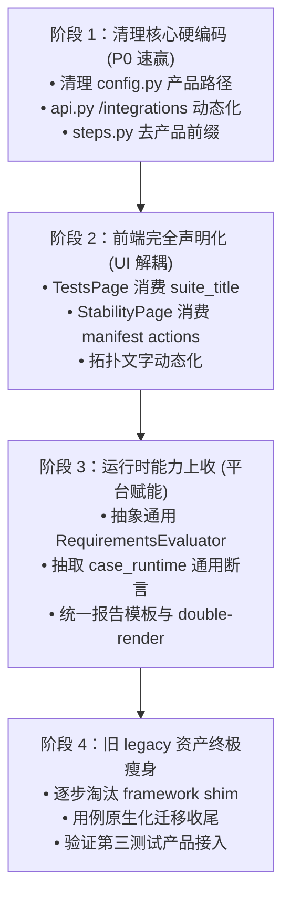

# 公司产品公共管理平台：公共能力平台化与产品零耦合差距分析报告

版本：v1.0 · 2026-09-28  
基准对照：[docs/design.md](design.md) (v3) · [docs/progress.md](progress.md) · [docs/regression-status.md](regression-status.md)  
分析范围：`backend/platform_app/`、`backend/platform_regress/`、`products/`、`frontend/`

---

## 1. 总体定性与成熟度评估

### 1.1 总体评估得分：70% ~ 75%
当前项目处于 **v3 架构演进的中后期**。最艰难的“南向生命周期契约”、“底层数据库集群统一引擎”、“跨产品通用 License 签发内核”以及“通用回归调度与事件流收敛”已经攻克并完成实测验证。

目前距离“**各个产品的公共能力均由平台提供，新增产品平台核心零代码修改（零耦合）**”的北极星目标，主要差距**不再是架构方向性问题，而是细节处的‘遗留脚手架’、‘平台代码中的产品名称泄漏’以及‘前端和运行时中未抽离的硬编码’**。

### 1.2 现状雷达图（解耦成熟度）

| 核心维度 | 成熟度 | 现状定性 | 核心剩余差距 |
| :--- | :---: | :--- | :--- |
| **产品接入与发现机制** | **85%** | 已建立 Manifest 动态发现、动态动作与路由装配 | `config.py` 和 `/integrations` 仍有静态产品路径硬编码 |
| **数据库集群部署能力** | **90%** | 全面收口为平台 `PgclusterDatabaseProvider`，产品零实现 | 画布与交互细节待补全，引擎本身已完全公共化 |
| **回归测试框架通用内核** | **70%** | 双引擎已合并为 `RegressionEngine`，psql/pgwire/jdbc 已抽象 | steps/forensics/reporting 仍有产品名泄漏，缺少通用门禁框架 |
| **通用 License 签发** | **95%** | 纯 Python 实现，多产品/多版本/多 MAC 统一签发并通过 C 校验 | 密钥管理与校验已完全通用化，产品仅提供声明 |
| **任务、锁与事件/证据** | **90%** | 资源级排他锁、不可变 execution、原子 `result.json` 全平台化 | 已完全解耦，不依赖任何产品逻辑 |
| **前端平台壳与产品解耦** | **60%** | 具备生成式注册表 (`generated.ts`) 和动态导航 | 套件中文名字典硬编码、常稳页面写死产品动作、画布有硬编码文案 |
| **规划中通用能力 (P4-P8)** | **30%** | SQL 工作台初步可用 | 终端交互、流水线编排、通知告警、通用压测 Workload 尚未建设 |

---

## 2. 北极星原则与“零耦合”定义

平台与产品的绝对边界必须遵循以下 4 条铁律：

1. **新增产品零核心修改（Zero Core Modifications）**：
   在 `products/` 下新建一个标准产品包目录（含 `product.yaml`、`adapter.py`、用例及可选前端），平台启动时自动呈现该产品的环境、测试套件与 License 选项，**禁止修改 `backend/` 或 `frontend/src/` 中的任何文件**。
2. **删除产品零破坏（Graceful Degradation）**：
   物理移除 `products/<id>` 目录后，平台依然能正常启动；关联该产品的历史环境、测试报告、执行事件和 License 文件自动标记为 `PRODUCT_UNAVAILABLE`，只读可见，核心 API 不产生 500 异常。
3. **平台拥有通用能力，产品只声明产品知识（Domain Knowledge Only）**：
   集群启停编排、网络探活、TCP/裸协议/JDBC 通用交互、超时取消、进程组守护、断言比对、证据归档属于平台；产品只提供二进制路径、配置文件模板、拓扑节点参数、SQL 语句和业务断言规则。
4. **前端通用外壳，产品专属扩展（Platform Shell vs Product Extensions）**：
   公共页面按通用能力（capabilities）和 schema 渲染；套件分类、特殊报告解析、专属拓扑渲染以插件注册表形式挂载，公共组件不得包含特定产品名称的 `if/else` 或静态映射字典。

---

## 3. 已完成解耦的坚实底座

经过前序阶段的重构，平台已经建立起强大的通用底座：

```text
                       ┌─────────────────────────┐
                       │     Platform Shell      │
                       │   (React 19 + Vite)     │
                       └────────────┬────────────┘
                                    │ /api/v1 (REST + SSE)
                       ┌────────────▼────────────┐
                       │       Platform API      │
                       │   (FastAPI + SQLite)    │
                       └────────────┬────────────┘
                                    │ Task Queue (Huey)
     ┌──────────────────────────────┼──────────────────────────────┐
     ▼                              ▼                              ▼
┌────────────────────────┐  ┌────────────────────────┐  ┌────────────────────────┐
│   Database Deployment  │  │   Regression Engine    │  │     License Engine     │
│ PgclusterDatabaseProv. │  │  (platform_regress)    │  │  (Ed25519 + Argon2id)  │
│  统一 14 节点集群拓扑  │  │   生命周期+事件+证据    │  │    多产品/多版本授权   │
└────────────────────────┘  └────────────────────────┘  └────────────────────────┘
     ▲                              ▲                              ▲
     └──────────────────────────────┼──────────────────────────────┘
                       ┌────────────┴────────────┐
                       │   Product Manifest SDK  │
                       │   products/<product_id> │
                       └─────────────────────────┘
```

1. **统一产品目录契约 (`backend/platform_app/product_catalog.py`)**：
   产品以 `product.yaml` 声明 capabilities、actions、cli、test_profiles 和 license。平台启动时动态构建目录，完全取代了历史上的静态产品注册表。
2. **底层数据库生命周期统一收口 (`backend/platform_app/providers.py:PgclusterDatabaseProvider`)**：
   FBase 数据库（多活、等保）与 fbasecman 共享同一个 `PgclusterDatabaseProvider`，所有环境生命周期（`validate/plan/apply/inspect/lifecycle`）走标准 `DeploymentPlan` 协议，产品包内不再有独立的底层数据库管理代码。
3. **跨产品通用 License 签发内核 (`backend/platform_app/license.py`)**：
   基于 Ed25519 签名、Argon2id 密钥派生和 XChaCha20-Poly1305 私钥保护，独立于产品运行，支持一次请求签发多产品，且已通过 C 原生校验器测试。
4. **回归测试双引擎合并 (`backend/platform_regress/engine.py`)**：
   - 彻底废弃子进程调用旧 `run.py` 的“引擎套引擎”模式；
   - 统一由平台 `RegressionEngine` 驱动 setup → run → cleanup 状态机，提供统一判定（PASS / FAIL / BLOCKED / ERROR / CANCELLED）；
   - FBase 228 条用例全量以平台声明式步骤（8 种步骤类型、12 种断言）原生执行；
   - fbasecman 212 条用例通过进程内 `LegacySuiteCase` 适配器挂接在同一引擎下调度。
5. **协议原语通用化**：
   - `platform_regress/clients/pgwire.py`：通用 PostgreSQL 前后端裸协议客户端；
   - `platform_regress/clients/jdbc.py`：通用 pgjdbc jar 解析、URL 构建与 javac/java 调用；
   - `platform_regress/execution/daemon.py`：通用 `ManagedDaemon` 守护进程生命周期（端口防冲突、nohup 封装、Ready 探针轮询、多级终止与崩溃取证）。

---

## 4. 详细代码级耦合与差距全景（Gap Analysis）

本节列出当前代码中**所有违背“零耦合”的真实文件、行号与现象**。

### 4.1 平台控制面（`backend/platform_app/`）中的硬编码泄漏

| 文件与行号 | 现状代码 | 违背的解耦原则 | 正确的平台化做法 |
| :--- | :--- | :--- | :--- |
| [backend/platform_app/config.py#L16-L17](file:///home/postgres/fly_dev/product_platform/backend/platform_app/config.py#L16-L17)<br>[L69-L84](file:///home/postgres/fly_dev/product_platform/backend/platform_app/config.py#L69-L84) | `fbasecman_regress_root: Path`<br>`fbase_regress_root: Path` | 平台全局配置结构体写死了具体产品字段 | 平台配置只保留 `products_root: Path`；每个产品的根目录与源码路径由其自身的 `ProductManifest` 提供 |
| [backend/platform_app/api.py#L142-L146](file:///home/postgres/fly_dev/product_platform/backend/platform_app/api.py#L142-L146) | `/api/v1/integrations` 接口返回硬编码数组：<br>`("pgcluster", ...)`<br>`("fbasecman-regress", ...)`<br>`("fbase-regress", ...)` | 接口硬编码了特定产品回归路径 | 遍历已发现的已安装产品列表，提取各产品声明的 `manifest.cli` 项，动态暴露可用的 CLI 集成状态 |
| [backend/platform_app/cli.py#L40-L41](file:///home/postgres/fly_dev/product_platform/backend/platform_app/cli.py#L40-L41) | `doctor` 命令中静态检查 `fbasecman regress` 与 `FBase regress` | 平台命令行运维工具与产品名称绑定 | 动态遍历产品包并调用各产品的诊断/体检挂点 |

---

### 4.2 平台回归内核（`backend/platform_regress/`）中的产品烙印

通用内核 `platform_regress/` 旨在成为跨产品测试引擎，但目前内部残留了若干针对旧回归工程的命名与默认值：

| 模块 | 残留代码/现象 | 违背的解耦原则 | 正确的平台化做法 |
| :--- | :--- | :--- | :--- |
| **步骤断言器**<br>[steps.py#L35](file:///home/postgres/fly_dev/product_platform/backend/platform_regress/steps.py#L35)<br>[steps.py#L132](file:///home/postgres/fly_dev/product_platform/backend/platform_regress/steps.py#L132) | `_NULL = "__FBASE_REGRESS_NULL__"`<br>`def _fbase_binary(...)`，读取 `context.environment.get("fbase_bin_dir")` | 通用步骤执行器中包含特定产品命名常量与函数 | 抽象为通用的 `_PLATFORM_NULL_TOKEN`；函数更名为 `_db_binary(...)`，优先读取 `db_bin_dir` 或环境中的 `PGHOME/bin` |
| **报告生成器**<br>[reporting/junit.py#L15](file:///home/postgres/fly_dev/product_platform/backend/platform_regress/reporting/junit.py#L15)<br>[reporting/html.py#L16](file:///home/postgres/fly_dev/product_platform/backend/platform_regress/reporting/html.py#L16) | 默认入参写死：<br>`suite_name = "fbasecman_regression"`<br>`title = "fbasecman 回归测试执行报告"` | 通用报告渲染器带有特定产品默认值 | 必填入参，或者从 `CaseContext` / `ProductManifest` 中提取产品标题与 suite 名称进行模板填充 |
| **崩溃取证**<br>[execution/forensics.py#L13](file:///home/postgres/fly_dev/product_platform/backend/platform_regress/execution/forensics.py#L13) | `def find_core_files(..., binary_name: str = "fbasecman")` | 平台执行取证默认指定单一产品二进制名 | 去除特定产品默认值，由用例或产品 Provider 显式传入目标二进制名称 |
| **端口规划**<br>[execution/ports.py#L6-L64](file:///home/postgres/fly_dev/product_platform/backend/platform_regress/execution/ports.py#L6-L64) | 注释与逻辑假定“fbasecman 需要 listen, listen+1, listen+2 三个端口” | 端口分配器中存在特定产品的端口拓扑硬编码 | 泛化为通用块分配器：`reserve_port_block(count=N)`，由用例/产品声明所需连续端口数量 |

---

### 4.3 产品包内尚未完全剥离的“伪私有”通用能力

在 `products/` 目录下，依然有大量具备通用价值的逻辑尚未彻底下沉，导致产品目录过于臃肿：

#### 1. 用例环境门禁框架（Requirements Evaluator）尚未通用化
- **现状**：[products/fbase-database/cases.py#L427-L470](file:///home/postgres/fly_dev/product_platform/products/fbase-database/cases.py#L427-L470) 中维护了一个庞大的 `check_requirements()` 函数，逐项检查 `clusters`, `commands`, `plugins`, `writable_node`, `system_time_control`, `roles`, `extensions`。
- **差距**：“前置依赖检查失败 -> 置为 BLOCKED 判定”是平台回归引擎的标准生命周期能力。当前缺少平台级的 `RequirementsEvaluator` 注册表，导致新产品若有依赖门禁必须重写一套。

#### 2. Runtime 内部通用断言与轮询未抽干
- **现状**：[products/fbasecman/case_runtime.py](file:///home/postgres/fly_dev/product_platform/products/fbasecman/case_runtime.py) 仍然长达 900+ 行。
- **差距**：内部的 `assert_table`（表格行比对）、`wait_node_monitor`（SQL 轮询匹配）、`backup_checkpoint` / `assert_backup_created`（配置文件备份快照及校验）、`diff_contains` 等均为纯通用工具函数。
- **解耦目标**：这些逻辑应沉淀到 `platform_regress/evidence/` 或 `platform_regress/clients/`，使产品 runtime 只保留真实业务配置注入与特有断言。

#### 3. 历史遗留资产目录（`regression/legacy/`）与 shim 垫片
- **现状**：`products/fbasecman/regression/legacy/` 和 `products/fbase-database/regression/legacy/` 保留了旧框架的大量源码和数百个单测文件，`framework/*` 目前通过 shim 层维持旧代码的运行。
- **差距**：只要旧目录与旧 shim 还在，产品包就无法称之为“纯粹的适配器”。最终目标是将有效用例全部转为平台 SDK 原生执行，并退役 legacy 源码树。

---

### 4.4 前端通用视图（`frontend/src/`）中的产品耦合

前端虽已引入 `PlatformShell` 和 `generated.ts` 插件注册表，但在核心通用视图中仍存在硬编码穿透：

| 文件与行号 | 耦合现象 | 影响后果 | 改造方案 |
| :--- | :--- | :--- | :--- |
| [frontend/src/views/TestsPage.tsx#L26-L42](file:///home/postgres/fly_dev/product_platform/frontend/src/views/TestsPage.tsx#L26-L42) | 函数 `getSuiteName` 硬编码了静态字典：<br>`mmr`, `mac`, `rw_toggle`, `global_cache`, `guc`, `ha_commands`, `high_availability`, `handover`, `outstanding`, `sql_parse`, `common`, `tmp` | 接入新产品时，公共测试列表无法显示其套件中文名，必须改 `TestsPage.tsx` | 事实上后端的 [CaseDefinition](file:///home/postgres/fly_dev/product_platform/backend/platform_regress/catalog.py#L16) 已经返回了 `suite_title`。前端直接取 `case.suite_title \|\| case.suite`，彻底删掉静态字典 |
| [frontend/src/views/StabilityPage.tsx#L29, L40](file:///home/postgres/fly_dev/product_platform/frontend/src/views/StabilityPage.tsx#L29) | 写死触发 `operationRequest(..., 'stability.fbasecman', ...)`；标题写死“`fbasecman 常稳任务`” | 切换到其他产品时，常稳页面无法工作或触发错误动作 | 从当前环境可用的 `environment.actions` 中动态查找 `capability === 'stability'` 的动作项，标题读取 action 的 title |
| [frontend/src/components/ThreeTopologyView.tsx#L222](file:///home/postgres/fly_dev/product_platform/frontend/src/components/ThreeTopologyView.tsx#L222) | 3D 拓扑组件直接写死 `makeBillboardSprite('fbasecman 网关', ...)` | 非 fbasecman 产品查看 3D 拓扑时出现错误角色文字 | 角色名从后端的观察事实（`Observation` / 拓扑节点 `role` 字段）动态渲染 |

---

### 4.5 规划中尚未落地的公共能力（路线图缺口）

按照 [docs/design.md](file:///home/postgres/fly_dev/product_platform/docs/design.md) 的远期规划，以下通用平台能力仍处于方案或初始状态，尚未落地：

1. **受控交互终端（Interactive Terminal）**：
   - 规划通过 `@xterm/xterm` 建立安全 WebSocket 终端，供人工排查或特定 CLI 操作，且操作命令受限并完整留痕。
2. **任务流水线与自动化调度（Pipelines & Scheduling）**：
   - 基于 Huey Periodic 的轻量级定时调度，支持将环境部署、测试批跑、报告生成串联成流水线。
3. **旁路通知与告警（Notifications & Alerts）**：
   - 支持 Webhook / Email 发送测试终态报告，旁路失败不影响任务执行结果。
4. **通用压测工作负载引擎（Workload Engine）**：
   - 目前常稳测试直接依赖产品包自带的脚本。平台缺少统一的压测驱动（如通用 pgbench 编排、指标采样、TPS/时延实时曲线汇总）。

---

## 5. 分阶段清零解耦路线图（Roadmap）

为了稳妥推进零耦合，同时不破坏现有的 180+ 项平台测试与旧回归保真度，建议分为 4 个演进阶段：



### 阶段 1：清理平台核心硬编码（工作量：1~2 人天，高收益）
- **目标**：彻底消除平台核心后端对特定产品名称的感知。
- **动作**：
  1. 重构 [config.py](file:///home/postgres/fly_dev/product_platform/backend/platform_app/config.py)：移除 `fbasecman_regress_root` / `fbase_regress_root`，改为按需读取已发现产品的 `manifest.package_root`。
  2. 重构 [api.py](file:///home/postgres/fly_dev/product_platform/backend/platform_app/api.py) 和 [cli.py](file:///home/postgres/fly_dev/product_platform/backend/platform_app/cli.py)：`/integrations` 与 `doctor` 动态遍历已安装产品的 `manifest.cli`。
  3. 重构 [steps.py](file:///home/postgres/fly_dev/product_platform/backend/platform_regress/steps.py)：重命名 `_fbase_binary` 为通用的 `_database_binary`，去除 `__FBASE_REGRESS_NULL__`。
  4. 清理 `reporting/` 和 `execution/forensics.py` 中的产品默认入参。

### 阶段 2：前端视图纯声明式重构（工作量：2~3 人天）
- **目标**：新增产品时，平台前端公共页面零改动。
- **动作**：
  1. 修改 [TestsPage.tsx](file:///home/postgres/fly_dev/product_platform/frontend/src/views/TestsPage.tsx)：删除 `SUITE_NAMES` 静态映射，直接读取 API 返回的 `case.suite_title`。
  2. 修改 [StabilityPage.tsx](file:///home/postgres/fly_dev/product_platform/frontend/src/views/StabilityPage.tsx)：改为由 `environment.actions` 中声明的 `capability === 'stability'` 动态渲染，不再写死 `stability.fbasecman`。
  3. 修改 [ThreeTopologyView.tsx](file:///home/postgres/fly_dev/product_platform/frontend/src/components/ThreeTopologyView.tsx)：去除静态文字，从拓扑观察数据动态显示角色标签。

### 阶段 3：上收通用运行时与门禁（工作量：3~5 人天）
- **目标**：产品包只保留真正的业务逻辑，通用辅助能力全归平台。
- **动作**：
  1. 在 `platform_regress/execution/` 中建立通用 `RequirementsEvaluator`，把 FBase 的门禁逻辑上收为平台通用框架。
  2. 瘦身 [case_runtime.py](file:///home/postgres/fly_dev/product_platform/products/fbasecman/case_runtime.py)，将其中的配置比对、表格断言轮询、备份校验抽入 `platform_regress`。
  3. 报告模型统一：使平台 HTML/JUnit 生成器能直接服务于两套产品的全部产物。

### 阶段 4：旧架构退役与零耦合验证（工作量：3~5 人天）
- **目标**：完成最终的“零耦合”闭环验收。
- **动作**：
  1. 引入临时测试产品 `products/demo/`，验证：
     - 增加 `products/demo/` 后，平台**零代码修改**即可完整展示其环境、测试用例和 License 选项并成功执行；
     - 删除 `products/demo/` 后，核心无异常，关联环境与历史结果平滑转为只读。
  2. 清理产品目录下的无用 legacy shim 层。

---

## 6. 最终验收标准

完成上述四阶段重构后，项目应达到以下 6 条终验红线：

1. **Grep 零泄漏**：在 `backend/platform_app/`、`backend/platform_regress/` 和 `frontend/src/views/`、`frontend/src/platform/` 中搜索 `fbase`、`cman` 等产品关键字，**仅在注释或通用兼容说明中存在，绝对不允许出现在任何业务代码逻辑中**。
2. **第三产品即插即用（0 核心修改）**：新建一个空逻辑的 `products/mock-database/`，执行 `./web.sh restart` 和 `./web.sh build` 后，Web 界面与 CLI 立即无缝呈现该产品的一切能力。
3. **安全删除降级**：删除产品目录后，SQLite 不崩溃，历史测试记录与证据文件仍可随时调阅回放。
4. **全量测试守门**：
   - 平台原生测试 `pytest tests/` 保持 100% 通过（当前 180+ passed）；
   - 各产品用例在真实集群实测判定与旧框架基线保持 100% 保真（不为凑绿而放宽断言）；
   - 前端 TypeScript 类型检查与 Vite 生产打包 0 错误（`npm run build`）。
