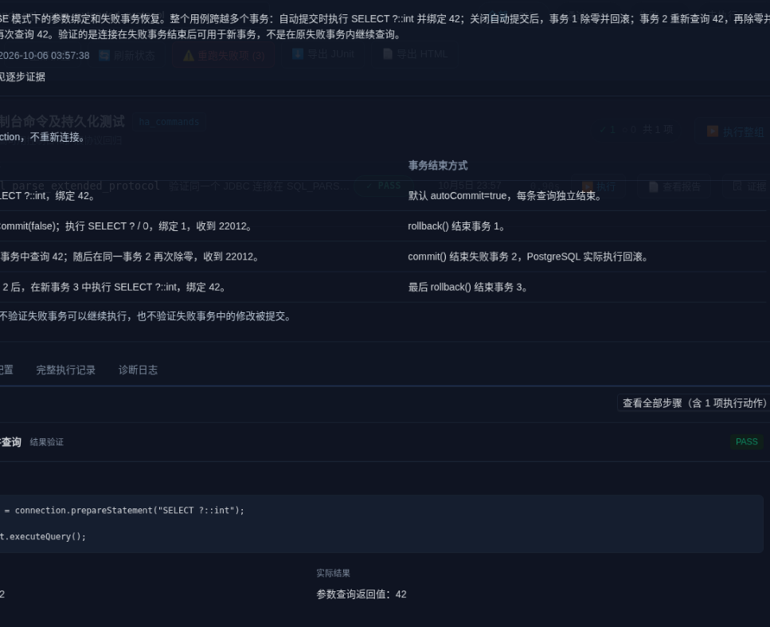

# 回归用例编写与报告规范

新增及修改用例必须按此规范记录事实。产品专属目的、步骤和断言放在 `products/<product_id>/`；平台负责执行、证据归档与展示。迁移旧用例时保留其业务行为，不能为了 PASS 放宽断言。

## 一个合格的用例应回答什么

| 内容 | 写法要求 | 不合格示例 |
| --- | --- | --- |
| 测试目的 | 写清触发条件、被验证行为和最终成功状态 | “验证 SQL_PARSE”“测试后台维护” |
| 前置条件 | 指明版本、插件、拓扑、身份、配置和数据要求；缺失则 BLOCKED | 前置条件错误仍继续跑 |
| 操作／检查 | 写明操作节点、对象、动作以及它的作用 | 连续多步都叫“执行 SQL” |
| 期望结果 | 执行前声明可比较的值、行数、状态、错误或时限 | “执行成功”“断言都通过” |
| 实际结果 | 保存实际值、退出码、SQLSTATE、输出及证据定位 | 只写 PASS |
| 判定依据 | 说明比较了什么、哪些符合、哪些不符合 | “正常”“符合预期”而不说明依据 |
| 清理 | 恢复修改、删除本次专属对象，并记录清理结果 | 清理失败仍认为完整执行通过 |

目的中的每个承诺都必须有对应断言。准备动作可以只有“命令退出码 0”，但不能把它显示为功能验证。SQL 返回 false 可以满足预期；SQL 返回 true 也不自动意味着用例通过。

## 按用例选择说明形式

统一使用正式标题“测试目的”，不用“这个用例验证什么”等口语标题。目的说明被验证的行为和成功条件，避免用内部函数名替代解释。

**不是每个用例都需要代码示例。**选择读者理解操作所需的最少信息：

| 用例类型 | 推荐说明方式 |
| --- | --- |
| JDBC 参数绑定、协议交互、复杂事务恢复 | 展示最小关键代码，说明绑定值及返回值 |
| SQL 函数、视图或元数据检查 | 展示关键 SQL 和需要比较的字段；不附整段客户端程序 |
| 节点启停、主备切换、部署和监控 | 写清节点、动作、时间限制与预期状态；必要时给一条命令 |
| 简单配置或状态检查 | 直接写配置项／状态值与期望，不额外堆代码 |

代码只用于解释容易产生歧义的机制。只截取实际测试中的关键操作，不复制连接、导入、日志等样板；辅助函数要说明作用。执行前归档示例，历史报告不得拿当前代码冒充当时执行代码。完整程序保留在源码和执行工件中。

## SQL_PARSE 示例

**用例名称：**SQL_PARSE 模式下 JDBC 参数绑定与失败事务恢复验证。

**测试目的：**验证 fbasecman 在 SQL_PARSE 模式下能正确处理 JDBC PreparedStatement 参数绑定；失败事务通过回滚或提交结束后，连接仍能重新查询。

**连接与事务范围：**整个用例复用同一个 JDBC Connection，但不在同一个事务内执行。

| 阶段 | 操作 | 事务边界 |
| --- | --- | --- |
| 自动提交 | 查询参数 42 | autoCommit=true，每条查询独立结束 |
| 事务 1 | setAutoCommit(false) 后执行除零 SQL | rollback() 结束事务 1 |
| 事务 2 | 先查询返回 42，再执行除零 SQL | commit() 结束失败事务；实际是回滚 |
| 事务 3 | 再查询返回 42 | 最后 rollback() 结束事务 3 |

回滚后的恢复查询属于新事务 2；事务 2 结束后的恢复查询属于新事务 3。不声明在失败事务内继续执行成功，也不声明失败事务的修改被提交。

**前置条件：**数据库成员可连接，代理路由已收敛；JDBC 驱动与 Java 测试程序可用；启用 SQL_PARSE 和 PreparedStatement 预留配置。

### 检查一：绑定整数参数 42 并查询

```java
PreparedStatement statement =
    connection.prepareStatement("SELECT ?::int");
statement.setInt(1, 42);
ResultSet result = statement.executeQuery();
```

**期望：**结果集仅包含一行非空整数 `42`。**实际：**记录本次真实查询值。**判定：**核对行数、非空和值是否等于 `42`，不能只检查查询执行成功。

### 检查二：事务 1 回滚后，在新事务 2 中查询

```java
connection.setAutoCommit(false);
PreparedStatement statement = connection.prepareStatement("SELECT ? / 0");
statement.setInt(1, 1);
// executeQuery() 应抛出 SQLException，SQLSTATE 必须为 22012。
connection.rollback();
queryInt(connection, "SELECT ?::int", 42);
```

`queryInt` 使用 PreparedStatement 绑定参数，并读取恰好一行非空整数。**期望：**除零错误为 `22012`；回滚后重新查询返回 `42`。**实际：**保存错误码与重新查询值，不能只输出“恢复成功”。

### 检查三：事务 2 结束后，在新事务 3 中查询

再次执行相同的除零 SQL，收到 `22012` 后调用 `connection.commit()`，随后使用同一连接执行 `SELECT ?::int` 并绑定 `42`。

**期望：**后续查询返回 `42`。PostgreSQL 的失败事务会以回滚结束，此检查不证明失败事务中的修改被提交，也不代替正常事务持久化测试。这里引用前一步 SQL 即可，不重复整段代码。

本用例只验证参数绑定与失败事务恢复，不创建临时表，也不读取诊断端口。读写路由由独立用例声明允许节点集合并核对实际目标。

## 原生 SDK 步骤示例

```python
actual = context.sql("mmr1", query).rows
expected = (("ACTIVE", "OK"),)
passed = actual == expected
context.step("node-health", "确认 mmr1 状态 ACTIVE 且无异常",
    status="PASS" if passed else "FAIL", details={
        "intent": "verify",
        "command": query,
        "node": "mmr1",
        "expected": "仅返回一行：ACTIVE、OK",
        "actual": actual,
        "assertion": {"type": "rows_equal", "rows": expected},
        "analysis": "返回行及两个字段均匹配" if passed else
                    f"期望 {expected}，实际 {actual}",
    })
if not passed:
    raise AssertionError(f"mmr1 健康状态不符：期望 {expected}，实际 {actual}")
```

`intent` 使用 prepare、action、verify、cleanup。关键检查必须保存 expected、actual、assertion 和 analysis。验证外部程序时还应归档原始 stdout／stderr、退出码和证据文件；预期错误必须同时核对失败与正确的错误内容或 SQLSTATE。

## 失败与历史报告

- 生命周期 finished 仅表示步骤结束，不能代替业务结果 PASS／FAIL。
- 前序失败后未执行的步骤标为 BLOCKED，保存原定期望和未执行原因。
- 未记录结论时显示 UNKNOWN，不能默认通过。
- 失败首先指出第几步、在哪个节点、期望是什么、实际是什么，并给出错误和日志证据。
- 执行前归档用例目的、前置条件、期望和通过标准。历史报告只从同次执行工件恢复事实；当前目录说明单独标识，不能冒充历史断言。
- 清理失败与业务失败分别记录，最终报告不能掩盖任一失败。

## 会话参数、协议与配置用例的补充要求

- `RESET`、`RESET ALL`、`DISCARD ALL`：修改参数与清理参数必须在同一客户端会话中完成，并记录清理前后值。仅在新客户端执行清理命令，不能证明清掉了上一客户端的状态。
- `DISCARD ALL` 不能放在事务块中。使用同一 psql 的标准输入逐条执行语句，可以保留客户端连接，同时避免多语句 `psql -c` 把它包进一个隐式事务块。
- `SET LOCAL`：在原客户端中检查事务内值和 COMMIT／ROLLBACK 后的值，不能仅以另一个新客户端的默认值作为事务作用域恢复的证据。
- 保存点恢复：说明 ROLLBACK TO SAVEPOINT 保留原事务，区别于完整 rollback 后开始新事务。每条协议检查均保存错误码、事务状态、命令标签及返回值；比较失败时先记录失败步骤再抛异常。
- 表格结果按列名读取，不假定当前源码中的列位置就是运行版本的列位置；数值精确比较，不能把 `110` 中含有 `10` 当作权重等于 10。
- 准备动作与文字叙述不登记为业务验证。没有关联日志或缺少证据的辅助检查，不因“未搜到错误”而宣称已验证通过。
- 报告的实际结果必须包含本步骤比较的数据。退出码、重试次数和耗时是执行信息，不能替代参数值、状态、行数等实际检查值。

## Review 标准

事务类用例必须声明是否复用连接、autoCommit 状态、每个事务的开始与结束，以及检查发生在原事务还是新事务；还应说明 commit 对失败事务的实际语义。

提交前逐项核对：目的是否有对应断言；PASS 是否有可追溯比较；FAIL 能否定位差异；BLOCKED 是否有原因；初始化错误是否保留服务器日志；清理是否恢复环境。至少验证一个通过场景和一个不符合期望的场景，确认报告没有把失败或未执行步骤显示成 PASS。长时间用例按项目执行策略单独安排。

## 报告展示样板

顶部常驻测试目的，默认先看业务验证，准备动作单独展开。每个验证步骤并列显示期望与实际结果，下面给出判定依据；只有必要的执行命令可展开查看。步骤卡不重复整段程序输出，不展示内部 JSON 文件名或工件路径；完整原始记录在独立“原始报告”和“诊断日志”入口保留，用于排障与审计。实际结果应使用中文字段说明，并只展示本步骤相关值。

以下为已有 SQL_PARSE 执行归档的实际展示，不是虚构测试结果：



“原始报告”入口必须保留，直接展示当次 report.txt 原文；简化步骤页时不能删除或改成难以识别的名称。
